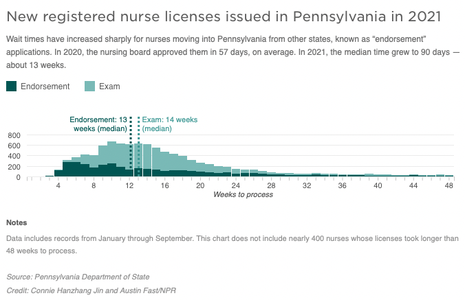
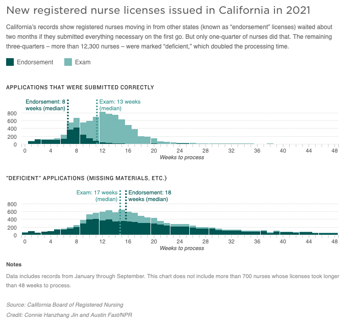

```{r, message=FALSE}
library(tidyverse)
library(janitor)
library(lubridate)
library(readxl)
library(tidycensus)

options(scipen=999)
knitr::opts_chunk$set(warning = FALSE, message=FALSE) 
#knitr::opts_knit$set(root.dir = rprojroot::find_rstudio_root_file())

start_time <- Sys.time()
#Set working directory to find data files in console to knit
setwd('/Users/austinfast/Documents/GitHub/nursing-licenses/R/')
```

# README

This document details NPR's methodology for an investigation that aired March 9, 2022, on All Things Considered. 

* NPR.org: ["Nurses are waiting months for licenses as hospital staffing shortages spread"](https://www.npr.org/2022/03/10/1084897499/nurses-are-waiting-months-for-licenses-as-hospital-staffing-shortages-spread)

Two member station reporters produced localized versions and participated in a [reporter roundtable](https://www.npr.org/2022/03/10/1084897499/nurses-are-waiting-months-for-licenses-as-hospital-staffing-shortages-spread) on Morning Edition on March 10, 2022: 

* [Jayme Lozano - Texas Tech Public Media (Lubbock, Texas)](https://radio.kttz.org/news/2022-03-08/data-shows-nurses-may-face-above-average-processing-times-for-licenses-in-texas)
* [Brett Sholtis - WITF (Harrisburg, Pa.)](https://urldefense.com/v3/__https://www.witf.org/2022/03/10/nurses-in-pennsylvania-waited-months-to-get-licenses-to-work-during-historic-staffing-shortage/__;!!Iwwt!CynyfQoW6lmpSOB3yyliU9pazriGPwxigcsXmj9ZnJWW0J-33zzjONglotE$)

Full GitHub repo with code, raw data and methodology is at: https://github.com/austinfast/nursing-licenses

# Methodology
On Sept. 23, 2021, NPR requested records for all licensed practical nurses and registered nurses who applied for licensure from 2019 to 2021 from 54 nursing boards, including every state and the District of Columbia. (California, Louisiana and West Virginia have separate RN and LPN boards.)

We asked for each nurse's:

* name
* city
* state
* license type (RN or LPN)
* license duration (temporary or permanent)
* application type (by exam, exam-retest, endorsement, renewal, reinstatement, etc.)
* application status 
* relevant dates (application submission, date when all required documents received, license issuance date and license expiration date). 

California and Virginia provided anonymized records, citing the nurses' privacy, and Connecticut and Virginia couldn't provide details on application type.

States responded as follows: 

**Thirty-three boards granted NPR's request**: 

* Arkansas
* California *(provided anonymized records - charged $60.17)*
* Colorado 
* Connecticut
* Hawaii *(only Feb. 2021 onward because of system migration)*
* Illinois
* Indiana
* Iowa 
* Kentucky 
* Louisiana *(LPN board only)*
* Maine
* Massachusetts 
* Michigan 
* Minnesota 
* Mississippi 
* Montana 
* Nebraska 
* New Hampshire *(redacted city/state)*
* New Jersey 
* New Mexico 
* North Carolina *(charged $875)* 
* Ohio 
* Oklahoma 
* Oregon 
* Pennsylvania 
* South Carolina 
* Texas *(only June 2020 onward because of system migration)* 
* Tennessee *(charged $554)* 
* Vermont 
* Virginia *(provided anonymized records - charged $134)*
* West Virginia *(RN board only)*
* Wyoming *(RN board only)*

**Five boards provided partial data**:

* Alabama provided unusable records
* Four boards provided processing time summaries that NPR could not independently verify:
  + Arizona
  + Idaho
  + Missouri
  + Nevada 

**Two boards did not respond to repeated requests for records**:

* Kansas
* West Virginia (LPN board only)

**Ten boards denied NPR's request**:

* Alaska: Told NPR they have no way to export application dates from their database.
* Delaware: "A public body in Delaware is not required to construct a record that does not previously exist for the purpose of fulfilling a FOIA request."  
* District of Columbia: Told NPR they have no way to export application dates from their database.
* Florida: Initially claimed no responsive records exist. When NPR pointed out annual reports advertise license processing times, the Florida Department of Health charged NPR $150, but has not provided any records to NPR as of March 10, 2022.
* New York: Withheld application dates as invasion of nurses' privacy. NPR's appeal was denied Jan. 10, 2022.
* Maryland: Quoted $213 to provide the records, but a recent system hack prevented the board from providing them.
* Rhode Island: "There are no currently existing records that are responsive to the request."
* South Dakota: Told NPR they have no way to export application dates from their database.
* Utah: The board "is not required to compile, format, manipulate, package, summarize, or tailor information in order to fulfill a request."
* Washington: "Per WAC 44-14-04003 (6) No duty to create records, we do not have anything containing the above highlighted information." 

**Four boards wanted fees that NPR did not pay**:

* Georgia ($434,178)
* Louisiana (RN board only-$1,754)
* North Dakota ($25)
* Wisconsin ($600)

Some boards use different terms for the same idea. For example, licensed practical nurses can also be called licensed vocational nurses, and states refer to licensed nurses applying in a new state as "endorsement" or "reciprocity." NPR standardized these terms among the 32 states' records and combined them into one dataset. 

The first states to respond to NPR's request provided records through Sept. 23, 2021, so NPR removed all records after that date from subsequent states to standardize the timeframe. This resulted in a final dataset containing over 226,000 nurses issued new, permanent licenses in 2021.

NPR subtracted the application date from the license issue date to calculate each nurse's processing time in days. We removed 77 nurses' records showing an issue date earlier than their application date, apparently in error. NPR then grouped by state, license type and application type to find median processing times for each of the four major types and to count how many of the nurses' processing times stretched longer than three months, six months, etc.

# Import state data

## Import Arkansas 
* Includes Endorsement, Exam, International (3), Renewal (200), Retest (600) 
* Includes temporary licenses (split by endorsement and examination)
* No pending applications provided

Arkansas doubled names, one temp permit and one permanent license.

```{r}
state <- read_excel("../state-data/AR-Application Management for FOIA 09_23_2021.xlsx", skip=1) %>% 
  clean_names()

#Standardize fields
ar_state <- state %>%
  filter (application_type != "Renewal") %>% #removes 200 renewals erroneously included with negative process times
  #Format date fields
  mutate (issue_date = as.Date(original_issuance_date),
          application_date = as.Date(application_submit_date),
          docs_date = as.Date(application_approval_date),
          gather_time = docs_date - application_date,
          docs_time = issue_date - docs_date,
          month = substr(issue_date, 1,7),
          year = year(issue_date),
          lic_type = case_when(
            #specify temporary vs permanent license applications
            license_type=="RN" & license_permit=="Temporary" ~ "RN-Temp",
            license_type=="LPN" & license_permit=="Temporary" ~ "LPN-Temp",
            TRUE ~ license_type),
          app_type = case_when (
            application_type == "Initial - Exam" ~ "Exam",
            application_type == "Retest" ~ "Exam-retest",
            TRUE ~ application_type),
          process_time = issue_date - application_date,
          docs_time = issue_date - docs_date,
          data_state = "AR",
          year = as.character(year)) 

#Any mismatches?
ar_state %>% filter (as.Date(original_issuance_date) != issue_date)
ar_state %>% filter (as.Date(application_submit_date) != application_date)

#Remove unformatted date fields and unnecessary fields
ar_state <- ar_state %>%
  select (-c(original_issuance_date, application_submit_date, application_approval_date, original_issuance_date, application_submit_date, license_type, application_type, checklist_item_name, checklist_status)) %>%
  rename (duration = license_permit)

ar_state %>%
  count(lic_type, app_type)

#check for duplicate license numbers - AR uses same license number even if nurses have RN & LPN applications and temp/permanent
#For example, see # 120001
ar_state %>% filter (license_number=="120001")

#These 14 people have duplicates - only difference is docs received date
dupe_numbers <- ar_state %>% 
  count (license_number, lic_type, duration, issue_date, application_date) %>%
  filter (n > 1) %>%
  distinct (license_number) %>%
  pull()

ar_state %>% 
  filter (license_number %in% dupe_numbers) %>% 
  View

#Remove these duplicates (22 records)
ar_state <- ar_state %>% 
  distinct (license_number, lic_type, duration, issue_date, .keep_all=T)
```

## Import California
California provided anonymized records with an entity_id to identify each individual. Each nurse has multiple rows, one for each stage of their application process. This code creates one row for each person, so we can calculate total processing time from the start of stage one until the license was issued.

* VNs by exam progress through three stages called Exam Request, Exam Results and Initial. See MILLER, SYDNEY NICOLE for proof at <https://search.dca.ca.gov/details/4301/VN/704727/97585d1c86321b5b232e49d5c7a65d38> She is the only VN license from AGUANGA, CA issued from 2019 through 2021. The Initial date approved matches her issuance date (May 23, 2019).

* VNs by endorsement progress through two stages called Endorsement and Initial. See CERDA, CHRYSTAL E of Yermo, CA (entity number: 4016139) Initial date matches (May 21, 2019).

* RNs by exam progress through two stages: Request for "RN Exam" and "Apprvd Exm App - Pendng Exm Pass Rslts." See STEELE, ALEXIS ANNE LOUISE for proof at <https://search.dca.ca.gov/details/4001/RN/95252157/31b623dd5e52fbc5ee0778f0edaa5cac> Only RN from ALTAVILLE, CA issued 2019-2021. Her Apprvd Exm App - Pendng Exm Pass Rslts date approved matches her issuance date (July 8, 2021).

### California's vocational nurses (LPNs)
```{r}
state_vn <- read_excel("../state-data/CA-BVNPT PRA Report 2022-01-04.xlsx", sheet=1) %>%
  clean_names()

vns <- state_vn %>%
  filter (license_type_long_name=="Vocational Nurse") %>%
  mutate (approved_date = as.Date(approved_date),
          received_date = as.Date(received_date)) %>%
  select (-c(license_type_long_name, board_long_name, transaction_class, application_id)) %>%
  group_by (entity_number) %>%
  mutate (count = n()) 

#Most people have 3 records, 2 records, or 4 records
vns %>% ungroup() %>% count (count)

#8524 unique test retakers of 88,000 records
retakes <- vns %>% 
  filter (transaction_description=="Exam Re-take") %>%
  distinct (entity_number) %>%
  pull (entity_number)

#565 interim permits 
interim <- vns %>%
  filter (transaction_description == "Issue Interim Permit" & application_status!="Withdrawn") %>%
  pull (entity_number)

#Identify applicants with deficiencies
deficiencies <- vns %>%
  filter (deficiency_y_n=="Y") %>%
  distinct (entity_number) %>%
  pull()

#Find only those that have been licensed = 20505 people
issued <- vns %>%
  filter (transaction_description=="Initial" & application_status=="Approved") %>%
  pull (entity_number)

#Add flag for re-testers, deficient applications, and those who applied/received interim permits
vns2 <- vns %>%
  mutate (retest = if_else (entity_number %in% retakes, "retest", NA_character_),
          interim = if_else (entity_number %in% interim, "interim", NA_character_),
          deficient = if_else (entity_number %in% deficiencies, "deficient", NA_character_),
          licensed = if_else (entity_number %in% issued, "licensed", NA_character_))

#Remove exam re-takes as well as abandoned applications (expired); duplicate entries (withdrawn); expired applications (cancelled); and denied
vns3 <- vns2 %>% 
  filter (transaction_description != "Exam Re-take") %>% #remove 5000 rows of exam-retakes 
  filter (!(application_status %in% c("Expired", "Withdrawn", "Denied", "Canceled"))) %>% #remove 2000 rows of abandoned applications (expired); duplicate entries (withdrawn); expired applications (cancelled); and denied
  arrange (entity_number, received_date, transaction_description) %>%
  group_by (entity_number, transaction_description) %>%
  slice_tail() %>%  #Keeps only more recent instance if more than one Exam Results or Initial (removes 23 rows that had multiple "Exam Results" or "Exam Request")
  group_by (entity_number) %>%
  mutate (count_noretakes = n()) %>%
  arrange (entity_number, received_date)

#What types of transactions are here? - 5 types
vns3 %>%
  ungroup() %>%
  count (transaction_description)

#Keep only first step of process (Exam Request/Endorsement) and final step (Initial)
vns4 <- vns3 %>%
  filter (transaction_description %in% c("Exam Request", "Initial", "Endorsement"))

#How many applications remain open? -- 4521
vns4 %>% ungroup() %>% count (application_status, transaction_description)

#vns5 <- vns4 %>%
#  pivot_wider (id_cols=c(entity_number, city, state, count_noretakes, retest, interim, deficient, licensed),
#               names_from = c("transaction_description", "application_status"),
#               values_from = c("received_date", "approved_date")) 

#Pivot so each row represents an individual nurse
vns5 <- vns4 %>%
  pivot_wider (id_cols=c(entity_number, city, state, count_noretakes, retest, interim, deficient, licensed),
               names_from = c("transaction_description"),
               values_from = c("received_date", "approved_date")) 

#Each row typically is either Exam OR endorsement, so combine the received date columns into one and calculate a processing time column
vns6 <- vns5 %>%
  mutate (received = coalesce (received_date_Endorsement, `received_date_Exam Request`),
          process_time = if_else (is.na(licensed), as.Date("2022-01-04") - received, approved_date_Initial - received),
          year = year(approved_date_Initial))

#3928 cannot process times, either pending or issued; 2898 of which only had Initial stage and most of which were issued 2019, so their Exam Results stage was likely before Jan. 1, 2019 and not sent from the California board. 149 issued in 2021 fit this category and couldn't calculate
no_process <- vns6 %>%
  ungroup() %>%
  filter (is.na(process_time) & count_noretakes>1) %>%
  count (year)
  
#3264 endorsement individuals
endorse <- vns %>%
  filter (transaction_description=="Endorsement") %>%
  distinct (entity_number) 
#27103 exam individuals
exam <- vns %>% 
  filter (transaction_description %in% c("Exam Request", "Exam Results"))%>%
  distinct (entity_number) 

#Only 21 people have both exam & endorsement
both_types <- inner_join (endorse, exam, by = "entity_number") %>%
  pull() 

#Create dataframe to assign the primary application type
app_types <- vns %>% 
  filter (entity_number %in% both_types) %>%
  filter (application_status %in% c("Approved", "Open")) %>%
  filter (transaction_description!="Initial") %>%
  group_by (entity_number) %>%
  mutate (count = n()) %>%
  arrange (received_date) %>%
  slice_tail () %>%
  mutate (app_type = case_when (
    str_detect (transaction_description, "Endorsement") ~ "Endorsement",
    str_detect (transaction_description, "Exam") ~ "Exam")) %>%
  select (entity_number, app_type)

exam_type <- exam %>%
  filter (!entity_number %in% both_types) %>%
  mutate (app_type = "Exam")

endorse_type <- endorse %>%
  filter (!entity_number %in% both_types) %>%
  mutate (app_type = "Endorsement")

app_types <- rbind (app_types, exam_type, endorse_type)
  
#Join application type with main dataframe
vns7 <- vns6 %>%
  left_join (app_types, by = "entity_number") 

#Standarize application type column
vns8 <- vns7 %>% 
  mutate (app_type = case_when (
    retest == "retest" ~ "Exam-retest",
    app_type=="Exam" & is.na(retest) ~ "Exam",
    is.na(app_type) ~ "Unknown",
    app_type=="Endorsement" ~ "Endorsement",
    TRUE ~ "PROBLEM"))

#All the unknowns are from 2019, because they applied before Jan 1, 2019, and CA didn't provide their records
vns8 %>% ungroup() %>% count (year, app_type)

#Remove NA times and adjust year to pending for those still open
vns9 <- vns8 %>%
  filter (process_time > -1) %>% #remove 3928 NA times
  mutate (year = if_else (is.na(year), "Pending", as.character(year))) %>%  
  #Remove pending older than July 2020
  filter (!(str_detect(year, "^Pending") & (received < as.Date("2020-07-01"))))

#How many from each year?
vns9  %>% 
  ungroup() %>%
  count (year, app_type)

#Any unknowns left? They're all pulled out as NAs
unknowns <- vns9 %>%
  filter (app_type == "Unknown") %>%
  pull (entity_number)

unknowns_df <- vns %>%
  filter (entity_number %in% unknowns)

#Clean up and standardize columns to add into full dataset
vns10 <- vns9 %>%
  mutate (lic_type = "LPN") %>%
  rename (issue_date = approved_date_Initial,
          application_date = received,
          first_name = entity_number) %>%
  select (lic_type, app_type, first_name, city, state, application_date, issue_date, process_time, year, deficient)
  
#California vocational nurses' processing times
vns10 %>%
  #group_by (year, app_type, deficient) %>%
  group_by (app_type, year) %>%
  summarize (mean = round(mean(process_time, na.rm=T)),
             median = median (process_time),
             count = n(),
             over30days = sum(process_time > 30),
             pct_over30days = over30days/count,
             over60days = sum(process_time > 60),
             pct_over60days = over60days/count,
             over90days = sum(process_time > 90),
             pct_over90days = over90days/count,
             over120days = sum(process_time > 120),
             pct_over120days = over120days/count,
             over180days = sum(process_time > 180),
             pct_over180days = over180days/count,
             over1year = sum(process_time > 365),
             pct_over1year = over1year/count ) %>%
  filter (year %in% c("2021", "Pending"))
```

### California's RNs
```{r}
state_rn <- read_excel("../state-data/CA-BRN PRA Report 2022-01-04.xlsx", sheet=1) %>%
  clean_names()

#Pull out only RNs
rns <- state_rn %>%
  filter (license_type_long_name %in% c("Registered Nurse", "Temporary Registered Nurse License")) %>%
  mutate (approved_date = as.Date(approved_date),
          received_date = as.Date(received_date)) %>%
  #filter (license_type_long_name %in% c("Registered Nurse")) %>% #Remove Temps for now
  select (-c(license_type_long_name, board_long_name, transaction_class, application_id)) %>%
  group_by (entity_number) %>%
  mutate (count = n())

rns %>%
  ungroup() %>%
  count (transaction_description)

#Identify nurses who opted for temporary licenses
temp <- rns %>%
  filter (transaction_description %in% c("RN Request for Temporary License", "Emergency RN Temp License")) %>%
  pull (entity_number)

temp_df <- rns %>%
  filter (entity_number %in% temp)

temp_df2 <- temp_df %>%
  filter (!(transaction_description %in% c("RN Request for Temporary License", "Emergency RN Temp License")))

#Almost ALL temp permits go to endorsement applicants (only 116 of 22000+ are request for RN Exam)
temp_df2 %>% 
  ungroup() %>%
  count (transaction_description)

#Identify licensees whose applications had deficiencies
deficiencies <- rns %>%
  filter (deficiency_y_n=="Y") %>%
  distinct (entity_number) %>%
  pull()

#11955 unique test retakers of 210,000 records
retakes <- rns %>% 
  filter (transaction_description=="Reapply for RN Exam") %>%
  distinct (entity_number) %>%
  pull ()

#Reapply for RN Exam, comes after Pending Pass Results, but they update the approve date for pending pass results with issuance date
retakes_df <- rns %>%
  filter (entity_number %in% retakes)

#Find only those that have been issued = 80688 people
issued <- rns %>%
  filter (transaction_description %in% c("Apprvd Exm App - Pendng Exm Pass Rslts", "Initial RN License Via Endorsement") & application_status=="Approved")%>% 
  pull (entity_number)

#Add flag for re-testers, deficient applications, those who applied/received temporary permits, and those successfully licensed
rns2 <- rns %>%
  mutate (retest = if_else (entity_number %in% retakes, "retest", NA_character_),
          temp = if_else (entity_number %in% temp, "temp", NA_character_),
          deficient = if_else (entity_number %in% deficiencies, "deficient", NA_character_),
          licensed = if_else (entity_number %in% issued, "licensed", NA_character_))

rns2 %>% ungroup() %>% count (transaction_description)

rns3 <- rns2 %>%
#  filter (transaction_description != "Reapply for RN Exam") %>% #remove 20000 rows of exam-retakes 
  filter (is.na(retest)) %>%
  filter (!(application_status %in% c("Expired", "Withdrawn", "Denied", "Canceled"))) %>% #remove 17000 rows of abandoned applications (expired); duplicate entries (withdrawn); expired applications (cancelled); and denied
  mutate (count_noretakes = n())

#137 people have more than 2 records, including people who applied by exam, then succeeded by endorsement typically
rns3 %>% ungroup() %>% distinct (entity_number, .keep_all=T) %>% count (count_noretakes)
```

#### RNs by endorsement (moving from other states)
This code pulls out endorsement applicants, which only have one stage in CA's records. It totals 65662 endorsement individuals (including expired, withdrawn, denied, canceled).

```{r}
rn_endorse <- rns3 %>%
  filter (transaction_description=="Initial RN License Via Endorsement") %>%
  group_by (entity_number) %>%
  mutate (count_noretakes = n())

rn_endorse %>% ungroup() %>% count (application_status)

rn_endorse2 <- rn_endorse %>% 
  mutate (app_type = "Endorsement",
    lic_type = "RN",
    process_time = if_else (is.na(licensed), as.Date("2022-01-04") - received_date, approved_date - received_date),
          year = year(approved_date)) %>%
  #Standardize column names to join with endorsement records
  rename (issue_date = approved_date,
          application_date = received_date,
          first_name = entity_number) %>%
  select (lic_type, app_type, first_name, city, state, application_date, issue_date, process_time, year, deficient) 

#5 people couldn't calculate, these are people licensed with duplicate entries (7522244, for example)
rn_endorse2 %>%
  ungroup() %>%
  filter (is.na(process_time)) 
```

#### RNs by exam (typically new graduates getting their first license)
This code pulls out endorsement applicants, which only have one stage in CA's records. It totals 65662 endorsement individuals (including expired, withdrawn, denied, canceled).
```{r}
rn_exam <- rns3 %>%
  filter (transaction_description %in% c("Apprvd Exm App - Pendng Exm Pass Rslts", "Request for RN Exam")) %>%
  mutate (count_noretakes = n()) %>%
  arrange (entity_number, received_date, desc(transaction_description))

#45 have 3 entries
rn_exam %>% ungroup() %>% count (count_noretakes)

rn_exam2 <- rn_exam %>%
  group_by (entity_number, transaction_description) %>%
  slice_tail() %>%  #Keeps only more recent instance if more than one Request for RN Exam or Pendng Exm Pass Rslts (removes 19 rows that had multiple "Exam Results" or "Exam Request")
  group_by (entity_number) %>%
  mutate (count_noretakes = n()) %>%
  arrange (entity_number, received_date)

#How many remain open?
rn_exam2 %>% ungroup() %>% count (application_status, transaction_description)

rn_exam3 <- rn_exam2 %>%
  pivot_wider (id_cols=c(entity_number, city, state, count_noretakes, retest, temp, deficient, licensed),
               names_from = c("transaction_description"),
               values_from = c("received_date", "approved_date")) 

rn_exam4 <- rn_exam3 %>%
  mutate (process_time = if_else (is.na(licensed), as.Date("2022-01-04") - `received_date_Request for RN Exam`, `approved_date_Apprvd Exm App - Pendng Exm Pass Rslts` - `received_date_Request for RN Exam`),
          year = year(`approved_date_Apprvd Exm App - Pendng Exm Pass Rslts`))

#6061 cannot calculate because they only have 1 entry (missing Request for RN Exam), or they originally applied by exam and were approved by endorsement
nas <- rn_exam4 %>%
  ungroup() %>%
  filter (is.na(process_time)) 

nas %>%
  count (count_noretakes)

#Flag retests versus first-time exams
rn_exam5 <- rn_exam4 %>% 
  mutate (app_type = case_when (
    retest == "retest" ~ "Exam-retest",
    TRUE ~ "Exam"),
    lic_type = "RN") %>%
  #Standardize column names to join with endorsement records
  rename (issue_date = `approved_date_Apprvd Exm App - Pendng Exm Pass Rslts`,
          application_date = `received_date_Request for RN Exam`,
          first_name = entity_number) %>%
  select (lic_type, app_type, first_name, city, state, application_date, issue_date, process_time, year, deficient) 
```

#### RNs temporary licenses (moving from other states)
This code pulls out "Emergency RN Temp Licenses" issued since Jan. 29 to Nov. 3, 2021, and "RN Request for Temporary License"	issued throughout whole period of 2019-2021.
```{r}
rns_temp <- state_rn %>%
  filter (license_type_long_name=="Temporary Registered Nurse License") %>%
  mutate (approved_date = as.Date(approved_date),
          received_date = as.Date(received_date)) %>%
  select (-c(license_type_long_name, board_long_name, transaction_class, application_id)) %>%
  group_by (entity_number) %>%
  mutate (count = n())

rns_temp %>%
  group_by (transaction_description) %>%
  summarize (range = range (approved_date, na.rm=T))

rns_temp %>% 
  ungroup() %>%
  count (application_status)

rns_temp2 <- rns_temp %>%
  filter (!(application_status %in% c("Expired", "Withdrawn", "Denied", "Canceled"))) %>% #remove 2000 rows of abandoned applications (expired); duplicate entries (withdrawn); expired applications (cancelled); and denied
  mutate (count2 = n(),
          process_time = if_else (application_status=="Approved", approved_date - received_date, as.Date("2022-01-04") - received_date),
          year = year (approved_date))

#No rows unable to calculate
rns_temp2 %>%
  filter (is.na(process_time))

rns_temp3 <- rns_temp2 %>%
  mutate (lic_type = "RN-Temp",
          app_type = case_when (
            transaction_description=="Emergency RN Temp License" ~ "Emergency",
            transaction_description=="RN Request for Temporary License" ~ "Application"),
          deficient = if_else (deficiency_y_n=="Y", "deficient", NA_character_)) %>%
  #Standardize column names to join with endorsement records
  rename (issue_date = approved_date,
          application_date = received_date,
          first_name = entity_number) %>%
  select (lic_type, app_type, first_name, city, state, application_date, issue_date, process_time, year, deficient) 
```

#### Join all RNs together
```{r}
rns_all <- rbind (rn_exam5, rn_endorse2, rns_temp3) 
rns_all2 <- rns_all %>%
  #Remove NA times and adjust year to pending for those still open
  filter (process_time > -1) %>% #remove 2 negative times and 6108 NA times, mostly from 2019
  mutate (year = if_else (is.na(year), "Pending", as.character(year))) %>%  
  #Remove 1767 pending apps older than July 2020
  filter (!(str_detect(year, "^Pending") & (application_date < as.Date("2020-07-01"))))
```

### Join VNs and RNs
```{r}
ca_state <- rbind (rns_all2, vns10) %>%
  mutate (data_state = "CA",
          first_name = as.character(first_name)) %>%
  rename (process_time2 = process_time) #to match other states

#Quick look at processing times by license/application type. Can also separate by deficiency status
ca_state %>%
  group_by (lic_type, app_type, year) %>% #, deficient
  filter (app_type != "Exam-retest" & lic_type %in% c("RN", "LPN", "RN-Temp", "LPN-Temp")) %>%
  filter (!(str_detect(year, "^Pending") & (application_date < as.Date("2020-12-31")))) %>%
  #group_by (year, lic_type, app_type) %>%
  summarize (mean = round(mean(process_time2, na.rm=T)),
             median = median (process_time2),
             count = n(),
             over30days = sum(process_time2 > 30),
             pct_over30days = over30days/count,
             over60days = sum(process_time2 > 60),
             pct_over60days = over60days/count,
             over90days = sum(process_time2 > 90),
             pct_over90days = over90days/count,
             over120days = sum(process_time2 > 120),
             pct_over120days = over120days/count,
             over180days = sum(process_time2 > 180),
             pct_over180days = over180days/count,
             over1year = sum(process_time2 > 365),
             pct_over1year = over1year/count ) %>%
  filter (year %in% c("2021", "Pending"))

ca_state %>% 
  filter (lic_type=="LPN" & app_type=="Endorsement" & year=="2021") %>%
  filter (process_time2 > 60) %>%
  nrow()

#How large are the pending nurse backlogs?
ca_state %>%
  filter (app_type != "Exam-retest" & lic_type %in% c("RN", "RN-Temp")) %>%
  filter (year == "Pending") %>%
  filter (between(application_date, as.Date("2021-01-01"), as.Date("2021-10-06"))) %>%
  ungroup () %>%
  #mutate (month = month(application_date)) %>%
  count (lic_type, app_type, deficient)

#REMOVE INTERMEDIARY FILES, leaving ar_state & ca_state
rm(list=setdiff(ls(), c("start_time", "ar_state", "ca_state")))

#How many total applications by license/app
ca_state %>%
  filter (app_type != "Exam-retest" & lic_type %in% c("RN", "LPN", "RN-Temp", "LPN-Temp")) %>%
  #Pending vs. actually licensed
  filter (year %in% c("2021", "Pending")) %>%
  #remove pending before Jan. 1, 2021
  filter (!(str_detect(year, "^Pending") & (application_date < as.Date("2020-12-31")))) %>%
  #remove pending from 2022
  filter (!(str_detect(year, "^Pending") & (application_date > as.Date("2021-12-31")))) %>%
  #filter ((str_detect(year, "^Pending") & between(application_date, as.Date("2021-01-01"), as.Date("2021-12-31")))) %>%
  #filter (year=="2021" | (str_detect(year, "^Pending") & between(application_date, as.Date("2021-01-01"), as.Date("2021-12-31")))) %>%
  ungroup() %>%
  count (lic_type, app_type, year)
```

## Import Colorado
State board combined renewal/new dates.

* Includes Endorsement, Exam, Temp (mixed), 15 NAs
* Includes pending applications 
* No renewals

```{r}
state <- read_excel("../state-data/CO-250-2021_RN_TRN_PN_TPN_Applicants.xlsx") %>% clean_names()

#Calculate processing time, taking into account renewals
co_state <- state %>%
  filter (!is.na(last_name)) %>% #removes one blank row
  filter (last_name != "22739 Items Found") %>% #removes summary row
  mutate (issue_date = as.Date(effective_date),
          application_date = as.Date(application_date),
          initial_license_date = as.Date(initial_license_date),
          effective_renewal_date = as.Date(effective_date),
          expiration_date = as.Date(expiration_date),
          month = substr(initial_license_date, 1,7),
          year = year(initial_license_date),
          app_year = year(application_date),
          lic_type = case_when(
    license_type=="Temporary - Registered Nurse" ~ "RN-Temp",
    license_type=="Temporary - Licensed Practical Nurse" ~ "LPN-Temp",
    license_type=="Registered Nurse" ~ "RN",
    license_type=="Licensed Practical Nurse" ~ "LPN"),
    app_type = case_when (
    license_method == "Examination" ~ "Exam",
    license_method == "Initial Temporary" ~ "Application",
    is.na(license_method) ~ "Unknown",
    TRUE ~ license_method)) %>%
  mutate (license_number = as.character(license_number), 
          process_time = if_else (initial_license_date == issue_date, 
                                  issue_date - application_date, 
                                  initial_license_date - application_date)) %>% 
  #For those that have been renewed at some point, renewal date is in in issue_date column. Swap those out here and double check they calculate the same. 
  mutate (issue_date2 = if_else (initial_license_date == issue_date, 
                                issue_date, initial_license_date),
          process_time_test = issue_date2 - application_date,
          #Calculate how much time those still pending have been waiting
          diff = process_time_test - process_time)

#None are different
co_state %>% filter (diff != 0)
  
#Check statuses for those that couldn't calculate process_time, so we can remove clearly inactive applications and calculate pending time for all others as process_time2 in next step
co_state %>%
  filter (is.na(process_time)) %>%
  count (status) %>%
  arrange (desc(n)) 

#Calculates how long those left pending have been pending as process_time2
co_state <- co_state %>%
  mutate (process_time2 = if_else (is.na(process_time) & status %in% c("Application Incomplete", "Application Incomplete - Background Check Needed", "Online Application Received", "Pending - Exam Eligible", "Pending Examination", "Program Area Review", "SPECIALIST INITIAL REVIEW"), 
                                   as.Date("2021-09-27") - application_date, 
                                   process_time),
          data_state = "CO",
          #Mark those still pending
          year = if_else (is.na(year), "Pending as of 09/27/21", as.character(year)))

#Any mismatches?
co_state %>% filter (as.Date(effective_renewal_date) != issue_date2)
#9384 have different issue/initial license dates, meaning there's been renewals, but we don't know when those renewal applications were submitted.
co_state %>% filter (as.Date(application_date) != application_date)

#Remove unformatted date fields and unnecessary fields
co_state <- co_state %>%
  select (-c(license_type, license_type_prefix, license_method, effective_date, issue_date, process_time_test, diff, initial_license_date)) %>%
  rename (app_status = status,
          issue_date = issue_date2)

co_state %>%
  count(lic_type, app_type)

str(co_state)

#co_state %>% 
#  filter (issue_date != initial_license_date)
#co_state2 <- co_state %>% 
#  mutate (issue_date2 = if_else (initial_license_date == issue_date, 
#                                issue_date, initial_license_date))

#Check for license number duplicates
str(state)

#These 211 licenses have duplicates -
dupe_numbers <- co_state %>% 
  filter (!is.na(license_number)) %>% #pending apps will show up as NA
  count (license_number) %>%
  filter (n > 1) %>%
  distinct (license_number) %>%
  pull()

#Duplicate license numbers are all temporary licenses, so no removal necessary
co_state %>% 
  filter (license_number %in% dupe_numbers) %>% 
  count (lic_type, app_type) 
#  View
```

## Import Connecticut
* Only split by LPN and RN (no exam, endorsement, etc.) 
* Includes pending 
* State board could not provide application types (exam, endorsement, etc.)
```{r warning=FALSE}
state <- read_excel("../state-data/CT-NPR FOI Austin Fast - RN, LPN - Update-clean.xlsx") %>%
  clean_names() %>%
  mutate (across(c(effective_date, grant_date, expiration_date, reinstate_date, application_date, graduation_date, date_of_birth), ~ymd(.x)))

#112196 records have no application date, almost exclusively licenses granted before 2010, as far back as 1923
state %>% 
  filter (is.na(application_date)) %>% 
  count (year(grant_date))

#Calculate processing time
ct_state <- state %>%
  filter (!is.na(application_date)) %>% #keep only those with application dates -- others will not calculate anything
  mutate (issue_date = as.Date(grant_date),
          application_date = as.Date(application_date),
          effective_renewal_date = as.Date(effective_date),
          expiration_date = as.Date(expiration_date),
          month = substr(issue_date, 1,7),
          year = year(issue_date),
          lic_type = case_when(
    professional_title=="LPN" & application_type==10 ~ "Unknown", #2 LPN apps coded 10 (RN), marking as unknown
    professional_title=="RN" ~ "RN",
    application_type==10 ~ "RN",
    professional_title=="LPN Temporary Permit" ~ "LPN-Temp",
    professional_title=="LPN" ~ "LPN",
    TRUE ~ "Unknown"), # 7 records without professional_title and application_type of "101"
    app_type = "Unknown") %>%
  mutate (year = replace_na (year, "NA")) %>%
  #Remove 76,000 licenses issued before 2019
  filter (year %in% c("2019", "2020", "2021", "NA")) %>%
  mutate (process_time = issue_date - application_date) 

#Check status for those that couldn't calculate process_time to find those actively pending, and set them to calculate pending time as process_time2
ct_state %>%
  filter (is.na(process_time)) %>%
  count (status_reason) %>%
  arrange (desc(n)) 

#Calculates how long those left pending have been pending as process_time2
ct_state <- ct_state %>%
  mutate (process_time2 = if_else (is.na(process_time) & status_reason %in% c("ONLINE APPLICATION", "APPLICATION FOR LICENSE PENDING", "APPROVED FOR EXAM", "NEW ONLINE APPLICATION", "APPLICATION UNDER REVIEW", "ONLINE REINSTATEMENT", "EDUCATION REVIEW"),
                                   as.Date("2021-11-04") - application_date, 
                                   process_time),
          data_state = "CT",
          year = if_else (year=="NA", "Pending as of 11/04/21", as.character(year))) 

#Any mismatches?
ct_state %>% filter (as.Date(grant_date) != issue_date)
ct_state %>% filter (as.Date(application_date) != application_date)

#Remove unformatted date fields and unnecessary fields
ct_state <- ct_state %>%
  select (-c(business_name, fax_number, professional_title, grant_date, reinstate_date, application_type, specialty, license_type, effective_date)) %>%
  rename (middle_name = middle_initial,
          address_line1 = address1,
          address_line2 = address2,
          app_status = status,
          lic_status = status_reason)

ct_state %>%
  count(lic_type, app_type)

str(ct_state)
#ct_state %>%
 # filter (!(is.na(business_name)|business_name=="NULL"))
#  filter (!is.na(fax_number))

#Check for license number duplicates
str(state)

#No duplicates (other than NA license_number) 
dupe_numbers <- ct_state %>% 
  count (license_number) %>%
  filter (n > 1) 
#NA license_numbers are all pending, expired, inactive, etc.
ct_state %>%
  filter (is.na(license_number)) %>%
  count (lic_type, app_type, app_status)

#No duplicate removal necessary
```

## Import Hawaii
* System migration on Feb. 22, 2021, means all records before could be wrong, so this filters older applications out 
* Includes exam, endorsement 
* No pending applications
* Renewals are all negative, cannot use

```{r warning=FALSE}
state <- read_excel("../state-data/HI-RN_LPN Applications Report-2021-11-19-18-32-54.xlsx", skip=9) %>%
  clean_names() %>%
  filter (application_received_date != "Total") %>% 
  select (-x2)

state %>% count (type,method_of_licensure)

state %>% filter (is.na(method_of_licensure))

check <- state %>% 
  mutate (app_type = case_when (
  str_detect(type, "New License") & str_detect(method_of_licensure, "Exam") ~ "Exam",
  str_detect(type, "New License") & str_detect(method_of_licensure, "Endorsement") ~ "Endorsement",
  str_detect(type, "Reactivation") & str_detect(method_of_licensure, "Exam") ~ "Reinstatement-Exam",
  str_detect(type, "Reactivation") & str_detect(method_of_licensure, "Endorsement") ~ "Reinstatement-Endorsement",
  str_detect(type, "Reactivation") & is.na(method_of_licensure) ~ "Reinstatement-Unknown",
  type=="ADDC - Additional Class" ~ "Exam",
  str_detect(type, "Renewal") & str_detect(method_of_licensure, "Exam") ~ "Renewal-Exam",
  str_detect(type, "Renewal") & str_detect(method_of_licensure, "Endorsement") ~ "Renewal-Endorsement",
  str_detect(type, "Renewal") & !(str_detect(method_of_licensure, "Exam")|str_detect(method_of_licensure, "Endorsement")) ~ "Renewal-Unknown",
  str_detect(type, "Renewal") & is.na(method_of_licensure) ~ "Renewal-Unknown",
  str_detect(type, "Restore") & str_detect(method_of_licensure, "Exam") ~ "Reinstatement-Exam",
  str_detect(type, "Restore") & str_detect(method_of_licensure, "Endorsement") ~ "Reinstatement-Endorsement",
  str_detect(type, "Restore") & is.na(method_of_licensure) ~ "Reinstatement-Unknown",
  TRUE ~ "Unknown")) %>% 
  count (type,method_of_licensure, app_type)
  
#Calculate processing time
hi_state <- state %>%
  mutate (application_date = mdy(application_received_date),
          issue_date = mdy(current_license_orig_date_of_licensure),
          expiration_date = mdy(license_expiration_date),
          month = substr(issue_date, 1,7),
          year = year(issue_date),
          app_type = case_when (
            str_detect(type, "New License") & str_detect(method_of_licensure, "Exam") ~ "Exam",
            str_detect(type, "New License") & str_detect(method_of_licensure, "Endorsement") ~ "Endorsement",
            str_detect(type, "Reactivation") & str_detect(method_of_licensure, "Exam") ~ "Reinstatement-Exam",
            str_detect(type, "Reactivation") & str_detect(method_of_licensure, "Endorsement") ~ "Reinstatement-Endorsement",
            str_detect(type, "Reactivation") & is.na(method_of_licensure) ~ "Reinstatement-Unknown",
            type=="ADDC - Additional Class" ~ "Exam",
            str_detect(type, "Renewal") & str_detect(method_of_licensure, "Exam") ~ "Renewal-Exam",
            str_detect(type, "Renewal") & str_detect(method_of_licensure, "Endorsement") ~ "Renewal-Endorsement",
            str_detect(type, "Renewal") & !(str_detect(method_of_licensure, "Exam")|str_detect(method_of_licensure, "Endorsement")) ~ "Renewal-Unknown",
            str_detect(type, "Renewal") & is.na(method_of_licensure) ~ "Renewal-Unknown",
            str_detect(type, "Restore") & str_detect(method_of_licensure, "Exam") ~ "Reinstatement-Exam",
            str_detect(type, "Restore") & str_detect(method_of_licensure, "Endorsement") ~ "Reinstatement-Endorsement",
            str_detect(type, "Restore") & is.na(method_of_licensure) ~ "Reinstatement-Unknown",
            TRUE ~ "Unknown")) %>%
  mutate (process_time = issue_date - application_date) 

#Check status for those that couldn't calculate process_time to find those actively pending, and set them to calculate pending time as process_time2
hi_state %>%
  filter (is.na(process_time)) %>%
  count (status) %>%
  arrange (desc(n)) 

#Calculates how long those left pending have been pending as process_time2
hi_state <- hi_state %>%
  mutate (process_time2 = if_else (is.na(process_time) & status %in% c("A3 - Deficiency Notice Sent", "X1 - Awaiting Exam", "A1 - Application Submitted, Awaiting Review", "X3 - Must Take Remedial Course", "L1 - Applications Submitted, Awaiting Notice", "E1 - To Executive Officer Awaiting Review", "E3 - Executive Officer Requests Add'l Information", "L3 - Deficiency Notice Sent", "H1 - Awaiting Licensing", "A2 - Deficient, Awaiting Notice"),
                                   as.Date("2021-11-19") - application_date, 
                                   process_time),#Calculates how long those left pending have been pending
          data_state = "HI",
          year = if_else (is.na(year), "Pending as of 11/19/21", as.character(year))) %>%
  rename (lic_type = license_type)

#Any negatives? 26,825 - only 432 are not renewals or reinstatements
#160 after Feb 20, 2021 have negative times
hi_state %>% 
  filter (application_date > as.Date("2021-02-20")) %>%
  filter (process_time < 0) %>% 
  filter (!(str_detect(app_type, "^Renewal")|str_detect(app_type, "^Reinstatement"))) %>%
  count (app_type) %>%
  arrange (desc(n))

#Any failed to calculate? 7266, almost all endorse/exam
hi_state %>% 
  #filter (application_date > as.Date("2021-02-20")) %>%
  #filter (is.na(process_time2)) %>% 
  filter (!(str_detect(app_type, "^Renewal")|str_detect(app_type, "^Reinstatement"))) %>%
  count (year)
#  count ( app_type) %>%
#  arrange (desc(n))

#Only 3450 calculated properly...
hi_state %>% 
  filter (application_date > as.Date("2021-02-20")) %>%
  filter (process_time2 > -1) %>%
  count (type)
#  summarize (range = range(issue_date))

#15,424 records are endorsement/exam, but only 3450 calculated anything usable
hi_state %>% 
  filter (!(str_detect(app_type, "^Renewal")|str_detect(app_type, "^Reinstatement"))) %>%
  summarize (range = range(issue_date, na.rm=T))

#All 41978 have an application date
state %>% filter (!is.na(application_received_date))
#Only 30275 have an issue date. Missing 11682 are virtually all new licenses.
state %>% 
  filter (is.na(current_license_orig_date_of_licensure)) %>%
  count (type)

#9332 records have issue date after Jan 1, 2019; 3305 are new licenses all issued in 2021
hi_state %>% 
  filter (issue_date >= as.Date("2019-01-01")) %>%
  count (type)

hi_state %>% 
  filter (application_date < as.Date("2020-01-01")) %>% 
  arrange (application_date)

hi_state %>%
  filter (application_date > as.Date("2021-02-21")) %>%
  count (type)

avg_by_type_app <- hi_state %>%
  ungroup() %>%
  filter (process_time2 > -1) %>% #removes renewals/reinstatements, which all calculated wrong
  filter (!is.na(process_time2)) %>%
  filter (application_date > as.Date("2021-02-21")) %>% #System migration on Feb. 22, 2021 means all records before could be wrong
  filter (!(str_detect(year, "^Pending") & (application_date < as.Date("2020-07-01")))) %>% #remove pending apps older than July 2020
  group_by (lic_type, app_type, year) %>%
  summarize (mean = round(mean(process_time2)),
             median = median (process_time2),
             count = n(),
             over30days = sum(process_time2 > 30),
             pct_over30days = over30days/count,
             over60days = sum(process_time2 > 60),
             pct_over60days = over60days/count,
             over90days = sum(process_time2 > 90),
             pct_over90days = over90days/count,
             over120days = sum(process_time2 > 120),
             pct_over120days = over120days/count,
             over180days = sum(process_time2 > 180),
             pct_over180days = over180days/count,
             over1year = sum(process_time2 > 365),
             pct_over1year = over1year/count) 

hi_21 <- avg_by_type_app %>%
  filter (year=="2021"|str_detect(year, "^Pending"))

#Any mismatches?
hi_state %>% filter (mdy(application_received_date) != application_date)

#Check conversion of type/method to app_type column
hi_state %>%
  count (lic_type, app_type, method_of_licensure, type)

#Remove unformatted date fields and unnecessary fields
hi_state <- hi_state %>%
  filter (application_date > as.Date("2021-02-21")) %>% #System migration on Feb. 22, 2021 means all records before could be wrong
  select (-c(application_received_date, current_license_orig_date_of_licensure, license_expiration_date, type, method_of_licensure)) %>%
  rename (name = applicant_name,
          license_number = current_license,
          lic_status = status)

hi_state %>%
  count (lic_type, app_type)

str(hi_state)

#Check for license number duplicates
str(state)

#376 duplicate license numbers; drops to 51 after removing negative process times 
dupe_numbers <- hi_state %>% 
  filter (!is.na(license_number)) %>% #removes pending licenses
  filter (process_time2 > -1) %>% #remove negative times, errors
  count (license_number) %>%
  filter (n > 1) %>%
  distinct (license_number) %>%
  pull()

#Pull records for these duplicated people -- they all have different application types, except RN-100636-0	has two renewal-unknowns
hi_state %>%
  filter (license_number %in% dupe_numbers) %>%
  count (license_number, app_type) %>%
  filter (n > 1)

#No duplicate removal necessary
```

## Import Illinois 
* includes Exam, endorsement 
* No temporary licenses
* No pending applications
* No renewals
```{r}
il1 <- read_excel("../state-data/IL-Responsive Documents/2019 Nurses Applied and Issued by Endorsement.xls.xlsx", skip=8) %>% 
  clean_names()  %>%
  mutate (application_type = "Endorsement",
          app_year = 2019,
          license_type = case_when (
            str_detect(license_number, "^41") ~ "RN",
            str_detect(license_number, "^43") ~ "LPN",
            TRUE ~ "PROBLEM"))
il2 <- read_excel("../state-data/IL-Responsive Documents/2019 Nurses Applied and Issued by Exam.xls.xlsx", skip=8) %>% 
  clean_names() %>%
  mutate (application_type = "Exam",
          app_year = 2019,
          license_type = case_when (
            str_detect(license_number, "^41") ~ "RN",
            str_detect(license_number, "^43") ~ "LPN",
            TRUE ~ "PROBLEM"))

il3 <- read_excel("../state-data/IL-Responsive Documents/2020 Nurses Applied and Issued by Endorsement.xls.xlsx", skip=8) %>% 
  clean_names()  %>%
  mutate (application_type = "Endorsement",
          app_year = 2020,
          license_type = case_when (
            str_detect(license_number, "^41") ~ "RN",
            str_detect(license_number, "^43") ~ "LPN",
            TRUE ~ "PROBLEM"))
il4 <- read_excel("../state-data/IL-Responsive Documents/2020 Nurses Applied and Issued by Exam.xls.xlsx", skip=8) %>% 
  clean_names() %>%
  mutate (application_type = "Exam",
          app_year = 2020,
          license_type = case_when (
            str_detect(license_number, "^41") ~ "RN",
            str_detect(license_number, "^43") ~ "LPN",
            TRUE ~ "PROBLEM"))

il5 <- read_excel("../state-data/IL-Responsive Documents/2021 Nurses Applied and Issued by Endorsement.xls.xlsx", skip=8) %>% 
  clean_names()  %>%
  mutate (application_type = "Endorsement",
          app_year = 2021,
          license_type = case_when (
            str_detect(license_number, "^41") ~ "RN",
            str_detect(license_number, "^43") ~ "LPN",
            TRUE ~ "PROBLEM"))
il6 <- read_excel("../state-data/IL-Responsive Documents/2021 Nurses Applied and Issued by Exam.xls.xlsx", skip=8) %>% 
  clean_names() %>%
  mutate (application_type = "Exam",
          app_year = 2021,
          license_type = case_when (
            str_detect(license_number, "^41") ~ "RN",
            str_detect(license_number, "^43") ~ "LPN",
            TRUE ~ "PROBLEM"))

state <- rbind (il1, il2, il3, il4, il5, il6) 

#How many are missing the type?  -- 12 rows, summary and blanks
state %>% filter (license_type == "PROBLEM")

#Standardize columns
il_state <- state %>%
  filter (license_type != "PROBLEM") %>% #removes summary and blank rows
  mutate (issue_date = as.Date(issue_date),
          application_date = as.Date(application_date),
          effective_renewal_date = as.Date(effective_date),
          expiration_date = as.Date(expiration_date),
          license_number = as.character(license_number),
          month = substr(issue_date, 1,7),
          year = as.character(year(issue_date))
          ) %>%
  mutate (process_time = issue_date - application_date,
          data_state = "IL")

#Remove unformatted date fields and unnecessary fields
il_state <- il_state %>%
  select (-c(effective_date)) %>%
  rename (city = cred_city,
          state = cred_state,
          zip_code = cred_zip_code, 
          app_type = application_type,
          lic_type = license_type)

il_state %>%
  count(lic_type, app_type)

str(il_state)
#il_state %>%
 # filter (!(is.na(business_name)|business_name=="NULL"))
#  filter (!is.na(fax_number))

#Check for license number duplicates
str(state)

#No duplicates, so no removal necessary
dupe_numbers <- il_state %>% 
  count (license_number) %>%
  filter (n > 1)
```

## Import Iowa 
* Includes Exam, Endorsement, Re-Exam, Reactivation, Renewal 
* Includes pending applications
* Duration field is not useful. It contains almost all permanent, only 2 temporary licenses, plus 803 endorsement and 791 Examination for some reason.

```{r}
state <- read_excel("../state-data/IA-Records Request.xlsx") %>% clean_names()

#Calculate processing time
ia_state <- state %>%
  mutate (application_date = mdy(app_recd_date),
          docs_date = mdy(doc_recd_date),
          issue_date = mdy(org_issue),
          effective_renewal_date = mdy(last_renewal),
          approved_to_test_date = mdy(approved_to_test_date),
          gather_time = docs_date - application_date,
          docs_time = issue_date - docs_date,
          expiration_date = mdy(exp_date),
          month = substr(issue_date, 1,7),
          year = if_else (app_type %in% c("LPN Renewal", "RN Renewal", "LPN Reactivation", "RN Reactivaton"), as.character(year(effective_renewal_date)), as.character(year(issue_date)))) %>%
  mutate (process_time = if_else (app_type %in% c("LPN Renewal", "RN Renewal", "LPN Reactivation", "RN Reactivaton"), 
                                  effective_renewal_date - application_date, #calculates for ^^ these four types
                                  issue_date - application_date)) #calculates for everything else that's been issued

#Check statuses for those that couldn't calculate process_time, so we can remove clearly inactive applications and calculate pending time for all others as process_time2 in next step -- all appear to be actively pending
ia_state %>%
  filter (is.na(process_time)) %>%
  count (lic_status) %>%
  arrange (desc(n)) 

ia_state <- ia_state %>%
#Calculates how long those left pending have been pending as process_time2
  mutate (process_time2 = if_else (is.na(process_time), as.Date("2021-10-20") - application_date, process_time)) %>%
  separate (app_type, into=c("lic_type", "app_type"), sep=" ") %>%
  mutate (app_type = case_when (
    app_type == "Re-Exam" ~ "Exam-retest",
    app_type %in% c("Reactivaton", "Reactivation") & basis_of_lic=="Examination" ~ "Reinstatement-Exam",
    app_type %in% c("Reactivaton", "Reactivation") & basis_of_lic=="Endorsement" ~ "Reinstatement-Endorsement",
    app_type == "Renewal" & basis_of_lic=="Examination" ~ "Renewal-Exam",
    app_type == "Renewal" & basis_of_lic=="Endorsement" ~ "Renewal-Endorsement",
    TRUE ~ app_type),
    data_state = "IA",
    year = if_else (is.na(year), "Pending as of 10/20/21", as.character(year))) 

#Any mismatches?
ia_state %>% filter (mdy(org_issue) != issue_date)
ia_state %>% filter (mdy(app_recd_date) != application_date)

#Remove unformatted date fields and unnecessary fields
ia_state <- ia_state %>%
  select (-c(basis_of_lic, app_recd_date, doc_recd_date, org_issue, last_renewal, approved_to_test_date, duration, exp_date)) %>% 
  rename (first_name = f_name,
          middle_name = m_name,
          last_name = l_name)

ia_state %>%
  count(lic_type, app_type)

str(ia_state)

#Check for license number duplicates -- license number not included, using name, city and license type instead
str(ia_state)

#These 908 records have duplicates -
dupe_numbers <- ia_state %>% 
 # filter (!is.na(license_number)) %>% #pending apps will show up as NA
  group_by (first_name, middle_name, last_name, city, lic_type, app_type) %>%
  mutate (n = n()) %>%
  filter (n > 1) %>%
  arrange (last_name, first_name, middle_name, city, lic_type, app_type)

#Most are exam-retests
dupe_numbers %>% ungroup() %>% count (app_type) %>% arrange (desc(n))
#417 have the same processing time, meaning they're true duplicates
#Only four people have differing dates/process times, only one is a pending endorsement, others are reinstatements
dupe_numbers2 <- dupe_numbers %>% 
  ungroup() %>%
  group_by (first_name, middle_name, last_name, city, lic_type, app_type, process_time2) %>%
  mutate (count = n()) %>%
#  filter (count == 1) #
 filter (count > 1) #to see those with repeating process_time2

#Duplicate license numbers are all temporary licenses, so no removal necessary
ia_state2 <- ia_state %>% 
  distinct (first_name, middle_name, last_name, city, lic_type, app_type, process_time2, .keep_all=T)
#  filter (license_number %in% dupe_numbers) %>% 
#  count (lic_type, app_type) 
#  View

#Every person has a match after removing duplicates, so should be OK
anti_join (ia_state, ia_state2, by = c("first_name", "middle_name", "last_name", "city", "lic_type", "app_type", "process_time2")) #%>% View

#For example, Heather Lynn ALTEMEIER of West Des Moines, IA has duplicate records in ia_state, but not in ia_state2
ia_state %>% filter (first_name=="HEATHER" & last_name=="ALTEMEIER" & city=="WEST DES MOINES")
ia_state2 %>% filter (first_name=="HEATHER" & last_name=="ALTEMEIER" & city=="WEST DES MOINES")

#Rename to join to full dataset
ia_state <- ia_state2
rm(ia_state2)
```

Import Indiana Includes Exam, Endorsement. Only includes pending/denied reinstatements (232) & renewals (14). Includes 3959 temp licenses. Includes pending

```{r}
state <- read_excel("../state-data/IN-RN and LPN Applications Received 1.1.19-10.6.21.xls", 
                    skip=1,
                    col_types = c("text", "text", "text", "date", "text", "date", "text","date", "text","date")) %>% 
  clean_names() %>%
  mutate (lic_type = case_when (
    between(row_number(), 2, 3319) ~ "LPN",
    between(row_number(), 3322, 30754) ~ "RN",
    between(row_number(), 30757, 31162) ~ "LPN-Temp",
    between(row_number(), 31165, 34717) ~ "RN-Temp",
    TRUE ~ "PROBLEM")) #leaves 10 rows of subtotals and total as problem to be filtered out

state %>% filter (lic_type=="PROBLEM") #10 rows of subtotals and total as problem to be filtered out

#Calculate processing time
in_state <- state %>%
  filter (lic_type != "PROBLEM") %>%
  mutate (application_date = as.Date(app_received),
          issue_date = as.Date(issue_date),
          effective_renewal_date = as.Date(last_renewed),
          expiration_date = as.Date(expiration_date),
          month = substr(issue_date, 1,7),
          year = as.character(year(issue_date)),
          lic_type = case_when (
    lic_type == "Temp-LPN" ~ "LPN-Temp", 
    lic_type == "Temp-RN" ~ "RN-Temp", 
    TRUE ~ lic_type),
    app_type = case_when (
    method == "Application" ~ "Application",
    method == "Examination" ~ "Exam",
    TRUE ~ method)) %>%
  mutate (process_time = issue_date - application_date) 

#Check statuses for those that couldn't calculate process_time, so we can remove clearly inactive applications and calculate pending time for all others as process_time2 in next step -- all appear to be actively pending
in_state %>%
  filter (is.na(process_time)) %>%
  count (status) %>%
  arrange (desc(n)) 

#Calculates how long those left pending have been pending as process_time2
in_state <- in_state %>%
  mutate (process_time2 = if_else (is.na(process_time) & status %in% c("Pending Application", "Reinstatement Pending"),
                                   as.Date("2021-10-07") - application_date, 
                                   process_time),
          data_state = "IN", #Calculates how long those left pending have been pending
          year = if_else (is.na(year), "Pending as of 10/07/21", as.character(year)))

#Any mismatches?
in_state %>% filter (as.Date(issue_date) != issue_date)
in_state %>% filter (as.Date(app_received) != application_date)

#Remove unformatted date fields and unnecessary fields
in_state <- in_state %>%
  select (-c(app_received, last_renewed, method)) %>% 
  rename (license_number = license_no, 
          app_status = status)

in_state %>%
  #count(lic_type, method, app_type)
  count (lic_type, app_type)

str(in_state)

#Check for license number duplicates
str(state)

#1 license is duplicated
dupe_numbers <- in_state %>% 
  filter (!is.na(license_number)) %>% #pending apps will show up as NA
  count (license_number) %>%
  filter (n > 1) %>%
  distinct (license_number) %>%
  pull()

#Only one license number is duplicated. First application was denied and reinstatement pending, so no removal necessary
in_state %>% 
  filter (license_number %in% dupe_numbers)
```

## Import Kentucky 
* Includes exam, endorsement 
* Includes provisional licenses (exam applicants) and temporary licenses (endorsement applicants) 
* No pending applications

```{r}
#Second version from KY
state <- read_excel("../state-data/KY/KY-NPR_ORR_20211109.xlsx",
                    col_types = c("text", "text", "text", "text", "text", "text", "text", "text", "text", "text", "text", "text", "text", "text", "text", "text", "text", "text", "text", "date", "text", "date", "date", "date", "text", "date", "date", "date")
                    ) %>% 
  clean_names() %>%
  mutate (ky_licensure_date = mdy(ky_licensure_date),
          ky_license_expiration_date = mdy(ky_license_expiration_date))

#Earliest and latest license issuance? (Jan 3, 2019-Nov. 9, 2021)
state %>%
  summarize( range (ky_licensure_date))
#Earliest and latest application (Jan 1, 2019-Nov. 9, 2021)
state %>%
  summarize( range (application_received_on))
#How many of each type exist? Exam, endorsement, reinstatement (148)
state %>%
  count (license_type, application_type) %>%
  arrange (desc(n))

#3000 examples where a provisional license was issued before an application received
#150 cases where the licensure_date is before the application received date
state %>% 
  filter (ky_licensure_date < application_received_on)

#Add count
state2 <- state %>% 
  filter (application_type != "Reinstatement") %>% #reinstatements will not come out correctly so remove them
  group_by (ky_license_number) %>%
  mutate (count = n())

#Calculate for people who applied more than once because their times will be off.
#Use process time from first application and process_time_prov from first application
dupes <- state2 %>% 
  filter (count > 1) %>%
  arrange (last_name, first_name, application_received_on) %>%
  mutate (issue_date = as.Date(ky_licensure_date),
          expiration_date = as.Date(ky_license_expiration_date),
          application_date = as.Date(application_received_on),
          provisional_issue_date = as.Date(provisional_issue_date),
          temporary_issue_date = as.Date(temporary_issue_date),
          month = substr(issue_date, 1,7),
          year = as.character(year(issue_date)),
          app_year = year (application_date)) %>%
  mutate (process_time = issue_date - application_date,
          process_time_prov = provisional_issue_date - application_date,
          process_time_temp = temporary_issue_date - application_date) 

#Keep only first application date, leaves no negative process times
#Few negative provisional license times, all from early 2019, meaning initial application was likely in 2018 and not included here. Could pull from other document for 10 licenses affected
dupes2 <- dupes %>%
  slice_head (n=1) 

#Compare all the various applications with their process times, looks like provisional licenses were always issued on first application
dupes_count <- dupes %>%
  group_by (ky_license_number, count) %>%
  mutate (lic_app = paste0(license_type, "-", application_type)) %>%
  summarise(Type = toString(lic_app),
            App_Dates = toString(application_received_on),
            Issue_Dates = toString(ky_licensure_date),
            Issue_time = toString(process_time),
            Prov_date = toString(provisional_issue_date),
            Prov_time = toString(process_time_prov)
            ) %>%
  separate(Type, into = paste0("Type", 1:9), sep = ", ", fill = "right", extra = "drop") %>%
  separate(App_Dates, into = paste0("App", 1:9), sep = ", ", fill = "right", extra = "drop") %>%
  separate(Issue_Dates, into = paste0("Iss", 1:9), sep = ", ", fill = "right", extra = "drop") %>%
  separate(Issue_time, into = paste0("Time", 1:9), sep = ", ", fill = "right", extra = "drop") %>%
  separate(Prov_date, into = paste0("Prov", 1:9), sep = ", ", fill = "right", extra = "drop") %>%
  separate(Prov_time, into = paste0("PTime", 1:9), sep = ", ", fill = "right", extra = "drop") %>%
  ungroup()

#Clean up, keeping only first application for those with multiple
dupes <- state2 %>% 
  filter (count > 1) %>%
  arrange (last_name, first_name, application_received_on) %>%
  slice_head (n=1) 

#Only 1856 temporary licenses given out, from uncleaned data
state %>% 
  filter (!is.na(temporary_issue_date))

#Calculate processing time
state3 <- state2 %>% 
  filter (count == 1) %>% #keep only people in there once
  rbind (dupes) %>% #add correct record for those with multiples back in
  ungroup() %>%
  mutate (issue_date = as.Date(ky_licensure_date),
          application_date = as.Date(application_received_on),
          expiration_date = as.Date(ky_license_expiration_date),
          provisional_issue_date = as.Date(provisional_issue_date),
          temporary_issue_date = as.Date(temporary_issue_date),
          month = substr(issue_date, 1,7),
          year = as.character(year(issue_date)),
          app_year = year (application_date),
          app_type = case_when (
    application_type == "Examination" ~ "Exam",
    application_type == "Endorsement" ~ "Endorsement")  ) %>%
  mutate (process_time = issue_date - application_date,
          process_time_prov = provisional_issue_date - application_date,
          process_time_temp = temporary_issue_date - application_date)

#How many license times come out negative? 150, 148 are reinstatements
state3 %>%
  filter (process_time < 0 ) %>% 
  #arrange (process_time)
  count (application_type)
  #filter (application_type != "Reinstatement")

#How many license times don't calculate? #no errors
state3 %>%
  filter (is.na(process_time))#%>% 
  #arrange (process_time)
  #count (application_type)

#How many prov license times come out negative? 30, after removing duplicates. 1241, almost all are examination before removing dupes
state3 %>%
  filter (process_time_prov < 0 ) %>% 
  count (application_type)
  
#How many prov license times don't calculate? #5502, mostly endorsement
state3 %>%
  ungroup() %>%
  filter (is.na(process_time_prov)) %>% 
  count (application_type)

#How many temp license times come out negative? 10
state3 %>%
  filter (process_time_temp < 0 )

#How many temp license times don't calculate? #13000, mostly exam
state2 %>%
  ungroup () %>%
  filter (is.na(temporary_issue_date)) %>% 
  count (application_type)

#Create dataframe of only provisional licenses
ky_prov <- state3 %>%
  filter (!is.na(process_time_prov)) %>% #remove NA times
  filter (process_time_prov > -1) %>% #remove 10 negative times
  mutate (lic_type = paste0(license_type, "-Provisional")) %>%
  #Keep only details for provisional license issuance and rename 
  select (-c(process_time, process_time_temp, ky_license_number, ky_licensure_date, ky_license_expiration_date, temporary_license_number, temporary_issue_date, temporary_expiration_date, temporary_void_date)) %>%
  rename (process_time = process_time_prov,
          ky_license_number = provisional_license_number,
          ky_licensure_date = provisional_issue_date,
          ky_license_expiration_date = provisional_expiration_date)

#Any provisional void dates different from expiration date? NONE
ky_prov %>%
  filter (ky_license_expiration_date != provisional_void_date)

#Create dataframe of only temporary licenses
ky_temp <- state3 %>%
  filter (!is.na(process_time_temp)) %>% #remove NA times
  filter (process_time_temp > -1) %>% #remove 10 negative times
  mutate (lic_type = paste0(license_type, "-Temp")) %>%
  select (-c(process_time, process_time_prov, ky_license_number, ky_licensure_date, ky_license_expiration_date, provisional_license_number, provisional_issue_date, provisional_expiration_date, provisional_void_date)) %>%
  rename (process_time = process_time_temp,
          ky_license_number = temporary_license_number,
          ky_licensure_date = temporary_issue_date ,
          ky_license_expiration_date = temporary_expiration_date )

#Any temp void dates different from exporation date? NONE
ky_temp %>%
  filter (ky_license_expiration_date != temporary_void_date)

state4 <- state3 %>%
  select (-c(process_time_prov, process_time_temp, provisional_license_number, provisional_issue_date, provisional_expiration_date, provisional_void_date, temporary_license_number, temporary_issue_date, temporary_expiration_date, temporary_void_date)) %>%
  mutate (lic_type = license_type)

#Current data has one row if a person got a permanent, provisional and temporary license. This create new one row per person and their multiple license types.
ky_state <- bind_rows (state4, ky_prov, ky_temp) %>% 
  select (-c(temporary_void_date, provisional_void_date)) #These are same as expiration dates, so remove

#Check for missing data
ky_state %>% 
  filter (is.na(lic_type))
ky_state %>% 
  filter (is.na(license_type))
ky_state %>% 
  filter (is.na(ky_licensure_date))
ky_state %>% 
  filter (is.na(application_date))

#Any mismatches?
ky_state %>% filter (as.Date(application_received_on) != application_date)

#Remove unformatted date fields and unnecessary fields
ky_state <- ky_state %>%
  mutate (data_state = "KY") %>%
  select (-c(license_type, application_received_on, ky_licensure_date, ky_license_expiration_date, application_type, count)) %>% 
  rename (license_number = ky_license_number,
          zip_code = zip, 
          county = county_of_residence,
          ethnicity = ethnic_group)

ky_state %>%
  count(lic_type, app_type)

str(ky_state)

#Check for license number duplicates
str(state)

#No license numbers are duplicated. No removal necessary.
dupe_numbers <- ky_state %>% 
  #filter (!is.na(ky_license_number)) %>% #pending apps will show up as NA
  group_by (license_number) %>%
  mutate (n = n()) %>%
  filter (n > 1) 
```

## Import Louisiana (LPNs only) 
* Includes Endorsement, exam, retest, late renewal, delinquent renewal, probation renewal, renewal 
* All renewals have negative processing times -- board provided original application date, not renewal application data 
* Includes pending applications

```{r warning=FALSE}
state <- read_excel("../state-data/LA-NPR Public Records Request.LSBPNE.xlsx",
                    col_types = c("date", "text", "text", "text", "text", "text", "text", "text", "text", "text", "date", "date")) %>% 
                      clean_names()

#All renewals have negative processing times -- they provided original application, not renewal application data
la_state <- state %>%
  filter (!str_detect (application_type, "Renewal")) %>%
  #combine 59 miscategorized rows
  mutate (application_type = if_else (str_detect(application_type, "^Use this application"), "LPN Initial by Exam Retest Application", application_type)) %>%
  separate (application_type, into=c("lic_type", "app_type"), sep="\\s", extra = "merge") %>%
  mutate (app_type = case_when (
    app_type == "Endorsement Application" ~ "Endorsement",
    app_type == "Initial by Exam Application" ~ "Exam",
    app_type == "Initial by Exam Retest Application" ~ "Exam-retest")) %>%
  mutate (application_date = as.Date(application_submitted_date),
          issue_date = as.Date(issue_date),
          expiration_date = as.Date(expiration_date),
          month = substr(issue_date, 1,7),
          year = as.character(year(issue_date))) %>%
  mutate (process_time = issue_date - application_date) 

#Check status for those that couldn't calculate process_time to find those actively pending, and set them to calculate pending time as process_time2
la_state %>%
  filter (is.na(process_time)) %>%
  count (application_status) %>%
  arrange (desc(n)) 

#Calculates how long those left pending have been pending as process_time2
la_state <- la_state %>%
  mutate (process_time2 = if_else (is.na(process_time) & application_status %in% c("Approved-Retest", "Incomplete", "Processing", "Ready to issue", "Retest"), 
                                   as.Date("2021-10-06") - application_date, 
                                   process_time),#Calculates how long those left pending have been pending
          data_state = "LA",
          year = if_else (is.na(year), "Pending as of 10/06/21", as.character(year))) 

#Any mismatches?
la_state %>% filter (as.Date(application_submitted_date) != application_date)

#Remove unformatted date fields and unnecessary fields
la_state <- la_state %>%
  select (-c(application_submitted_date)) %>% 
  rename (state = state_province,
          app_status = application_status, 
          lic_status = license_status)

la_state %>%
  count(lic_type, app_type)

str(la_state)


#Check for license number duplicates
str(state)

dupe_numbers <- la_state %>% 
  filter (!is.na(process_time2)) %>% #pending apps will show up as NA
  group_by (first_name, middle_name, last_name, city, lic_type, app_type) %>%
  mutate (n = n()) %>%
  filter (n > 1) %>%
  arrange (last_name, first_name, middle_name, city, lic_type, app_type)

dupe_numbers %>% ungroup() %>% count (app_type) %>% arrange (desc(n))
#57 have the same processing time, meaning they're true duplicates
dupe_numbers2 <- dupe_numbers %>% 
  ungroup() %>%
  group_by (first_name, middle_name, last_name, city, lic_type, app_type, process_time2) %>%
  mutate (count = n()) %>%
#  filter (count == 1) #
 filter (count > 1) #to see those with repeating process_time2

#Duplicate license numbers are all temporary licenses, so no removal necessary
la_state2 <- la_state %>% 
  distinct (first_name, middle_name, last_name, city, lic_type, app_type, process_time2, .keep_all=T)

#Every person has a match after removing duplicates, so should be OK
anti_join (la_state, la_state2, by = c("first_name", "middle_name", "last_name", "city", "lic_type", "app_type", "process_time2")) #%>% 
  #View

#For example, Heather Lynn ALTEMEIER of West Des Moines, IA has duplicate records in ia_state, but not in ia_state2
la_state %>% filter (first_name=="EDITH" & last_name=="CAMPBELL" & city=="Abbeville")
la_state2 %>% filter (first_name=="EDITH" & last_name=="CAMPBELL" & city=="Abbeville")

#Rename to join to full dataset
la_state <- la_state2
rm(la_state2)
```

## Import Massachusetts
* Massachusetts provided separate documents for application dates and license dates. This code matches the nurses by name since no ID number was provided. 
* Includes Exam, Reciprocity, Covid-19 emergency order 
* Includes pending applications

```{r warning=FALSE}
state <- read_excel("../state-data/MA/Copy of Application Status Report - Nursing 9.23.21.xlsx") %>% clean_names()
str(state)

#Calculate processing time
state2 <- state %>%
  mutate (application_date = ymd(app_date),
          app_month = substr(app_date, 1,7),
          app_year = year(application_date)) %>%
  rename (license_type_name = license_type)

state2 %>%
  count (license_status)

#Import license data downloaded from https://madph.mylicense.com/verification/Search.aspx on Oct. 19, 2021.
ma_rns <- read_csv ("../state-data/MA/MA_RN_data_101921_date.csv", 
                    col_types = cols(.default = "c", expiration_date = "D", issue_date = "D")) 
ma_rns_tmp <- read_csv ("../state-data/MA/MA_RNtemp_data_101921.csv", 
                    col_types = cols(.default = "c", expiration_date = "D", issue_date = "D"))
ma_lpns <- read_csv ("../state-data/MA/MA_LPN_data_101921.csv",
                    col_types = cols(.default = "c", expiration_date = "D", issue_date = "D"))
ma_lpns_tmp <- read_csv ("../state-data/MA/MA_LPNtemp_data_101921.csv", 
                    col_types = cols(.default = "c", expiration_date = "D", issue_date = "D"))

ma_nurses <- rbind (ma_rns, ma_rns_tmp, ma_lpns, ma_lpns_tmp) %>% 
  filter (issue_date > as.Date("2018-12-31") | is.na(issue_date)) %>% #keep only licenses issued 2019-present
  filter (expiration_date > as.Date("2018-12-31") ) # keep those that didn't expire before Jan. 1, 2019

#How many are missing issue dates? >> only 75 current don't know issue date and 1 COVID-19
ma_nurses %>% filter (is.na(issue_date)) %>%
  count (license_status_name) %>%
  arrange (desc(n))

#How many LPNs/RNs applied? 34,000 RNs, 10000 Temp RNs, 3600 LPNs, 1359 Temp LPNs
state3 <- state2 %>%
  filter (license_type_name %in% c("Licensed Practical Nurse", "LPN Temporary", "Registered Nurse", "RN Temporary")) %>%
  filter (license_status != "Withdrawn") %>% #remove withdrawn applications
  mutate (full_name = case_when ( #clean up name mismatches between provided application date spreadsheet and downloaded nurse roster  
    full_name == "Kaitlin Elizabeth Quirk" ~ "Kaitlin Elizabeth Quirk-Maxwell",
    full_name == "Helen Suzanne Cawley" ~ "Eleni Suzanne Cawley",
    full_name == "La¿Kisha Bennings" ~ "La¬øKisha Bennings",
    full_name == "Stacy LeAnn Symonds" ~ "Stacy LeAnn Sylez",
    full_name == "Jennifer LaChance" ~ "Jennifer L LaChance",
    full_name == "Janette Robinson" ~ "Janette Marie Robinson",
    full_name == "Lilibet E Pleitez Lones" ~ "Lilibet E. Ponce Pleitez",
    full_name == "Candis D’Anne Calvert" ~ "Candis D‚ÄôAnne Calvert",
    full_name == "Lilibet E Pleitez Lones" ~ "Lilibet E. Ponce Pleitez",
    full_name == "Sara Ann Quinn" ~ "Sara Quinn-Black",
    full_name == "Tye’sha Keirra Glover" ~ "Tye‚Äôsha Keirra Glover",
    full_name == "Elaine Loretta Geigenmiller" ~ "Elaine Loretta Zamora", 
    full_name == "Ka’Juanica Donise Ervin" ~ "Ka‚ÄôJuanica Donise Ervin",
    full_name == "Amanda Nache¿ Spates" ~ "Amanda Nache¬ø Spates",
    full_name == "Brooke Littlefield" ~ "Brooke Ashley Littlefield",
    full_name == "DEON Boris MALONEY" ~ "Deon Boris Maloney",
    full_name == "Desirea Schmidt" ~ "Desirea Susanne Schmidt", 
    full_name == "claudia patricia Betancourt" ~ "Claudia Patricia Betancourt",
    full_name == "Samantha Genova" ~ "Samantha Jacqlyn Genova",
    full_name == "Jordin Alexa LeBouf" ~ "Jordin Lore",
    full_name == "Anny Karolyne Lellys de Abrantes" ~ "Anny Karolyne Abrantes", 
    full_name == "Karleen Shanie Shorette" ~ "Karleen Shania Shorette",
    full_name == "Pierre Garcès Carrenard" ~ "Pierre Garc√®s Carrenard",
    full_name == "Stepahnie Agnes Onoh" ~ "Stephanie Agnes Onoh",
    full_name == "Chistibel Nyanta" ~ "Christabel Nyanta",
    full_name == "Rebe Dawn Toothaker" ~ "Rebecca Dawn Toothaker",
    full_name == "Jaclyn Chavez" ~ "Jaclyn Jeanette Chavez",
    full_name == "Elissa Crum" ~ "Elissa Surran Crum",
    full_name == "Carley McQuinn" ~ "Carley Rayne McQuinn",
    full_name == "kelly Jean Bond" ~ "Kelly Jean Bond",
    full_name == "Mary Elise O’Sullivan" ~ "Mary Elise O‚ÄôSullivan",
    full_name == "Ebony T Jenkins" ~ "Ebony Tyece Jenkins",
    full_name == "Jesús J Rivera Rodríguez" ~ "Jes√∫s J Rivera Rodr√≠guez",
    full_name == "Shelby Martocchio" ~ "Shelby Lauer", #name change, same city, timeframe
    full_name == "Bethany Anne Borders-Whitehead" ~ "Bethany Bjork", #name change, same city, timeframe
    TRUE ~ full_name
  )) %>%
  filter (!(full_name =="Sean Michael Burnett" & application_date=="2020-05-01")) %>% #filter out second temp RN license causing join issues
  filter (!(full_name =="Joy Comasua Serrano" & application_date=="2021-06-17")) %>% #filter out second temp RN license causing join issues
  filter (!(full_name =="Adrianna Baptista" & application_date=="2021-02-09")) %>% #filter out second temp RN license causing join issues
  filter (!(full_name =="Michelle Andrea Smith" & license_status=="Null and Void")) %>% #filter out second temp RN license causing join issues
  arrange (full_name, application_date) 

#Remove pending applications from applicant list, otherwise it will screw up join later
ma_pending <- state3 %>%
  filter (license_status == "Pending")

state3 <- state3 %>%
  filter (license_status != "Pending")

#4 names won't match
#ma_nurses2b %>%
#  filter (license_status=="Current" & is.na(year)) %>%
#  arrange (app_date)

#Status of these licenses? << 7624 pending; 36111 current; 2021 expired
state3 %>%
  count (obtained_by)

repeats <- state3 %>% 
  filter (license_status != "Withdrawn") %>%
  group_by (full_name, addr_line_4) %>%
  mutate (count = n()) %>%
  arrange (desc(count), full_name)

#Join app data with issuance data
ma_nurses2 <- state3 %>%
  inner_join (ma_nurses, by = c("full_name", "license_type_name", "addr_line_4")) %>%
  mutate (process_time = issue_date - application_date)

#Previous attempts
#ma_nurses2a <- state3  %>%
#  full_join (ma_nurses, by = c("full_name", "license_type_name")) %>%
#  mutate (process_time = issue_date - application_date) %>%
#  group_by (full_name, license_type_name) %>%
#  mutate (count = n()) %>%
#  filter (!(count>1 & app_year != year (issue_date))) #remove duplicates whose app_year doesn't match issue_year, added by joining errors

two_people_same_name <- ma_nurses %>%
  count (full_name, license_type_name) %>%
  filter (n > 1)

#Dealing with two app dates in same year, add row id and only join first one as best guess
#https://community.rstudio.com/t/dplyr-joins-dealing-with-multiple-matches-duplicates-in-key-column/14528
print(Sys.time())
ma_nurses2c <- left_join ( #can't join by addr_line_4 (11,000 changes between application dataset and licensee database)
  state3 %>% group_by(full_name, license_type_name) %>% mutate(id = row_number()),
  ma_nurses %>% group_by(full_name, license_type_name) %>% mutate(id = row_number()), 
  by = c("full_name", "license_type_name", "id") ) %>%
  #Manually fix duplicate names where two people in different cities have been mixed up
  mutate (issue_date = case_when (
    full_name == "Jessica Lynne Harwood" ~ as.Date("2021-08-31"),
    full_name == "Gregory Desir" ~ as.Date("2019-04-12"), #following fixed by arranging state3 by full_name, issue_date
    #full_name == "Erin Elizabeth Quigley" & addr_line_4.x == "Shrewsbury MA  01545" ~ as.Date("2021-07-07"), 
    #full_name == "Erin Elizabeth Quigley" & addr_line_4.x == "Lebanon NH  03766" ~ as.Date("2019-11-01"),
    #full_name == "Elizabeth McNamara" & addr_line_4.x == "Lima OH  45804" & license_type_name=="Registered Nurse" ~ as.Date("2020-05-29"),
    #full_name == "Elizabeth McNamara" & addr_line_4.x == "Saint Paul MN  55125" & license_type_name=="Registered Nurse" ~ as.Date("2020-05-28"),
    #full_name == "Jessica Lynn Brown" & addr_line_4.x == "Brighton MA  02135" & license_type_name=="Registered Nurse" ~ as.Date("2021-07-20"),
    #full_name == "Jessica Lynn Brown" & addr_line_4.x == "Marion SC  29571" & license_type_name=="Registered Nurse" ~ as.Date("2021-09-08"),
    #full_name == "Stephanie Edwards" & addr_line_4.x == "Deland FL  32724"  ~ as.Date("2021-09-17"),
    #full_name == "Stephanie Edwards" & addr_line_4.x == "Umatilla FL  32784"  ~ as.Date("2021-04-21"),
    TRUE ~ issue_date),
          year = year(issue_date), 
          process_time = issue_date - application_date) %>%
  group_by (full_name, license_type_name) %>%
  mutate (count = n())
print(Sys.time())

#checking for applications for two people with the same name -- need to manually check these people
double_check_these <- inner_join (two_people_same_name, state3, by = "full_name") %>%
  distinct (full_name, addr_line_4, .keep_all=T) %>%
  pull(full_name)

#Find two people with same name, non-matching addresses, likely matched backwards to fix manually above -- look for addr_line_4 switched
ma_nurses2c %>%
  ungroup() %>%
  filter (full_name %in% double_check_these) %>%
  arrange (full_name) %>%
#  filter (addr_line_4.x != addr_line_4.y) %>%
  select (1:3, addr_line_4.y, license_status, obtained_by, application_date, issue_date, process_time)

#check for duplicates - should keep only those with multiple application dates
ma_nurses2c %>%
  count (full_name, license_type_name) %>%
  arrange (desc(n))

#4 currently licensed applicants don't match?!
ma_nurses2c %>%
  filter (license_status=="Current" & is.na(year)) %>%
  arrange (application_date)

#Join pending cases back in and calculate how long they've been pending
ma_nurses3 <- ma_nurses2c %>%
  bind_rows (ma_pending) %>%
  mutate (addr_line_4.x = coalesce (addr_line_4.x, addr_line_4)) %>%
  select (-addr_line_4) %>%
  rename (addr_line_4 = addr_line_4.x) %>% 
  mutate (process_time2 = if_else (is.na(process_time) & license_status %in% c("Pending"), 
                                   as.Date("2021-10-15") - application_date,
                                   process_time),
          lic_type = case_when (
      license_type_name == "Licensed Practical Nurse" ~ "LPN",
      license_type_name == "LPN Temporary" ~ "LPN-Temp",
      license_type_name == "Registered Nurse" ~ "RN",
      license_type_name == "RN Temporary" ~ "RN-Temp"),
    app_type = case_when (
      obtained_by == "Reciprocity" ~ "Endorsement",
      obtained_by == "Examination" ~ "Exam",
      obtained_by == "COVID-19 Emergency Order" ~ "Application",
      TRUE ~ obtained_by))

ma_state <- ma_nurses3 %>% 
  ungroup()

#114 null and void, temporary licenses where applicant has also received permanent license
mismatches <- ma_nurses3 %>%
  filter (is.na(process_time2)) %>%
  arrange (application_date)

mismatches %>% ungroup() %>% count (license_type_name, license_status) 

#pulls out all mismatches' names from join to confirm almost all had multiple applications, but only one issue date for permanent license included in MA data
check <- semi_join (ma_nurses3, mismatches, by = c("full_name")) %>%
  arrange (full_name) %>%
  select (1:6, issue_date)

#11 exceptions with only one row -- these just didn't match nurse database, some expired decades ago, others just are missing.
check %>% 
  ungroup() %>%
  count (full_name) %>%
  filter (n != 2)

address_check <- ma_nurses3 %>%
  filter (addr_line_4 != addr_line_4.y)

#These two people have identical names, but obviously got switched: Elizabeth McNamara, Erin Elizabeth Quigley, Jessica Lynn Brown	
address_check %>% 
  group_by (full_name) %>%
  mutate (n = n()) %>%
  filter (n > 1) %>%
  arrange (full_name)

#Look for missing processing times? 9463 entries
#4985 active licenses << those who applied before Jan. 1, 2019 not included in application dataset, and will be missing, so 2019's data will be off.
no_process_time <- ma_nurses3 %>%
  ungroup() %>%
  filter (is.na(process_time2)) %>%
  count (license_type_name, license_status_name, license_status, year) %>%
  arrange (desc(n))

#check types of applications
ma_nurses3 %>% 
  ungroup() %>%
  count (obtained_by) 

#Remove unformatted date fields and unnecessary fields
ma_state <- ma_state %>% 
  #Combine addr_line_4 with addr_city, addr_state, addr_zipcode fields
  mutate (city = if_else (is.na(addr_city), 
                          str_remove_all(addr_line_4, " ([A-Z]{2}) +\\d{5}.*"), 
                              addr_city),
          state = if_else (is.na(addr_state), 
                          str_extract(addr_line_4, "[A-Z]{2}"), 
                              addr_state),
          zip_code = if_else (is.na(addr_zipcode), 
                          str_extract(addr_line_4, "[0-9]{5}"), 
                              addr_zipcode)) %>%
  mutate (zip_code = str_pad(zip_code, 5, pad="0"),
          year = if_else (is.na(year), "Pending as of 10/15/21", as.character(year)),
          data_state = "MA") %>%
  select (-c(app_date, addr_line_4, addr_city, addr_state, addr_zipcode, id, count, license_type_name, obtained_by, addr_line_4.y)) %>% 
  rename (app_status = license_status,
          license_number = license_no,
          name = full_name,
          lic_status = license_status_name,
          address_line1 = addr_line_1,
          address_line2 = addr_line_2,
          county = addr_county)

ma_state %>%
  count(lic_type, app_type)
#ma_state %>%
#  count(lic_status, lic_status_scrape) %>%
#  arrange (n)
ma_state %>% 
  count (year)

str(ma_state)

#Check for license number duplicates
#No license numbers are duplicated. No removal necessary.
dupe_numbers <- ma_state %>% 
  filter (!is.na(license_number)) %>% #pending apps will show up as NA
  group_by (license_number) %>%
  mutate (n = n()) %>%
  filter (n > 1) 
```

## Import Maine 
* Includes endorsement, examination + 1 NA 
* Includes pending applications

```{r}
state <- read_excel("../state-data/ME/Days to Licensure Merge.xlsx",
                    #col_types = c("date", "text", "text", "text", "text", "text", "text", "text", "text", "text", "date", "date")
                    ) %>% 
                      clean_names()

#Calculate processing time 
state2 <- state %>%
  mutate (application_date = as.Date(pend_date_app_submission),
          issue_date = as.Date(lic_date),
          month = substr(issue_date, 1,7),
          year = as.character(year(issue_date))) %>%
  mutate (lic_type = if_else (str_detect (license, "^RN"), "RN", "LPN"), 
          process_time = issue_date - application_date,
          app_type = case_when (
    origin == "ENDORSEMENT" ~ "Endorsement",
    origin == "EXAMINATION" ~ "Exam")) %>%
  filter (!is.na(app_type)) #remove 1 "NOT APPLICABLE" exception
  
#Pull in Maine's pending nurses scraped from https://www.pfr.maine.gov/ALMSOnline/ALMSQuery/SearchIndividual.aspx#validationSummary: 
pending_me <- read_csv ("/Users/austinfast/Documents/GitHub/Maine-nursing-licenses/outputs/Pending SCRAPES/Pending_nurses_all_2021-10-23.csv") %>%
  filter (app_date <= as.Date("2021-10-21")) %>%
  filter (!(name %in% c("LORI ANN HOWARD", "ALICIA VIRGINIA CAREY", "JESSICA GERTRUDE CAMPBELL", "ELIZABETH PATRICIA COREY", "CAMILLE RALPHENE DUMOIT"))) %>% #remove those approved Oct. 21 and no longer pending
  select (name, status, address, type, app_status, app_date, gender, phone) %>%
  mutate (pend_date_app_submission = app_date, 
          lic_type = if_else (str_detect (type, "^RN"), "RN", "LPN"),
          app_type = if_else (str_detect (type, "Reciprocity"), "Endorsement", "Exam"),
          process_time = as.Date("2021-10-21") - app_date,
          year = "Pending as of 10/21/2021") %>%
  rename (application_date = app_date,
          lic_stat = status,
          origin = type)

me_state <- bind_rows(state2, pending_me) %>%  
  mutate (data_state = "ME")

#Any mismatches?
me_state %>% filter (as.Date(pend_date_app_submission) != application_date)

#Remove unformatted date fields and unnecessary fields
me_state <- me_state %>%
  mutate (city = str_to_sentence(str_remove_all(address, ", ([A-Z]{2}) +\\d{5}.*")),
          state = str_extract(address, " [A-Z]{2} "),
          zip_code = str_extract(address, "[0-9]{5}"),
          lic_status = case_when (
            lic_stat == "A" ~ "Active",
            lic_stat == "D" ~ "Denied",
            lic_stat == "I" ~ "Inactive",
            lic_stat == "T" ~ "Terminated",
            lic_stat == "W" ~ "Withdrawn",
            lic_stat == "X" ~ "X") ) %>%
  select (-c(board, board_name, pend_date_app_submission, lic_date, origin, days, app_status, address, lic_stat)) %>% 
  rename (license_number = license)

me_state %>%
  count(lic_type, app_type, year)

str(me_state)

#Check for license number duplicates
#4 license numbers are duplicated.
dupe_numbers <- me_state %>% 
  filter (!is.na(license_number)) %>% #pending apps will show up as NA
  group_by (license_number) %>%
  mutate (n = n()) %>%
  filter (n > 1) %>%
  arrange (license_number, application_date)

dupe_numbers <- dupe_numbers %>% pull(license_number)

#Pull out correct row of duplicated lines
me_state2 <- me_state %>%
  filter (license_number %in% dupe_numbers) %>%
  group_by (license_number) %>%
  slice_head()

#Remove all rows of these duplicated lines, and then add back in correct ones
me_state3 <- me_state %>%
  filter (!(license_number %in% dupe_numbers)) %>%
  rbind (me_state2)
  
#check correct records remain
me_state3 %>% filter (license_number %in% dupe_numbers)

me_state <- me_state3 
rm (me_state3, me_state2, pending_me)
```

## Import Michigan
* Includes Endorsement, Exam, Relicensure (Exam, Endorsement), Renewal (exam, endorsement), NA 
* Includes pending, but doesn't separate pending RN from pending LPN

```{r}
state <- read_csv ("../state-data/MI-PROD__simple_saved.csv",
                   col_types = cols(.default = "c", LICENSE_INITIAL_ISSUE_DATE = "D", LICENSE_EXP_DATE = "D", APPLICATION_RENEWAL_RELICENSURE_FILE_DATE = "D")) %>%
  clean_names () 

#Calculate processing time 
mi_state <- state %>%
  mutate (application_date = as.Date(application_renewal_relicensure_file_date),
          issue_date = as.Date(license_initial_issue_date),
          expiration_date = as.Date(license_exp_date),
          month = substr(issue_date, 1,7),
          year = as.character(year(issue_date))) %>%
  mutate (process_time = issue_date - application_date) 

#Check status for those that couldn't calculate process_time to find those actively pending, and set them to calculate pending time as process_time2
mi_state %>%
  filter (is.na(process_time)) %>%
  count (application_renewal_relicensure_status) %>%
  arrange (desc(n)) 

#Calculates how long those left pending have been pending as process_time2
mi_state <- mi_state %>%
  mutate (process_time2 = if_else (is.na(process_time) & application_renewal_relicensure_status %in% c("In Review", "Authorized to Take Exam", "Additional Info Required", "License Issued"), 
                                   as.Date("2021-10-20") - application_date, 
                                   process_time)) %>%
  mutate (year = if_else (is.na(year), "Pending as of 10/20/21", as.character(year))) %>%
  mutate (app_type = case_when (
    license_obtained_by == "Examination" ~ "Exam",
    license_obtained_by=="Relicensure ~" ~ "Reinstatement-Unknown",
    license_obtained_by=="Relicensure ~ Examination" ~ "Reinstatement-Exam",
    license_obtained_by=="Relicensure ~ Endorsement" ~ "Reinstatement-Endorsement",
    license_obtained_by=="Renewal ~" ~ "Renewal-Unknown",
    license_obtained_by=="Renewal ~ Examination" ~ "Renewal-Exam",
    license_obtained_by=="Renewal ~ Endorsement" ~ "Renewal-Endorsement",
    is.na(license_obtained_by) ~ "Unknown",
    TRUE ~ license_obtained_by),
    lic_type = case_when (
      license_type == "Licensed Practical Nurse License" ~ "LPN",
      license_type == "Registered Nurse License" & is.na(license_obtained_by) ~ "RN-Temp",
      license_type == "Registered Nurse License" ~ "RN",
      license_type == "Registered Nurse Temporary License" ~ "RN-Temp",
      str_detect(application_renewal_relicensure_type, "^Registered Nurse") ~ "RN",
      str_detect(application_renewal_relicensure_type, "^Licensed Practical Nurse Application") ~ "LPN"),
    data_state = "MI")

#Any mismatches?
mi_state %>% filter (as.Date(application_renewal_relicensure_file_date) != application_date)
#Can I tell what type of application those pending are? No
mi_state %>% 
  ungroup() %>%
  filter (is.na(license_obtained_by))

#Remove unformatted date fields and unnecessary fields
mi_state <- mi_state %>%
  select (-c(application_renewal_relicensure_file_date, license_initial_issue_date, license_obtained_by, license_exp_date, application_renewal_relicensure_rec_id, application_renewal_relicensure_type, topic, license_type)) %>% 
  rename (suffix = name_suffix,
          license_number = license_id,
          lic_status = license_status,
          app_status = application_renewal_relicensure_status) %>%
  #Fix suffix irregularities in Michigan
  mutate (suffix = str_replace_all (suffix, "\\.", NA_character_)) %>%
  mutate (suffix = str_replace_all (suffix, "\\`", NA_character_)) %>%
  mutate (suffix = str_replace_all (suffix, "03/13/1974", NA_character_)) %>%
  mutate (suffix = if_else (str_to_lower(suffix)==str_to_lower(last_name) & data_state=="MI", NA_character_, suffix))

mi_state %>%
  count(lic_type, app_type)

str(mi_state)

#Check for license number duplicates
#4 license numbers are duplicated.
dupe_numbers <- mi_state %>% 
  filter (!is.na(license_number)) %>% #pending apps will show up as NA
  group_by (license_number) %>%
  mutate (n = n()) %>%
  filter (n > 1) %>%
  arrange (license_number, application_date)

#Lots of duplicate numbers, but most are renewals and reinstatements, which all have negative process times anyway
dupe_numbers %>% 
  filter (process_time2 > -1) %>%
  ungroup() %>% 
  count (lic_type, app_type) %>%
  arrange (desc(n))

dupe_numbers %>% filter (process_time2 > -1)
dupe_numbers2 <- dupe_numbers %>%
  filter (process_time2 > -1) %>% #Keep only positive process times 
  mutate (count = n()) %>% #recount
  filter (count > 1) #Find true duplicates, those with more than one exam/endorsement

#Keeps only one person, and one record is renewal, so no duplicate removal necessary.
```

## Import Minnesota
* Includes exam, endorsement, renewals, reinstatement 
* Includes temporary licenses (endorsement permits) 
* Includes pending applications
```{r}
sheets <- excel_sheets(path = "../state-data/MN-npr_data_request_v2.xlsx")

state <- tibble()
for (i in sheets){
  #i <- "Q1 21"
  step_df <-read_excel("../state-data/MN-npr_data_request_v2.xlsx",
                       sheet = i) %>% 
    clean_names() %>%
    mutate (source = i)
    #mutate (entry_date = as_date(entry_date),
    #        last_item_complete_date = as_date(last_item_complete_date),
    #        issue_date = as_date(issue_date)#,
            #sheet = i
     #       )
      
  state <- bind_rows (state, step_df)
}

#Renewals - app date is almost always same as renewal date
state %>% filter (source=="Renewals") %>% 
  filter (as.Date(application_date) != as.Date(renewal_date)) 
#None with rereg_appl also have application_date field
state %>% 
  filter (!is.na(rereg_appl_date) & !is.na(application_date))
#None with renewal date also have issue_date field
state %>% 
  filter (!is.na(issue_date) & !is.na(renewal_date))

state2 <- state %>% 
  mutate (issue_date = as.Date(coalesce(permit_issue_date, issue_date, renewal_date)),
          expiration_date = as.Date(coalesce(permit_expire_date, expire_date)),
          application_date = as.Date(coalesce(rereg_appl_date, application_date)),
          license_type = coalesce(application_type, license_type)) 

#Only applicants have no license_type
state2 %>% filter (is.na (license_type)) %>% count (source)
repeats <- state2 %>% 
  #filter (str_detect(source, "Applicant")) %>%
  group_by (first_name, middle_name, last_name, city, state) %>%
  mutate (count = n()) %>%
  filter (count > 1) %>%
  arrange (desc(count), last_name, first_name)

state3 <- state2 %>%
  mutate (lic_type = case_when (
    source=="EndorsementApplicants" & !is.na(issue_date) ~ "Unknown-Temp",
    #source=="ExamApplicants" ~ "Unknown-Exam",
    #source=="EndorsementApplicants" ~ "Unknown-Endorsement",
    license_type=="LP" ~ "LPN",
    license_type=="RN" ~ "RN",
    TRUE ~ "Unknown"),
    app_type = case_when (
      str_detect(source, "Exam") ~ "Exam",
      str_detect(source, "Endorse") ~ "Endorsement",
      str_detect(source, "Renewal") ~ "Renewal",
      str_detect(source, "Reregistrations") ~ "Reinstatement"),
    process_time = issue_date - application_date)

#Any negatives? 1588 -- all renewals and temp permits
state3 %>% 
  filter (process_time < 0) %>% 
  count (lic_type, app_type)
#Only the unknowns (from applicant sheets failed to calculate, meaning these are the pending files)
state3 %>% 
  filter (is.na(process_time)) %>% 
  count (lic_type, app_type)

state3 %>% count (lic_type, app_type)

mn_state <- state3 %>% 
  mutate (month = substr(issue_date, 1,7),
          year = as.character(year(issue_date))) %>%
  mutate (year = if_else (is.na(year), "Pending as of 11/23/21", as.character(year)),
          data_state = "MN") 

#Remove unformatted date fields and unnecessary fields
mn_state <- mn_state %>%
  select (-c(permit_issue_date, renewal_date, permit_expire_date, rereg_appl_date, application_type, expire_date, license_type, source))

mn_state %>%
  #count(lic_type, renewal_app, app_type) #check for mistakes with renewal_app field
  count(lic_type, app_type, year)

str(mn_state)

#Check for license number duplicates
#4 license numbers are duplicated.
dupe_numbers <- mn_state %>% 
  filter (!is.na(process_time)) %>% #pending apps will show up as NA
  group_by (first_name, middle_name, last_name, city, lic_type, app_type) %>%
  mutate (n = n()) %>%
  filter (n > 1) %>%
  arrange (last_name, first_name, middle_name, city, lic_type, app_type)

#Lots of duplicate numbers, but most are renewals and reinstatements, which all have negative process times anyway
dupe_numbers %>% 
  filter (process_time > -1) %>%
  ungroup() %>% 
  count (lic_type, app_type) %>%
  arrange (desc(n))

dupe_numbers %>% filter (process_time > -1)
#34 duplicate license_number records 
dupe_numbers2 <- dupe_numbers %>%
  filter (!(app_type %in% c("Renewal", "Reinstatement"))) %>% #Remove renewals/reinstatements, which will obviously have repeating license numbers
  filter (process_time > -1 ) %>% #Keep only positive process times 
  mutate (count = n()) %>% #recount
  filter (count > 1) %>% #Find true duplicates, those with more than one exam/endorsement
  arrange (last_name, first_name, middle_name, city, lic_type, app_type, application_date)
#Only Unknown-Temp has duplicates, many of which have one very long process time and one very short. Will keep first application date.

#remove 17 duplicates
dupe_numbers2 <- dupe_numbers2 %>%
  slice_tail(n=1)
  
#Remove 17 wrong rows from mn_state
mn_state2 <- mn_state %>%
  anti_join (dupe_numbers2, by = c("last_name", "first_name", "middle_name", "city", "lic_type", "app_type", "process_time"))

nrow(mn_state2) - nrow(mn_state)

#1 row has two records with same process time, and both get removed. This re-adds it
missing <- anti_join (mn_state, mn_state2) %>%
  filter(row_number()==2)

mn_state <- mn_state2 %>%
  rbind (missing)

rm(mn_state2, dupe_numbers2, dupe_numbers, missing, repeats)
```

##  Import Mississippi 
* Includes exam, endorsement and renewal (split by exam, endorsement) 
* No pending applications
```{r}
state <-read_excel("../state-data/MS-NPR Request-correct2.xlsx", skip=2) %>% 
    clean_names() 

str(state)

state %>% 
  count (renewal_app)

ms_state <- state %>% 
  mutate (application_date = as_date(app_submit_date),
          docs_date = as_date(all_docs_rec_date),
          issue_date = as_date(initial_issue_date),
          effective_renewal_date = as_date(renewal_date),
          expiration_date = as_date(expiration_date),
          gather_time = docs_date - application_date,
          docs_time = issue_date - docs_date,
          month = if_else (renewal_app == "YES",
                                      substr(effective_renewal_date, 1,7),
                                      substr(issue_date, 1,7)),
          year = if_else (renewal_app == "YES",
                                      as.character(year(effective_renewal_date)),
                                      as.character(year(issue_date))),
          process_time = if_else (renewal_app == "YES", 
                                  (effective_renewal_date - application_date), #<< use this for Renewal LPN, Renewal RN
                                  (issue_date - application_date) ),
          lic_type = case_when(
    license_type=="Licensed Practical Nurse" ~ "LPN",
    license_type=="Registered Nurse" ~ "RN"),
    app_type = case_when (
    renewal_app=="YES" ~ paste0("Renewal-", initial_license_method),
    TRUE ~ initial_license_method),  #<< use this for new applications
    data_state = "MS") 

#Any mismatches?
ms_state %>% filter (as.Date(app_submit_date) != application_date)
ms_state %>% filter (as.Date(renewal_date) != effective_renewal_date)

#Remove unformatted date fields and unnecessary fields
ms_state <- ms_state %>%
  select (-c(license_type, initial_license_method, renewal_app, app_submit_date, all_docs_rec_date, initial_issue_date, renewal_date)) %>% 
  rename (city = residence_city,
          state = residence_state,
          duration = perm_temp)

ms_state %>%
  #count(lic_type, renewal_app, app_type) #check for mistakes with renewal_app field
  count(lic_type, app_type)

str(ms_state)

#Six records have duplicates -- all are renewals with negative processing times, so no removal necessary.
dupe_numbers <- ms_state %>% 
 # filter (!is.na(license_number)) %>% #pending apps will show up as NA
  group_by (name, city, lic_type, app_type) %>%
  mutate (n = n()) %>%
  filter (n > 1) %>%
  arrange (name, city, lic_type, app_type)
```

## Import Montana
* Includes exam, endorsement 
* Includes pending applications
* No renewals (no application date provided)
```{r}
#Import LPN files showing licenses issued
mt_lpn1 <- read_excel ("../state-data/MT/MT-LPN Licenses - Exam.xlsx") %>% 
  clean_names() %>%
  mutate (app_type = "Exam",
          lic_type = "LPN")
mt_lpn2 <- read_excel ("../state-data/MT/MT-LPN Licenses - Credential.xlsx") %>% 
  clean_names() %>%
  mutate (app_type = "Endorsement",
          lic_type = "LPN")
mt_lpn_lic <- rbind (mt_lpn1, mt_lpn2) %>%
  rename (license_number_lic = license_number,
          lic_status = record_status,
          issue_date = issued_date) %>%
  select (-c(lic_type, state, country_region))
#Import LPN files showing applications
mt_lpn3 <- read_excel ("../state-data/MT/MT-LPN Applications - Exam .xlsx") %>% 
  clean_names() %>%
  mutate (app_type = "Exam",
          lic_type = "LPN")
mt_lpn4 <- read_excel ("../state-data/MT/MT-LPN Applications - Credential .xlsx") %>% 
  clean_names() %>%
  mutate (app_type = "Endorsement",
          lic_type = "LPN")
mt_lpn_app <- rbind (mt_lpn3, mt_lpn4) %>%
  rename (application_date = opened_date,
          license_number_app = license_number,
          app_status = record_status) 
#Join applications to licenses issued by name, city and app_type
lpn_bind <- full_join (mt_lpn_app, mt_lpn_lic, by = c("first_name", "last_name", "city", "app_type")) %>%
  mutate (application_date = as.Date(application_date),
          issue_date = as.Date(issue_date),
          expiration_date = as.Date(expiration_date),
          month = substr(issue_date, 1,7),
          year = as.character(year(issue_date))) %>%
  mutate (process_time = issue_date - application_date) 

#Check status for those that couldn't calculate process_time to find those actively pending, and set them to calculate pending time as process_time2
lpn_bind %>%
  filter (is.na(process_time)) %>%
  count (app_status) %>%
  arrange (desc(n)) 

#Calculates how long those left pending have been pending as process_time2
lpn_bind <- lpn_bind %>%
  mutate (process_time2 = if_else (is.na(process_time) & app_status %in% c("Additional Info Requested", "Awaiting Board Meeting", "Awaiting Service", "Awaiting Test Results", "Initial Review", "License Issued"), 
                                   as.Date("2021-11-19") - application_date, 
                                   process_time),
    year = if_else (is.na(year), "Pending as of 11/19/21", as.character(year)))

mt_lpn_app %>% 
  count (app_status)

#26 issued licenses are not in application data, mostly issued early 2019, likely applied before Jan 1, 2019 and not sent to NPR by board.
anti_join (lpn_bind, mt_lpn_app, by = c("first_name", "last_name", "city", "app_type")) %>% 
  count (lic_status)
  #summarize (range = range(issue_date))
#47 applications are not in licensure data, almost all those pending.
anti_join (lpn_bind, mt_lpn_lic, by = c("first_name", "last_name", "city", "app_type")) %>% 
  count (app_status)

#Import RN files showing licenses issued
mt_rn1 <- read_excel ("../state-data/MT/MT-RN Licenses - Exam.xlsx") %>% 
  clean_names() %>%
  mutate (app_type = "Exam",
          lic_type = "RN")
mt_rn2 <- read_excel ("../state-data/MT/MT-RN Licenses - Credential.xlsx") %>% 
  clean_names() %>%
  mutate (app_type = "Endorsement",
          lic_type = "RN")
mt_rn_lic <- rbind (mt_rn1, mt_rn2) %>%
  rename (license_number_lic = license_number,
          lic_status = record_status,
          issue_date = issued_date) %>%
  select (-c(lic_type, state, country_region))
#Import RN files showing applications
mt_rn3 <- read_excel ("../state-data/MT/MT-RN Applications - Exam.xlsx") %>% 
  clean_names() %>%
  mutate (app_type = "Exam",
          lic_type = "RN") 
mt_rn4 <- read_excel ("../state-data/MT/MT-RN Applications - Credential .xlsx") %>% 
  clean_names() %>%
  mutate (app_type = "Endorsement",
          lic_type = "RN") %>%
  select(-c(x9, x10))
mt_rn_app <- rbind (mt_rn3, mt_rn4) %>%
  rename (application_date = opened_date, 
          license_number_app = license_number,
          app_status = record_status) 

#Only two people with doubled applications
mt_rn_app2 <- mt_rn_app %>% 
  group_by (first_name, last_name, city) %>%
  mutate (count = n())
#Join applications to licenses issued by name, city and app_type
rn_bind <- full_join (mt_rn_app, mt_rn_lic, by = c("first_name", "last_name", "city", "app_type")) %>%
  mutate (application_date = as.Date(application_date),
          issue_date = as.Date(issue_date),
          expiration_date = as.Date(expiration_date),
          month = substr(issue_date, 1,7),
          year = as.character(year(issue_date))) %>%
  mutate (process_time = issue_date - application_date) 

#Check status for those that couldn't calculate process_time to find those actively pending, and set them to calculate pending time as process_time2
rn_bind %>%
  filter (is.na(process_time)) %>%
  count (app_status) %>%
  arrange (desc(n)) 

#Calculates how long those left pending have been pending as process_time2
rn_bind <- rn_bind %>% 
  mutate (process_time2 = if_else (is.na(process_time) & app_status %in% c("Additional Info Requested", "Awaiting Board Meeting", "Awaiting Service", "Awaiting Test Results", "Initial Review", "License Issued"), 
                                   as.Date("2021-11-19") - application_date, 
                                   process_time),
    year = if_else (is.na(year), "Pending as of 11/19/21", as.character(year)))

mt_rn_app %>% 
  count (app_status)

#301 issued licenses are not in application data, mostly issued early 2019, likely applied before Jan 1, 2019 and not included from board.
anti_join (rn_bind, mt_rn_app, by = c("first_name", "last_name", "city", "app_type")) %>% 
  count (lic_status)
  #summarize (range = range(issued_date))
#1259 applications are not in licensure data, almost all those pending.
anti_join (rn_bind, mt_rn_lic, by = c("first_name", "last_name", "city", "app_type")) %>% 
  count (app_status)

#Bind RN/LPN dataframes
mt_state <- rbind (rn_bind, lpn_bind) %>%
  select (-c(license_number_app, country_region)) %>%
  rename (license_number = license_number_lic) %>%
  mutate (data_state = "MT",
          #extract lic_type from license number for those issued early 2019 without app records
          lic_type = if_else (is.na(lic_type), substr(license_number, 5,6), lic_type)) %>%
  mutate (lic_type = if_else (lic_type=="LP", "LPN", lic_type))

#Calculate averages
averages <- mt_state %>%
  ungroup() %>%
  filter (process_time2 > -1) %>% #removes 7 rows below 0, errors
  filter (!is.na(process_time2)) %>%
  filter (!(str_detect(year, "^Pending") & (application_date < as.Date("2020-07-01")))) %>% #remove pending apps older than July 2020
  group_by (lic_type, app_type, month) %>%
  summarize (mean = round(mean(process_time2)),
             median = median (process_time2),
             count = n(),
             over30days = sum(process_time2 > 30),
             pct_over30days = over30days/count,
             over60days = sum(process_time2 > 60),
             pct_over60days = over60days/count,
             over90days = sum(process_time2 > 90),
             pct_over90days = over90days/count,
             over120days = sum(process_time2 > 120),
             pct_over120days = over120days/count,
             over180days = sum(process_time2 > 180),
             pct_over180days = over180days/count,
             over1year = sum(process_time2 > 365),
             pct_over1year = over1year/count) 

rn_exam21 <- mt_state %>% 
  filter (lic_type=="RN" & year=="2021")
#Graph
rn_exam21 %>%
  count (process_time2, app_type) %>%
  ggplot(aes(x = process_time2, y = n, fill = app_type)) +
  facet_wrap (~app_type) +
  geom_bar(stat='identity') +
  #geom_vline (xintercept = (30), linetype = "dashed", colour = "red") +
  labs(x="Count of days", 
       y="Count of applicants", 
       title="Montana nurse licenses issued in 2021", 
       subtitle="Days from application submission to license issuance", 
       caption="Source: XXX")

averages %>%
  filter (lic_type == "RN") %>%
  filter (str_detect(month, "2020")|str_detect(month, "2021")) %>%
  ggplot(aes(x = month, y = median, group=app_type)) +
  #facet_wrap (~app_type) +
  geom_line() +
  geom_smooth(method=lm) + 
  #geom_vline (xintercept = (30), linetype = "dashed", colour = "red") +
  labs(x="Count of days", 
       y="Count of applicants", 
       title="Montana nurse licenses issued in 2021", 
       subtitle="Days from application submission to license issuance", 
       caption="Source: XXX")

mt_state %>%
  count (lic_type, app_type)
str(mt_state)

#No duplicate numbers
dupe_numbers <- mt_state %>% 
  filter (!is.na(license_number)) %>% #pending apps will show up as NA
  count (license_number) %>%
  filter (n > 1)
```

## Import Nebraska 
* Includes exam, endorsement 
* Includes three types of temporary licenses: Provisional Temporary (pre-exam), Refresher Temporary, and Temporary (endorsement and exam)
* Includes pending applications
```{r}
state <- read_excel("../state-data/NE-NPR Nursing Data Request-092821.xlsx") %>% clean_names()

#Calculate processing time
ne_state <- state %>%
  mutate (issue_date = as.Date(issue_date),
          application_date = as.Date(app_received_date),
          expiration_date = as.Date(expiration_date),
          effective_renewal_date = as.Date(date_last_renewal),
          month = substr(issue_date, 1,7),
          year = year(issue_date), 
          lic_type = case_when(
    license_type %in% c("Licensed Practical Nurse", "LPN-Compact Privilege") ~ "LPN",
    license_type %in% c("Registered Nurse", "RN-Compact Privilege") ~ "RN",
    license_type=="Temporary Licensed Practical Nurse" ~ "LPN-Temp",
    license_type=="Registered Nurse - Temporary" ~ "RN-Temp",
    license_type=="LPN - Refresher Temporary" ~ "LPN-Refresher Temporary",
    license_type=="RN - Refresher Temporary" ~ "RN-Refresher Temporary",
    license_type=="LPN Provisional Temporary" ~ "LPN-Provisional",
    license_type=="RN Provisional Temporary" ~ "RN-Provisional",
    license_type=="Registered Nurse - Temporary" ~ "RN-Temp",
    TRUE ~ license_type),
    app_type = case_when (
      str_detect (license_type, "Provisional ") ~ "Application",
      str_detect (obtained_by, "Compact State License") ~ "SSL to MSL",
  #    str_detect (lic_type, "Refresher Temporary") ~ "All",
      str_detect (obtained_by, "Reinstate") ~ "Reinstatement",
      TRUE ~ obtained_by )) %>%
  mutate (process_time = issue_date - application_date) 

#Check status for those that couldn't calculate process_time to find those actively pending, and set them to calculate pending time as process_time2
ne_state %>%
  filter (is.na(process_time)) %>%
  count (status) %>%
  arrange (desc(n)) 

#Calculates how long those left pending have been pending as process_time2
ne_state <- ne_state %>%
  mutate (process_time2 = if_else (is.na(process_time) & status %in% c("Reinstatement Pending", "Pending"), 
                                   as.Date("2021-09-23") - application_date, 
                                   process_time)) %>%
  mutate (year = if_else (is.na(year), "Pending as of 09/23/21", as.character(year)),
          data_state = "NE") 

#Any mismatches?
ne_state %>% filter (as.Date(app_received_date) != application_date)
ne_state %>% filter (as.Date(date_last_renewal) != effective_renewal_date)

#Remove unformatted date fields and unnecessary fields
ne_state <- ne_state %>%
  select (-c(profession_name, license_type, app_received_date, date_last_renewal, obtained_by)) %>% 
  rename (city = addr_city,
          state = addr_state,
          lic_status = status)

ne_state %>%
  #count(lic_type, renewal_app, app_type) #check for mistakes with renewal_app field
  count(lic_type, app_type)

str(ne_state)

#Check for license number duplicates -- license number not included, using name, city and license type instead
str(ne_state)

#These 21 records have duplicates -
dupe_numbers <- ne_state %>% 
  filter (!is.na(process_time2)) %>% #pending apps will show up as NA
  group_by (first_name, middle_name, last_name, city, lic_type, app_type) %>%
  mutate (n = n()) %>%
  filter (n > 1) %>%
  arrange (last_name, first_name, middle_name, city, lic_type, app_type)

#All are temporary/provisional/refresher temporary licenses, so likely they were given multiple times to nurses. No removal necessary.
dupe_numbers %>% ungroup() %>% count (lic_type, app_type) %>% arrange (desc(n))
```

## Import New Hampshire 
* Includes exam (split into US, foreign, Canada), endorsement, reinstatement, application, comparable education, re-entry Renewals cannot be calculated (doesn't include application dates)
* Includes temporary RN/LPN, some with exam/endorsement information 
* Includes pending applications
* Includes checklist complete date, which shows license nearly always issued on the same day the checklist is marked complete.

```{r}
state <- read_csv("../state-data/NH-initial-apps.csv")%>%
  clean_names()

#Calculate processing time
nh_state <- state %>%
  mutate (issue_date = as.Date(issue_date),
          application_date = as.Date(application_received_date),
          month = substr(issue_date, 1,7),
          year = year(issue_date)) %>%
  mutate (process_time = issue_date - application_date) 

#Check status for those that couldn't calculate process_time to find those actively pending, and set them to calculate pending time as process_time2
nh_state %>%
  filter (is.na(process_time)) %>%
  count (license_status) %>%
  arrange (desc(n)) 

#Calculates how long those left pending have been pending as process_time2
nh_state <- nh_state %>%
  mutate (process_time2 = if_else (is.na(process_time) & license_status %in% c("Active", "Pending", "Reinstatement Pending"), 
                                   as.Date("2021-11-18") - application_date, 
                                   process_time)) %>%
  mutate (lic_type = case_when(
    license_type=="Licensed Practical Nurse" ~ "LPN",
    license_type=="Registered Nurse" ~ "RN",
    license_type=="Temporary LPN" ~ "LPN-Temp",
    license_type=="Temporary RN" ~ "RN-Temp",
    TRUE ~ license_type),
    app_type = case_when (
      str_detect (lic_type, "Temp") ~ "All",
      str_detect (obtained_by, "Endorsement") ~ "Endorsement",
      str_detect (obtained_by, "Examination") ~ "Exam",
      str_detect (obtained_by, "Reinstatement") ~ "Reinstatement",
      obtained_by %in% c("Comparable Education", "Re-entry - Refresher Course", "Application") ~ "Other",
      TRUE ~ obtained_by),
      year = if_else (is.na(year), "Pending as of 11/18/21", as.character(year)),
          data_state = "NH") 

#Any mismatches?
nh_state %>% filter (as.Date(application_received_date) != application_date)

#Remove unformatted date fields and unnecessary fields
nh_state <- nh_state %>%
  select (-c(obtained_by, license_type, application_received_date)) %>% 
  rename (docs_date = checklist_complete_date,
          lic_status = license_status) 

str(nh_state)

#2830 duplicated names
dupe_numbers <- nh_state %>% 
  count (name, lic_type, app_type) %>%
  filter (n > 1) %>% 
  pull (name)

dupe_records <- nh_state %>%
  filter (name %in% dupe_numbers)

nh_state2 <- nh_state %>% 
  distinct (name, lic_type, app_type, process_time2, .keep_all=T) #Remove duplicates with exact same name, license/application type and processing time
#Removed 2915 rows -- too many?
nrow(nh_state)-nrow(nh_state2)

#reduced to 9 duplicated names
dupe_numbers2 <- nh_state2 %>% 
  filter (!is.na(process_time2)) %>% #removes those that didn't calculate anyway
  count (name, lic_type, app_type) %>%
  filter (n > 1) %>%
  pull (name)
  
#All of the remaining duplicates have one active and one pending, so no further removal necessary
dupe_numbers3 <- nh_state2 %>% 
  filter (name %in% dupe_numbers2)

#Compare how many duplicates were removed from each year
nh_state %>%
  filter (year > "2018") %>%
  #count(lic_type, renewal_app, app_type) #check for mistakes with renewal_app field
  count(year, lic_type, app_type)# %>%
#  View()
nh_state2 %>%
  filter (year > "2018") %>%
  #count(lic_type, renewal_app, app_type) #check for mistakes with renewal_app field
  count(year, lic_type, app_type) #%>%
#  View()

#Rename and remove dataframes
nh_state <- nh_state2
rm(nh_state2, dupe_numbers3, dedupe, dupe_records, dupe_numbers, dupe_numbers2)
```

## Import New Jersey
* Includes exam, endorsement, foreign applicant, grad license (2020/2021), reactivation, reinstatement
* Renewals not done correctly 
* Includes pending applications
* New Jersey's emergency graduate license order: <https://www.njconsumeraffairs.gov/COVID19/Pages/Emergency-Graduate-Licensure.aspx>

```{r}
#Import RN files
nj1 <- read_csv ("../state-data/NJ-Responsive Documents/clean/NPR - RPN NEW APPLICANTS SINCE 2019 100521.csv") %>% clean_names()
nj2 <- read_csv("../state-data/NJ-Responsive Documents/clean/NPR - RPN GRAD LICENSEES 100521.csv") %>% clean_names() 
nj3 <- read_csv("../state-data/NJ-Responsive Documents/clean/NPR - RPN PENDING REINSTATEMENT APPLICANTS SINCE 2019 100521.csv") %>% clean_names()
nj4 <- read_csv("../state-data/NJ-Responsive Documents/clean/NPR - RPN COMPLETED REINSTATEMENT APPLICANTS SINCE 2019 100521.csv") %>% clean_names()

#Import LPN files
nj_lpn1 <- read_csv ("../state-data/NJ-Responsive Documents/clean/NPR - LPN NEW APPLICANTS SINCE 2019 100521.csv") %>% clean_names()
nj_lpn2 <- read_csv("../state-data/NJ-Responsive Documents/clean/NPR - LPN GRAD LICENSEES 100521.csv") %>% clean_names() 
nj_lpn3 <- read_csv("../state-data/NJ-Responsive Documents/clean/NPR - LPN PENDING REINSTATEMENT APPLICANTS SINCE 2019 100521.csv") %>% clean_names()
nj_lpn4 <- read_csv("../state-data/NJ-Responsive Documents/clean/NPR - LPN COMPLETED REINSTATEMENT APPLICANTS SINCE 2019 100521.csv") %>% clean_names()
nj_lpn5 <- read_csv("../state-data/NJ-Responsive Documents/clean/NPR - LPN RENEWALS SINCE 2019 100521.csv",
                    col_types = cols(.default = "c", CREATE_DATE = "D", EXPIRATION_DATE = "D", DATE_THIS_STATUS = "D", DATE_THIS_STATUS = "D",RENEWAL_DATE = "D"))  %>% clean_names()

#Combine exam, endorsement, foreign applicant licenses
nj1 <- rbind (nj1, nj_lpn1)
#Combine grad licenses
nj2 <- rbind (nj2, nj_lpn2) %>%
  rename (app_received_date = create_date) #rename one column to rbind later
#Combine pending reinstatement applications
nj3 <- rbind (nj3, nj_lpn3) %>%
  rename (app_received_date = reinst_app_received_date) #rename one column to rbind later
#Combine approved reinstatement applications
nj4 <- rbind (nj4, nj_lpn4) %>%
  select (-issue_date) %>%
  mutate (issue_date = date_this_status,
          obtained_by = "Reinstatement") %>%
  rename (app_received_date = entry_date) %>% #rename two columns to rbind later
  filter (license_status == "Active") #Can only be sure active licenses are correct, otherwise the status change may have been later. Removes ~160 expired, etc.

#Which rows don't have issue dates? -- Only Deleted, Denied, Pending (6891), Withdrawn
nj1 %>%
  filter (is.na(issue_date)) %>%
  count (license_status) #license_type, obtained_by, 

#Add all types into one dataframe and calculate processing times
nj_state <- nj1 %>% 
  rbind (nj2) %>% #add graduate licenses 
  rbind (nj3) %>% #add pending reinstatements  
  rbind (nj4) %>% #add completed reinstatements
  filter (issue_date > as_date ("2018-12-31") | is.na(issue_date)) %>% #remove few mistakes issued before Jan. 1, 2019
  rename (application_date = app_received_date,
          effective_renewal_date = date_this_status) %>%
  mutate (month = substr(issue_date, 1,7),
          year = year(issue_date)) %>%
  mutate (obtained_by = if_else (obtained_by == "Reactivation", "Reinstatement", obtained_by), #combines pending reactivations/pending reinstatements
          process_time = issue_date - application_date) 

#Check status for those that couldn't calculate process_time to find those actively pending, and set them to calculate pending time as process_time2
nj_state %>%
  filter (is.na(process_time)) %>%
  count (license_status) %>%
  arrange (desc(n)) 

#Calculates how long those left pending have been pending as process_time2
nj_state <- nj_state %>%
  mutate (process_time2 = if_else (is.na(process_time) & license_status %in% c("Reinstatement Pending", "Pending"), 
                                   as.Date("2021-10-05") - application_date, 
                                   process_time)) %>% 
  mutate (lic_type = case_when (
    license_type %in% c("Registered Prof. Nurse", "RN Reinstatement") ~ "RN",
    license_type %in% c("Licensed Practical Nurse", "LPN Reinstatement") ~ "LPN",
    license_type == "LPN Graduate License" ~ "LPN-Provisional",
    license_type == "RPN Graduate License" ~ "RN-Provisional"),
    year = if_else (is.na(year), "Pending as of 10/05/21", as.character(year)),
    app_type = case_when (
    obtained_by == "Examination" ~ "Exam",
    #str_detect (lic_type, "^Grad") ~ "All",
    TRUE ~ obtained_by),
    data_state = "NJ") 

#Remove unformatted date fields and unnecessary fields
nj_state <- nj_state %>%
  select (-c(license_type, obtained_by)) %>% 
  rename (city = addr_city,
          state = addr_state,
          license_number = license_no,
          lic_status = license_status)

nj_state %>%
  #count(lic_type, renewal_app, app_type) #check for mistakes with renewal_app field
  count(lic_type, app_type)

str(nj_state)

#These 39 licenses have duplicates -
dupe_numbers <- nj_state %>% 
  filter (!is.na(license_number)) %>% #pending apps will show up as NA
  count (license_number) %>%
  filter (n > 1) %>%
  distinct (license_number) %>%
  pull()

#Duplicate license numbers are mostly reinstatements
nj_state %>% 
  filter (license_number %in% dupe_numbers) %>% 
  count (lic_type, app_type) 

#Remove reinstatements and rerun and no duplicates are found, so no removal necessary
dupe_numbers <- nj_state %>% 
  filter (!is.na(license_number)) %>% #pending apps will show up as NA
  filter (app_type != "Reinstatement") %>%
  count (license_number) %>%
  filter (n > 1) %>%
  distinct (license_number) %>%
  pull()
```

## Import New Mexico
* Includes exam, endorsement, international (not clear if exam/endorsement), retest, reinstatement, renewal, Grad permit, temporary licenses 
* Includes pending applications

```{r}
state <- read_csv("../state-data/NM-11.03.2021-clean.csv") %>%
  clean_names() 

#Calculate processing time
nm_state <- state %>%
  mutate (application_date = as.Date(date_of_initial_application_submission),
          issue_date = as.Date(application_to_license_date),          
          #issue_date = as.Date(license_issue_date),
          #effective_renewal_date = as.Date(application_to_license_date), #app2license_date
          #Compared this to NM Board page and it matches "effective date" on Nursys 
          month = substr(issue_date, 1,7),
          year = year(issue_date)) %>%
  mutate (process_time = issue_date - application_date
          #process_time2 = issue_date - app2license_date,
          #change = process_time2 - process_time
          ) #calculates for everything else that's been issued

#Check status for those that couldn't calculate process_time to find those actively pending, and set them to calculate pending time as process_time2
nm_state %>%
  filter (is.na(process_time)) %>%
  count (license_application_status_11_03_2021) %>%
  arrange (desc(n)) 

#Calculates how long those left pending have been pending as process_time2
nm_state <- nm_state %>%
  mutate (process_time2 = if_else (is.na(process_time) & license_application_status_11_03_2021 %in% c("Processing", "On Hold", "Approved", "Ready to issue"),
                                   as.Date("2021-11-03") - application_date, 
                                   process_time), #Calculates how long those left pending have been pending
          lic_type = case_when (
    license_duration=="FUll" & license_type=="Licensed Practical Nurse" ~ paste0("LPN"),
    license_duration=="GradPermit" & license_type=="Licensed Practical Nurse" ~ paste0("LPN-Provisional"),
    license_duration!="FUll" & license_type=="Licensed Practical Nurse" ~ paste0("LPN-", license_duration),
    license_duration=="FUll" & license_type=="Registered Nurse" ~ paste0("RN"),
    license_duration=="GradPermit" & license_type=="Registered Nurse" ~ paste0("RN-Provisional"),
    license_duration!="FUll" & license_type=="Registered Nurse" ~ paste0("RN-", license_duration) )) %>% 
  mutate (app_type = case_when (
    str_detect (lic_type, "Provisional") ~ "Application",
    application_type == "Initial - Exam" ~ "Exam",
    application_type == "Retest" ~ "Exam-retest",
    TRUE ~ application_type),
    year = if_else (is.na(year), "Pending as of 11/03/21", as.character(year)),
    data_state = "NM")

#Any mismatches?
nm_state %>% filter (as.Date(date_of_initial_application_submission) != application_date)
#nm_state %>% filter (as.Date(application_to_license_date) != effective_renewal_date)

#Remove unformatted date fields and unnecessary fields
nm_state <- nm_state %>%
  select (-c(license_type, application_type, all_required_application_documents_received, application_to_license_date, license_issue_date, date_of_initial_application_submission)) %>% 
  rename (name = name_of_applicant_first_middle_last, 
          city = city_of_residence,
          state = state_of_residence,
          duration = license_duration,
          app_status = license_application_status_11_03_2021,
          app_expiration_date = application_expiration_date, 
          expiration_date = license_expiration_date)

nm_state %>%
  #count(lic_type, application_type, app_type) #check for mistakes with renewal_app field
  count(lic_type, app_type)

str(nm_state)

#12,000+ duplicates, but mostly renewals/reinstatements
dupe_numbers <- nm_state %>% 
  filter (!(app_type %in% c("Reinstatement", "Renewal"))) %>% #reduces dupes to 1201 names
  filter (!is.na(process_time2)) %>% #pending apps will show up as NA - reduces to 48 names
  count (name, lic_type, app_type) %>%
  filter (n > 1) %>%
  distinct (name) %>%
  pull()

dupe_records <- nm_state %>%
  filter (name %in% dupe_numbers) %>%
  filter (!is.na(process_time)) #%>% #pending apps will show up as NA - reduces to 48 names

#Small number are real duplicates, but most of these have two issue dates and the same application date or vice-versa. I cannot determine which one is the real one, and it's less than 100 records, so I'll leave as is.
dupe_records %>%
  distinct (name, lic_type, app_type, application_date, issue_date, .keep_all=T) %>%
  arrange (name) #%>%
#  view
```

## Import North Carolina
* Includes exam, endorsement, competency (appears to be a type of renewal, based on email from NC staff), refresher course, reinstatement, reactivation 
* Doesn't include pending applications
* Includes renewals, but labelled two different ways, so not going to try and clean
```{r warning=FALSE}
state <- read_excel("../state-data/NC-NPRApplicationDataV2.xlsx") %>%
  clean_names() 

#No records have both initial exam and initial endorsement, so can combine them into issue_date, which is empty for all files in V1. V2 has issue date column filled in.
state %>%
  filter (!is.na(initial_exam) & !is.na(initial_endorsement))
state %>%
  filter (!is.na(issue_date))

#Temp licenses don't calculate
nc_temp <- state %>%
  filter (app_type == "Temporary Request")

state2 <- state %>%
  mutate (issue_date2 = as.Date(coalesce(initial_exam, initial_endorsement, issue_date)),
          application_date = as.Date(format(app_sumbit_date, "%Y-%m-%d")),
          issue_date = as.Date(format(issue_date, "%Y-%m-%d")), #original
          last_renewal = as.Date(format(last_renewal, "%Y-%m-%d"))
          #Use below for V1 data
          #last_renewal=as.Date(as.numeric(last_renewal), origin =  "1899-12-30")
          ) #%>% #Converts last renewal to date format

# Only 44 don't match when comparing initial_exam/initial_endorsement to issue_date column, including 20 exams
mismatch <- state2 %>% 
  filter (issue_date != issue_date2) 

mismatch2 <- mismatch %>%
  mutate (issue_date2 = case_when (
    app_type %in% c("Renewal", "Competency") ~ coalesce(last_renewal,as.Date(format(last_reinstatment, "%Y-%m-%d"))),
    app_type == "Exam" ~ issue_date,
    app_type == "Reinstatement" ~ as.Date(format(last_reinstatment, "%Y-%m-%d"))))
    
mismatch2 %>% 
  filter (issue_date == issue_date2)

state2a <- state2 %>%
  anti_join (mismatch) %>% #remove those whose issue_date doesn't match and replace with corrected dates
  rbind (mismatch2)
# Check Diandra Denise Molson to see they've matched
#Issue_date and issue_date2 don't match
mismatch %>% 
  filter (first_name=="Diandra" & middle_name=="Denise" & last_name=="Molson") %>%
  select (8:20)
#Issue_date and issue_date2 match up here
state2a %>% 
  filter (first_name=="Diandra" & middle_name=="Denise" & last_name=="Molson") %>%
  select (8:20)

#Renewals are messy because they all have the most recent renewal's issue date instead of each renewal's issue date, so not going to include.
state3 <- state2a %>%
  mutate (process_time = case_when (
    app_type %in% c("Exam", "Endorsement", "Temporary Request") ~ issue_date2 - application_date,
    app_type %in% c("Competency", "Renewal") ~ last_renewal - application_date))

#How many have negative processing times?
negatives <- state3 %>%  
  filter (process_time < 0)
#All negatives are competency or renewals
negatives %>% count (app_type)

#Pull out only Exam/Endorsement. It appears this is how nurses are first licensed, and then later renewals are entered as competency or renewal. See below for example
jones <- state2a %>% filter (first_name=="Kimberly" & middle_name=="Ann" & last_name=="Jones")

#Pull out permanent licenses by exam and endorsement only. Will do temporary licenses separately
state3 <- state2a %>%
  filter (app_type %in% c("Exam", "Endorsement")) %>%
  mutate (month = substr(issue_date, 1,7),
          year = year(issue_date),
          #Temps don't have issue date, so they're not even here, but keeping in case NC returns them
          lic_type = case_when (
            license_duration=="Temporary" ~ paste0(license_type, "-Temp"),
            TRUE ~ license_type),
          process_time = issue_date - application_date)

#How many of each type are here?
state3 %>% count (lic_type, app_type, license_duration, year)
#Any negatives? none
state3 %>%
  filter (process_time < 0 )
#Any failed? none
state3 %>%
  filter (is.na(process_time))

#Any mismatches?
state3 %>% filter (as.Date(format(app_sumbit_date, "%Y-%m-%d")) != application_date)

#Some nurses applied multiple times. There are 34,202 individuals - 2,026 have more than 1 record, meaning they re-tested or submitted multiple endorsement applications >> 1746 are exams + 280 are endorsement
state3 %>% distinct (first_name, middle_name, last_name, addr_city)
  
nc_multiples <- state3 %>%
  group_by (first_name, middle_name, last_name, addr_city) %>%
  mutate (count=n()) %>%
  arrange (desc(count), last_name, first_name, addr_city, application_date)

#Are any of the same people's names listed under multiple cities? No
nc_multiples %>%
  ungroup() %>%
  distinct (first_name, middle_name, last_name, addr_city, .keep_all=T) %>%
  filter (count > 1) %>% 
  count (first_name, middle_name, last_name) %>%
  filter (n > 1)

#How many people have multiple records? 2026 
nc_multiples %>%
  ungroup() %>%
  distinct (first_name, middle_name, last_name, addr_city, .keep_all=T) %>%
  filter (count > 1) %>%
  count (app_type)

nc_multiples %>%
  ungroup() %>%
  filter (count > 1) %>%
  group_by (first_name, middle_name, last_name, addr_city) %>%
  mutate (count = n()) %>%
  distinct (first_name, middle_name, last_name, addr_city, .keep_all=T) %>%
  filter (count > 1)

#We'll assume the latest application is the one that eventually got approved, so this keeps the final application's process_time
nc_multiples2 <- nc_multiples %>%
  filter (count > 1) %>%
  slice_tail()
#Create dataframe with all 1-record people (32176 people)
nc_multiples1 <- nc_multiples %>%
  filter (count==1)
#Combine 1-record people with only 1 record from the 2026 multiple-record people
state4 <- rbind(nc_multiples1, nc_multiples2) %>%
  select (-count)

#Now add in temporary requests -- many of these are repeats of people from the permanent license records above, so adding this separately 
#Pull out temporary licenses only
state_temp <- state2a %>%
  filter (license_duration=="Temporary") %>%
  mutate (month = substr(issue_date, 1,7),
          year = year(issue_date),
          #Temps don't have issue date, so they're not even here, but keeping in case NC returns them
          lic_type = case_when (
            license_duration=="Temporary" ~ paste0(license_type, "-Temp"),
            TRUE ~ license_type),
          process_time = issue_date - application_date)

#How many of each type are here?
state_temp %>% count (lic_type, app_type, license_duration, year)
#Any negatives? none
state_temp %>%
  filter (process_time < 0 )
#Any failed? none
state_temp %>%
  filter (is.na(process_time))
#Any people have multiple records? Just two people who got both temp LPN and temp RN licenses
state_temp %>% 
  group_by (first_name, middle_name, last_name, addr_city) %>%
  mutate (count=n()) %>%
  filter (count > 1) %>%
  arrange (desc(count), last_name, first_name, addr_city, application_date)
#Any mismatches?
state_temp %>% filter (as.Date(format(app_sumbit_date, "%Y-%m-%d")) != application_date)

#Virtually all temporary licenses go to endorsement candidates
state4 %>% 
  semi_join (state_temp, by = c("first_name", "middle_name", "last_name", "addr_city", "addr_state")) %>% #keeps all exam/endorsement candidates also found in temp dataframe
  ungroup() %>%
  count (app_type)

#Join permanent exam/endorsement licenses with temporary licenses issued
state5 <- state4 %>%
  rbind (state_temp)

#Remove unformatted date fields and unnecessary fields
nc_state <- state5 %>%
  mutate (expiration_date = as.Date(expiration_date),
          data_state = "NC",
          year = as.character(year)) %>%
  select (-c(initial_exam, initial_endorsement, last_renewal, last_reactivation, last_reinstatment, app_sumbit_date, doc_received, license_type)) %>% 
  rename (duration = license_duration, 
          lic_status = license_status,
          city = addr_city,
          state = addr_state) %>%
  ungroup() 

nc_state %>%
  count(lic_type, app_type)

rm (state2, state3, negatives, jones, nc_multiples2, nc_multiples1, nc_multiples)

glimpse(nc_state)

#Zero duplicates, so no removal necessary
dupe_numbers <- nc_state %>% 
 # filter (!is.na(license_number)) %>% #pending apps will show up as NA
  group_by (first_name, middle_name, last_name, city, lic_type, app_type) %>%
  mutate (n = n()) %>%
  filter (n > 1) %>%
  arrange (last_name, first_name, middle_name, city, lic_type, app_type)
```

## Import Ohio
* Includes exam, endorsement 
* Includes temporary licenses 
* Includes pending applications
* Cannot calculate renewals because didn't have date

```{r}
state <- read_csv("../state-data/OH-DAS Report - 9_28_2021-clean.csv",
                  col_types = cols(.default = "c", `App Submitted Date` = "D", `Issue Date` = "D", `Expiration Date` = "D")) %>%
  clean_names() 

#Calculate processing time
oh_state <- state %>%
  mutate (application_date = as.Date(app_submitted_date),
          issue_date = as.Date(issue_date),
          month = substr(issue_date, 1,7),
          year = year(issue_date),
          lic_type = case_when (
    type == "Licensed Practical Nurse - Temporary (IP)" ~ "LPN-Temp", 
    type == "Registered Nurse - Temporary (IR)" ~ "RN-Temp",
    type == "Licensed Practical Nurse (LPN)" ~ "LPN", 
    type == "Registered Nurse (RN)" ~ "RN"),
    app_type = case_when (
    str_detect(type, "Temporary") ~ "Endorsement",
    licensed_by == "Reciprocity" ~ "Endorsement",
    licensed_by == "Examination" ~ "Exam",
    TRUE ~ "Unknown")) %>%
  mutate (process_time = issue_date - application_date) #calculates for everything else that's been issued

#Check status for those that couldn't calculate process_time to find those actively pending, and set them to calculate pending time as process_time2
oh_state %>%
  filter (is.na(process_time)) %>%
  count (status) %>%
  arrange (desc(n)) 

#Calculates how long those left pending have been pending as process_time2
oh_state <- oh_state %>%
  mutate (process_time2 = if_else (is.na(process_time) & status %in% c("In Review", "Submitted"),
                                   as.Date("2021-09-28") - application_date, 
                                   process_time)) %>% #Calculates how long those left pending have been pending
  mutate (year = if_else (is.na(year), "Pending as of 09/28/21", as.character(year)),
          data_state = "OH")

#Any mismatches?
oh_state %>% filter (as.Date(app_submitted_date) != application_date)

#Remove unformatted date fields and unnecessary fields
oh_state <- oh_state %>%
  select (-c(type, licensed_by, app_submitted_date)) %>% 
  rename (name = applicant_full_name, 
          city = mailing_address_city,
          state = mailing_address_state,
          app_status = status)

oh_state %>%
  #count(lic_type, licensed_by, app_type) #check for mistakes with renewal_app field
  count(lic_type, app_type)

str(oh_state)

#Zero duplicates - no removal necessary
dupe_numbers <- oh_state %>% 
  count (license_number) %>%
  filter (n > 1) %>%
  distinct (license_number) %>%
  pull()
```

## Import Oklahoma
* Includes Exam, endorsement, reinstatement, renewal, retest, SSL to MSL (single-state license to multistate license-1482), temporary (68); ALSO 109 "INACTIVE" 
* Includes pending applications (from Oct. 1, 2020)
* Only has data from Oct. 1, 2020m onward because of earlier data migration 
* Board provided estimates and counts from Jan. 1, 2019-Sept. 30, 2020 instead
* In Nov. 4 email, Jackye Ward wrote: *The "Other" category includes licensees who submitted an application to change licensure compact status from single state licensure to multistate licensure. The application type is entitled "Multistate Licensure for Existing Licensee". The law does not allow for temporary multistate licensure. Individuals granted multistate licensure are fully licensed.*
```{r}
state <- read_csv ("../state-data/OK-Copy of NPR Final Data-clean4.csv",
                    col_types = cols(.default = "c", `Application submit Date` = "D", `Documents recieved` = "D", IssuanceDate = "D", ExpirationDate = "D") ) %>%
  clean_names()

state %>% count (license_type_name, license_duration, application_type)

#Calculate processing time
ok_state <- state %>%
  mutate (application_date = as.Date(application_submit_date),
          issue_date = as.Date(issuance_date),
          docs_date = as.Date(documents_recieved),
          gather_time = docs_date - application_date,
          docs_time = issue_date - docs_date,
          month = substr(issue_date, 1,7),
          year = year(issue_date),
          app_type = case_when (
    application_type == "Retest" ~ "Exam-retest",
    application_type == "Initial - Exam" ~ "Exam",
    application_type == "Other" ~ "SSL to MSL",
    application_type == "Temporary" ~ "Application",
    TRUE ~ application_type)) %>%
  mutate (lic_type = case_when (
    application_type=="Temporary" ~ paste0(license_type_name, "-Temp"),
    TRUE ~ license_type_name)) %>%
  mutate (process_time = issue_date - application_date) 

#Check status for those that couldn't calculate process_time to find those actively pending, and set them to calculate pending time as process_time2
ok_state %>%
  filter (is.na(process_time)) %>%
  count (application_status) %>%
  arrange (desc(n)) 

#Calculates how long those left pending have been pending as process_time2
ok_state <- ok_state %>%
  mutate (process_time2 = if_else (is.na(process_time) & application_status %in% c("Processing", "Approved-Retest", "Retest", "Ready to issue", "Ready to Renew", "On Hold", "Approved"),
                                   as.Date("2021-10-20") - application_date, 
                                   process_time)) %>% #Calculates how long those left pending have been pending
  mutate (year = if_else (is.na(year), "Pending as of 10/20/21", as.character(year)),
          data_state = "OK")

#Any mismatches?
ok_state %>% filter (as.Date(application_submit_date) != application_date)

#Remove unformatted date fields and unnecessary fields
ok_state <- ok_state %>%
  select (-c(application_type, application_submit_date, issuance_date, documents_recieved)) %>% 
  rename (state = state_province,
          duration = license_duration,
          app_status = application_status)

ok_state %>%
  count(lic_type, app_type)

str(ok_state)

#These 360 records have duplicates -
dupe_numbers <- ok_state %>% 
  filter (!is.na(process_time)) %>% #removes pending/null duration
  group_by (first_name, middle_name, last_name, city, lic_type, app_type) %>%
  mutate (n = n()) %>%
  filter (n > 1) %>%
  arrange (last_name, first_name, middle_name, city, lic_type, app_type)

#Leaves only renewal, no removal necessary
dupe_numbers %>% ungroup() %>% count (app_type) %>% arrange (desc(n))
```

## Import Oregon 
* Includes exam, endorsement (split by foreign-educated and US-educated), renewals, reactivation 
* Does not include pending applications.
* Only the most recent renewal data is correct. 
* Oregon separates foreign educated and domestic -- I combined these 53 foreign applications for standardization with other states.
```{r warning=FALSE}
state <- read_excel("../state-data/OR-NPR chart 10-1-21.xlsx") %>% clean_names()

state2 <- state %>%
  arrange (last_name, middle_name, first_name, city, state, application_type, desc(apps_after_1_1_19)) %>%
  group_by (last_name, middle_name, first_name, city, state, application_type) %>%
  mutate (count = n(),
          id = row_number()) #adds row numbers for each grouping so I can keep only most recent renewal

#20,169 renewal applications doubled with wrong date
state2 %>%
  filter (count > 1 & str_detect(application_type, "^Renewal")) %>%
  arrange (last_name, middle_name, first_name, city, state, application_type, desc(apps_after_1_1_19))
#  ungroup() %>%
#  count (application_type) %>%
#  arrange (desc(n))

state2 %>%
  filter (count > 1 & str_detect(application_type, "^Renewal")) %>%
    group_by (last_name, middle_name, first_name, application_type, renewal_date) %>%
    mutate (unique_renewal_dates = unique(renewal_date))

state2 %>%
  filter (count > 1 & str_detect(application_type, "^Renewal")) %>%
    group_by (last_name, middle_name, first_name, city, state, application_type) %>%
    distinct (renewal_date, .keep_all=T) %>%
    count () %>% 
  arrange (desc(n))

state2 <- state2 %>% 
  filter (!(str_detect(application_type, "^Renewal") & count > 1 & id > 1)) #removes incorrect, earlier renewal rows

#New dataframe should have 90443 rows if these 20169 wrong renewals are removed
nrow (state) - 20169

#Check to see what dates initial licenses and their renewals have
state2 %>% 
  ungroup() %>%
  count (last_name, first_name, middle_name, city, state) %>%
  arrange (desc(n))
#Check Ambroson Diana to see they're the same

#Calculate processing time
or_state <- state2 %>%
  ungroup() %>%
  #Coalesce initial application and renewals into one column since they're repeated
  mutate (application_date = if_else (str_detect(application_type, "^Renewal")|str_detect(application_type, "^Reactivation"),
                                      as.Date(apps_after_1_1_19),
                                      as.Date(initial_application_submitted)),
          docs_date = as.Date(initial_required_documents_received),
          issue_date = if_else (str_detect(application_type, "^Renewal")|str_detect(application_type, "^Reactivation"),
                                      as.Date(renewal_date),
                                      as.Date(license_issue_date)),
          #renewal_date = as.Date(renewal_date),
          license_expiration_date = as.Date(license_expiration_date),
          #apps_after_1_1_19 = as.Date(apps_after_1_1_19),
          gather_time = docs_date - application_date,
          docs_time = issue_date - docs_date,
          month = substr(issue_date, 1,7),
          year = as.character(year(issue_date)),
          #month = if_else (str_detect(application_type, "^Renewal")|str_detect(application_type, "^Reactivation"),
          #                            substr(renewal_date, 1,7),
          #                            substr(initial_application_submitted, 1,7)),
          #year = if_else (str_detect(application_type, "^Renewal")|str_detect(application_type, "^Reactivation"),
          #                            year(renewal_date),
          #                            year(initial_application_submitted)),
          app_type = case_when (
    str_detect(application_type, "Endorsement - Foreign Educated") ~ "Endorsement (foreign)",
    str_detect(application_type, "Endorsement$") ~ "Endorsement (US)",
    str_detect(application_type, "Examination$") ~ "Exam (US)",
    str_detect(application_type, "Exam - Foreign Educated") ~ "Exam (foreign)",
    str_detect(application_type, "^Reactivation") ~ "Reinstatement",
    str_detect(application_type, "^Renewal") ~ "Renewal",
    TRUE ~ "UNKNOWN")) %>% 
  rename (lic_type = license_type) %>%
  mutate (process_time = #if_else (str_detect(application_type, "^Renewal")|str_detect(application_type, "^Reactivation"), 
                          #        (renewal_date - apps_after_1_1_19), #<< use this for Renewal LPN, Renewal RN
                          #        (license_issue_date - initial_application_submitted) )
            issue_date - application_date,
          data_state = "OR") #<< use this for new applications

#Any mismatches? Should only be renewals/reinstatements
or_state %>% filter (as.Date(initial_application_submitted) != application_date) %>%
  count (application_type)
or_state %>% filter (as.Date(issue_date) != license_issue_date) %>%
  count (application_type)

#Remove unformatted date fields and unnecessary fields
or_state <- or_state %>%
  select (-c(application_type, initial_application_submitted, count, id, initial_application_submitted, renewal_date, apps_after_1_1_19, initial_required_documents_received, license_issue_date)) %>% 
  rename (expiration_date = license_expiration_date,
          lic_status = license_status)

or_state %>%
  #count(lic_type, application_type, app_type) #check for mistakes with renewal_app field
  count(lic_type, app_type)

glimpse(or_state)

#These 52 records have duplicates -
dupe_numbers <- or_state %>% 
  filter (!is.na(process_time)) %>% #removes pending
  group_by (first_name, middle_name, last_name, city, lic_type, app_type) %>%
  mutate (n = n()) %>%
  filter (n > 1) %>%
  arrange (last_name, first_name, middle_name, city, lic_type, app_type)

#Leaves only reinstatement, no removal necessary
dupe_numbers %>% ungroup() %>% count (app_type) %>% arrange (desc(n))
```

## Import Pennsylvania 
* Includes exam (PA, out of state + foreign), endorsement (PA, out of state + foreign), endorsement with exam, grad LPN, grad RN, LPN temp, RN Temp 
* Includes pending applications
* Reactivations don't calculate correctly
* From Rebecca Fuhrman (general counsel) with PA DOS: *Above or Below Threshold applies to an application to reactivate or reinstate a license. Below threshold would apply to a reactivation/reinstatement where the license has been expired/inactive/suspended for less than 5 years. Above threshold would apply to reactivation/reinstatement applications where the license has been expired/inactive/suspended for 5 or more years, in which case the continued competency requirements of Sections 21.30a, 21.156a, 21.332a, and 21.725 of the Board's regulations apply.*
```{r}
sheets1 <- excel_sheets(path = "../state-data/PA/PA-RN APPLICATIONS.xlsx")
sheets2 <- excel_sheets(path = "../state-data/PA/PA-LPN APPLICATIONS.xlsx")

state <- tibble()
for (i in sheets1){
  #i <- "Q1 21"
  step_df <-read_excel("../state-data/PA/PA-RN APPLICATIONS.xlsx", sheet = i) %>% 
    clean_names()
    state <- rbind (state, step_df)
}
for (i in sheets2){
  #i <- "Q1 21"
  step_df <-read_excel("../state-data/PA/PA-LPN APPLICATIONS.xlsx", sheet = i) %>% 
    clean_names()
    state <- rbind (state, step_df)
}

#pa_rn <- read_excel("../state-data/PA/PA-RN APPLICATIONS.xlsx") %>% clean_names()
#pa_rn_renew <- read_excel("../state-data/PA/PA-RN RENEWALS.xlsx") %>% clean_names()
#pa_lpn <- read_excel("../state-data/PA/PA-LPN APPLICATIONS.xlsx") %>% clean_names()
#pa_lpn_renew <- read_excel("../state-data/PA/PA-LPN RENEWALS.xlsx") %>% clean_names()

str(state)

#Looking for various types
#application_license_type: grad LPN; grad RN; LPN; RN; & very few of these: LPN-Temp; RN-Temp
#application_type: above threshold (202); below threshold (753); Initial; reactivation

state %>% 
  #filter (application_type %in% c("Below Threshold", "Above Threshold")) %>%
  count (application_license_type, application_type) #, application_type, obtained_by

state %>% 
  summarize (submission = range(submitted_date), 
             issuance = range(license_issue_date, na.rm=T))

#Calculate processing time
pa_state <- state %>%
  ungroup() %>%
  mutate (application_date = as.Date(submitted_date),
          issue_date = as.Date(license_issue_date),
          expiration_date = as.Date(license_expiration_date),
          month = substr(issue_date, 1,7),
          year = year(issue_date),
    app_type = case_when (
      application_type %in% c("Above Threshold", "Below Threshold", "ReActivation") ~ "Reinstatement", #all negative and get removed
      #str_detect(obtained_by, "Examination - Out of State Grad") ~ "Exam (non-PA)",
      #str_detect(obtained_by, "Examination - PA") ~ "Exam (PA)",      
      #str_detect(obtained_by, "Examination") ~ "Exam (PA)",
      str_detect(obtained_by, "Examination") ~ "Exam",
      str_detect(obtained_by, "Endorsement") ~ "Endorsement", #Only a few are specified PA or foreign, so combining all
      TRUE ~ obtained_by),
    lic_type = case_when (
      is.na (license_type_issued) & application_license_type == "Graduate Practical Nurse Permit" ~ "LPN-Provisional",
      is.na (license_type_issued) & application_license_type == "Graduate Registered Nurse Permit" ~ "RN-Provisional",
      is.na (license_type_issued) & application_license_type == "Practical Nurse Temporary Permit" ~ "LPN-Temp",
      is.na (license_type_issued) & application_license_type == "Registered Nurse Temporary Permit" ~ "RN-Temp",
      is.na (license_type_issued) & application_license_type == "Registered Nurse" ~ "RN",
      is.na (license_type_issued) & application_license_type == "Practical Nurse" ~ "LPN",
      is.na (license_type_issued) & application_license_type == "Volunteer Registered Nurse" ~ "Volunteer RN",
      license_type_issued == "Practical Nurse" ~ "LPN",
      license_type_issued == "Registered Nurse" ~ "RN",
      license_type_issued == "Graduate Practical Nurse Permit" ~ "LPN-Provisional",
      license_type_issued == "Graduate Registered Nurse Permit" ~ "RN-Provisional",
      license_type_issued == "Practical Nurse Temporary Permit" ~ "LPN-Temp",
      license_type_issued == "Registered Nurse Temporary Permit" ~ "RN-Temp",
      license_type_issued == "Volunteer Registered Nurse" ~ "Volunteer RN")) %>%
  mutate (process_time = issue_date - application_date ) 

#Check status for those that couldn't calculate process_time to find those actively pending, and set them to calculate pending time as process_time2
pa_state %>%
  filter (is.na(process_time)) %>%
  count (application_status) %>%
  arrange (desc(n)) 

#Calculates how long those left pending have been pending as process_time2
pa_state <- pa_state %>%
  mutate (process_time2 =  if_else (is.na(process_time) & application_status %in% c("DISCREPANCY", "Submitted", "License Issued", "Pending Review"), 
                                   as.Date("2021-09-25") - application_date, 
                                   process_time)) %>%
  mutate (year = if_else (is.na(year), "Pending as of 09/25/21", as.character(year)),
          data_state = "PA",
          app_type = if_else (lic_type %in% c("LPN", "RN") & app_type=="Application", "Unknown", app_type)) #Fix provisional/temp licenses obtained_by "application"

#Any mismatches? Should only be renewals/reinstatements
pa_state %>% filter (as.Date(submitted_date) != application_date) 
pa_state %>% filter (as.Date(license_issue_date) != issue_date) 

#Remove unformatted date fields and unnecessary fields
pa_state <- pa_state %>%
  select (-c(profession, application_license_type, application_type, submitted_date, license_issue_date, license_expiration_date, license_type_issued, obtained_by)) %>% 
  rename (name = full_name,
          app_status = application_status)

pa_state %>%
  count (lic_type, app_type, year)
  #count(lic_type, application_type, app_type) #check for mistakes with renewal_app field
#  filter (app_type == "Application") %>%
#  count (application_type, license_type_issued, application_license_type, obtained_by)

str(pa_state)
#pa_state3 %>% 
#  count (application_type, license_type_issued, application_license_type, obtained_by)

#pa_state2 %>% 
  #filter (application_license_type=="Practical Nurse" & license_type_issued=="Graduate Practical Nurse Permit")
#  filter (application_license_type=="Registered Nurse" & license_type_issued=="Registered Nurse" & obtained_by=="Application") #%>% 
#  count (application_type)

#These 741 records have duplicates -
dupe_numbers <- pa_state %>% 
  filter (!is.na(process_time)) %>% #removes pending/null duration
  group_by (name, city, lic_type, app_type) %>%
  mutate (n = n()) %>%
  filter (n > 1) %>%
  arrange (name, city, lic_type, app_type)

#737 are reinstatements
dupe_numbers %>% ungroup() %>% count (app_type) %>% arrange (desc(n))

#Only two endorsements are duplicated. Cannot determine which is correct, so will leave. 
dupe_numbers <- dupe_numbers %>%
  filter (process_time2 > -1)
```

## Import South Carolina 
* Includes exam, endorsement, temporary (by exam, endorsement), renewals (not dated correctly) 
* No renewals 
* No pending applications
```{r}
state <- read_excel("../state-data/SC-Nursing FOIA Request RESPONSE.xlsx"#, 
                    #skip=1,
                    #col_types = c("text", "text", "text", "text", "text", "text", "text", "text", "date", "date", "text","date", "date")
                    ) %>% 
  clean_names() %>%
  mutate (license_expiration_date = ymd (license_expiration_date))

#Calculate processing time
sc_state <- state %>%
  filter (license_issue_date > as.Date("2018-12-31")) %>% #Keeps only 18209 licenses issued 2019-2021
  filter (application_type %in% c("Application By reciprocity/endorsement", "Application By Exam")) %>% #removes renewals, which will calculate wrong, and 40 reinstatements 
  mutate (application_date = as.Date(initial_application_date),
          issue_date = as.Date(license_issue_date),
          docs_date = as.Date(required_documents_received),
          gather_time = docs_date - application_date,
          docs_time = issue_date - docs_date,
          month = substr(issue_date, 1,7),
          year = as.character(year(issue_date)),
          lic_type = if_else (license_duration == "Temporary", 
                              paste0(license_type, "-Temp"),
                              license_type),
          app_type = case_when (
    str_detect (application_type, "Exam") ~ "Exam",
    str_detect (application_type, "endorse") ~ "Endorsement")) %>%
  mutate (process_time = issue_date - application_date,
          data_state = "SC")

#Any mismatches? 
sc_state %>% filter (as.Date(initial_application_date) != application_date) 
sc_state %>% filter (as.Date(license_issue_date) != issue_date) 

#Remove unformatted date fields and unnecessary fields
sc_state <- sc_state %>%
  select (-c(application_type, license_type, initial_application_date, required_documents_received, license_issue_date)) %>% 
  rename (state = state_code,
          duration = license_duration,
          lic_status = license_status,
          expiration_date = license_expiration_date)

sc_state %>%
  count (lic_type, app_type)
  #count(lic_type, application_type, app_type) #check they've all coded correctly field

str(sc_state)

#These 2 records have duplicates - different application dates, issue dates. Will leave as is.
dupe_numbers <- sc_state %>% 
  filter (!is.na(process_time)) %>% #removes pending/null duration
  group_by (first_name, middle_name, last_name, city, lic_type, app_type) %>%
  mutate (n = n()) %>%
  filter (n > 1) %>%
  arrange (last_name, first_name, middle_name, city, lic_type, app_type)
```

## Import Tennessee 
* Includes exam, endorsement 
* No pending applications
* Renewals, reinstatement don't calculate accurately because they preserve initial licensure date
```{r}
state <- read_excel("../state-data/TN-Updated Nursing Data for NPR 02042022 EM.xlsx",
                    col_types = c("text", "text", "text", "text", "text", "text", "date", "text", "text", "text", "text", "text", "text", "date")) %>% 
  clean_names()

#Check out what kind of licenses we've got
state %>% 
  count (license, initial_or_renewal, type_of_initial_licensure) %>%
  arrange (desc(n))
#weirdly, 49001 applications are open and only 901 closed?
state %>% 
  count (applcation_status, license_status) %>%
  arrange (desc(n))
#17 types of initial licensure
#3 types of initial or renewal (+ reinstatement + 1 NA)
state %>% 
  #count (year, license, initial_or_renewal, type_of_initial_licensure)
  count (initial_or_renewal, type_of_initial_licensure) #%>%
#  arrange (desc(n))

#Calculate processing time
tn_state <- state %>%
#  select (-date_when_all_required_application_documents_received_if_later_than_initial_application_date_not_tracked) %>%
  mutate (issue_date = as.Date(format(date_licensed, "%Y-%m-%d")),
          #current_license_expiration_date = ymd(current_license_expiration_date),
          app_date = as.Date(format(application_date, "%Y-%m-%d")),
          month = substr(issue_date, 1,7),
          year = as.character(year(issue_date)),
          app_type = case_when (
    initial_or_renewal=="Initial" & str_detect (type_of_initial_licensure, "EXAM") ~ "Exam", 
    initial_or_renewal=="Initial" & str_detect (type_of_initial_licensure, "ENDORSEMENT") ~ "Endorsement",
    initial_or_renewal=="Initial" ~ paste0("Initial-", type_of_initial_licensure),
    initial_or_renewal=="Reinstatement" ~ "Reinstatement",
    initial_or_renewal=="Renewal" ~ paste0("Renewal-", type_of_initial_licensure),
    is.na(initial_or_renewal) ~ "Renewal-Request License",
    TRUE ~ "???"),
    process_time = issue_date - app_date,
    data_state = "TN") %>%
  rename (lic_type=license)
   
tn_state %>% count (app_type) 
test <- tn_state %>% 
  filter (app_type == "Initial-RENEWAL ACTIVE")

app_counts <- tn_state %>%
  count (app_type) %>%
  rename (total = n)

#how many failed? None!
tn_state %>%
  filter ( is.na(process_time))

#12367 negative process times - ALL EXAM/ENDORSEMENT TIMES ARE POSITIVE
tn_state %>%
  filter (process_time < 0) %>%
  count (app_type) %>%
  full_join (app_counts) %>%
  mutate (pct_neg = round ( n / total * 100, digits=1)) %>%
  mutate (pct_neg = replace_na (pct_neg, 0)) %>%
  arrange (pct_neg)

tn_state %>% 
  count (lic_type, app_type)

#Any mismatches? 
tn_state %>% filter (as.Date(application_date) != app_date) 
tn_state %>% filter (as.Date(date_licensed) != issue_date) 

#Remove unformatted date fields and unnecessary fields
tn_state <- tn_state %>%
  select (-c(application_date, date_licensed, type_of_initial_licensure, initial_or_renewal)) %>%
  rename (lic_status = license_status,
          application_date = app_date,
          app_status = applcation_status,
          name = key_name,
          last_name = surname,
          middle_name = second_name,
          first_name = frst_name) 

tn_state %>%
  count (lic_type, app_type)
  #count(lic_type, application_type, app_type) #check they've all coded correctly field

#35,827 are records for repeated people, some up to 28 times. 5000 are repeated EXAM/ENDORSEMENT
#Checking that repeated license numbers/names are true duplicates
repeats <- tn_state %>% 
  filter (app_type %in% c("Exam", "Endorsement")) %>%
  group_by (license_number) %>%
  mutate (count=n()) %>%
  filter (count > 1) %>%
  arrange (desc(count)) %>%
  group_by (license_number, count) %>%
  mutate (lic_app = paste0(lic_type, "-", app_type)) %>%
  summarise(Type = toString(lic_app),
            App_Dates = toString(application_date),
            Issue_Dates = toString(issue_date),
            Time = toString(process_time)
            ) %>%
  separate(Type, into = paste0("Type", 1:4), sep = ", ", fill = "right", extra = "drop") %>%
  separate(App_Dates, into = paste0("App", 1:4), sep = ", ", fill = "right", extra = "drop") %>%
  separate(Issue_Dates, into = paste0("Iss", 1:4), sep = ", ", fill = "right", extra = "drop") %>%
  separate(Time, into = paste0("Time", 1:4), sep = ", ", fill = "right", extra = "drop") %>%
  ungroup()

#2293 have same times for all applications, meaning they're true duplicates; 48 people have different times, many are just 1 or 0 days, probably re-applied and quickly issued. This code uses longer time.
repeats %>% 
  filter (Time1 != Time2) %>% 
  arrange (desc(count))

str(tn_state)

#Keep only Exam/Endorsement and cut out repeat records
tn_state <- tn_state %>% 
  filter (app_type %in% c("Exam", "Endorsement"))  %>%
  #arrange by processing time to keep longest for 48 repeats
  arrange (license_number, desc(process_time)) %>% 
  distinct (license_number, .keep_all=T) 

#TESTING TN AVERAGES
#removes 3741 records from TN dataframe
valid_data2 <- tn_state %>% 
  filter (app_type %in% c("Exam", "Endorsement")) %>%
  filter (process_time > -1) %>% #Keep only valid processing times
  filter (!is.na(process_time)) %>%
  filter (year != "2022") %>% #remove Jan/Feb 2022
  #remove pending apps older than July 2020 (11789 RNs & 1994 LPNs)
  #filter (!(str_detect(year, "^Pending") & (application_date < as.Date("2020-07-01")))) %>%
  #Standardize timeframe
  filter (application_date <= as.Date("2021-09-23")) %>%
  filter (issue_date <= as.Date("2021-09-23")) 

tn_averages2 <- valid_data2 %>%
  #arrange by processing time to keep longest for 48 repeats
  arrange (license_number, desc(process_time)) %>% 
  distinct (license_number, .keep_all=T) %>%
  rename (process_time2 = process_time) %>%
  group_by (data_state, lic_type, app_type, year) %>%
  summarize (mean = round(mean(process_time2)),
             median = median (process_time2),
             count = n(),
             count_over30days = sum(process_time2 > 30),
             pct_over30days = count_over30days/count,
             count_over60days = sum(process_time2 > 60),
             pct_over60days = count_over60days/count,
             count_over90days = sum(process_time2 > 90),
             pct_over90days = count_over90days/count,
             count_over120days = sum(process_time2 > 120),
             pct_over120days = count_over120days/count,
             count_over180days = sum(process_time2 > 180),
             pct_over180days = count_over180days/count,
             count_over1year = sum(process_time2 > 365),
             pct_over1year = count_over1year/count) 
```

## Import Texas 
* Includes exam, endorsement, retest (all split by US / foreign) into several subtypes
* No pending applications
* No renewals (not functional - renewal date not recorded, so all renewals/reactivations have negative processing times)
```{r warning=FALSE}
state <- read_excel("../state-data/TX-Approved Licenses-USETHIS2.xlsx") %>% 
  clean_names()

tx_temp <- read_csv ("../state-data/TX-ApplicationsWithoutLicensure.csv") %>% 
  clean_names()

#They're all either endorsement or exam
tx_temp %>%
  count(license_application_type, basis_for_licensure)
tx_temp %>%
  count (license_type_name_1)
#Standardize license and app type
tx_temp2 <- tx_temp %>%
  mutate (app_type = case_when (
    str_detect (basis_for_licensure, "Exam") ~ "Exam",
    str_detect (basis_for_licensure, "Endorsement") ~ "Endorsement"),
    lic_type = case_when ( 
      license_type_name_1 %in% c("LVN", "LVN/LPN") ~ "LPN",
      license_type_name_1=="RN" ~ "RN") )
tx_temp2 %>% count (lic_type, app_type)
#19 pending statuses
tx_temp2 %>% count (application_status)

tx_temp3 <- tx_temp2 %>% 
  #remove those obviously not still pending (expired, denied, withdrawn, etc)
  filter(application_status %in% c("Processing", "Ready to issue", "Retest", "PROC.GN", "PASSED.EX", "On Hold", "Approved-Retest", "APPL.REC", "APPLCNT")) %>%
  mutate (application_date = ymd(submitdate),
          data_state = "TX",
          year = "Pending as of 10/01/2021") %>%
  filter (application_date >= as.Date("2020-06-15")) %>% #Keep only this applications after system migration
  mutate (process_time = as.Date("2021-10-01") - application_date) %>%
  rename (state = state_or_territory,
          lic_status = application_status) %>%
  select (-c(license_type_name_1, license_application_type, basis_for_licensure, license_type_name, submitdate))

tx_temp3 %>%
  count (lic_type, app_type, lic_status)

#Calculate processing time
tx_state <- state %>%
  select (-date_when_all_required_application_documents_received_if_later_than_initial_application_date_not_tracked) %>%
  mutate (issue_date = ymd(original_issuance_date),
          current_license_expiration_date = ymd(current_license_expiration_date),
          submit_date_available = ymd(submit_date_available),
          submit_date_placeholder_data_used_for_migration_during_major_system_update_in_june_2020 = ymd(submit_date_placeholder_data_used_for_migration_during_major_system_update_in_june_2020),
          application_date = coalesce(submit_date_available, submit_date_placeholder_data_used_for_migration_during_major_system_update_in_june_2020),
          month = substr(issue_date, 1,7),
          year = as.character(year(issue_date)),
          license_number = as.character(license_number),
    app_type = case_when (
    str_detect (license_application_template_name, "RETEST Application ñ U.S. Graduates") ~ "Exam-retest (US)",
    str_detect (license_application_template_name, "RETEST Application ñ International Graduates") ~ "Exam-retest (non-US)",
    str_detect (license_application_template_name, "Application ñ U.S. Graduates") ~ "Exam (US)",
    str_detect (license_application_template_name, "NCLEX Application ñ International Graduates") ~ "Exam (non-US)",
    str_detect (license_application_template_name, "U.S. EDUCATED BUT NOT PUERTO RICO EDUCATED") ~ "Endorsement (US)",
    str_detect (license_application_template_name, "INTERNATIONAL AND PUERTO RICO EDUCATED") ~ "Endorsement (non-US)",
    license_application_template_name %in% c("Endorsement RN Application for Graduates of U.S. Programs", "Endorsement LVN Application for Graduates of U.S. Programs") ~ "Endorsement (US)",
    license_application_template_name %in% c("Endorsement RN Application for Graduates of International Programs", "Endorsement LVN Application for Graduates of International Programs") ~ "Endorsement (non-US)",
    #Renewals/Reactivations won't calculate correctly because include original issue date
    str_detect (license_application_template_name, "Renewal") ~ "Renewal",
    str_detect (license_application_template_name, "Reactivation") ~ "Reinstatement",
    TRUE ~ paste0("Other - ", license_application_template_name)),
    lic_type = case_when ( 
      license_type_name=="LVN/LPN" ~ "LPN",
      license_type_name=="RN" ~ "RN") ,
    process_time = issue_date - application_date,
    data_state = "TX") %>%
  filter (application_date > as.Date("2020-06-15")) 

#Check columns in pending dataframe match issued
comparing <- compare_df_cols(tx_temp3, tx_state)

tx_state %>% 
  count (lic_type, app_type)

tx_state %>%
  filter (process_time < 0) %>%
  count (app_type)

#Any mismatches? 
tx_state %>% filter (as.Date(submit_date_available) != application_date) 
#tx_state %>% filter (as.Date(original_issuance_date) != issue_date) 

#Remove unformatted date fields and unnecessary fields
tx_state <- tx_state %>%
  select (-c(license_type_name, license_application_template_name, original_issuance_date, initial_type, submit_date_available, submit_date_placeholder_data_used_for_migration_during_major_system_update_in_june_2020)) %>% 
  rename (state = state_or_territory,
          expiration_date = current_license_expiration_date, 
          lic_status = status) %>%
  bind_rows (tx_temp3) #Add pending records

tx_state %>%
  count (lic_type, app_type)
  #count(lic_type, application_type, app_type) #check they've all coded correctly field

str(tx_state)

#These 128 records are duplicates - but most of them have one RN and one LPN
dupe_numbers <- tx_state %>% 
  filter (!(app_type %in% c("Reinstatement", "Renewal"))) %>%
  filter (!is.na(license_number)) %>% #pending apps will show up as NA
  group_by (license_number) %>%
  mutate (n = n()) %>%
  filter (n > 1) %>%
  arrange (license_number)

#Duplicate license numbers are mostly renewal
dupe_numbers %>% 
  ungroup() %>%
  count (lic_type, app_type) %>%
  arrange (desc(n))
#  View

#How many have 1 RN + 1 LPN record? Must have applied for both at once?
#Only six records are of same license type/application type and have very negative processing times, so they'll be filtered out anyway. 
#No removal necessary.
dupe_numbers %>%
  group_by (license_number, lic_type, app_type) %>%
  mutate (n=n()) %>%
  filter (n >1) #%>%
#  view
```

## Import Vermont 
* Includes exam, endorsement, fast-track endorsement (pending only), emergency temporary license 
* Includes pending applications
* No renewals (not correctly)
```{r}
state <- read_excel("../state-data/VT-NPR_Nursing_PRR_09-23-21_2021-09-23_20-10-30.xlsx") %>% 
  clean_names()

str(state)
#What combinations exist?
state %>%
  count (profession_type)

state %>%
  count (profession_type, basis_of_licensure)

#5694 licenses included here were first issued before Jan 2019, so they are renewals that we can't calculate with certainty because Vermont doesn't track intermediate renewal application dates
state %>% 
  filter (first_issuance_date < as.Date("2019-01-01")) #%>%
  #count (status)

#Any duplicates? 4 duplicates, 788 NAs
state %>%
  count(license_number) %>%
  arrange(desc(n))

#Calculate processing time
vt_state <- state %>%
  filter (!str_detect(profession_type, "^Advanced")) %>% #remove APRNs
  mutate (issue_date = as.Date(first_issuance_date),
          effective_renewal_date = as.Date(effective_date),
          application_date = as.Date(application_date),
          expiration_date = as.Date(expiration_date),
          month = substr(issue_date, 1,7),
          year = year(issue_date),
          lic_type = case_when (
      profession_type == "Licensed Practical Nurse" ~ "LPN",
      profession_type == "Licensed Practical Nurse - Emergency Temporary License" ~ "LPN-Temp",
      profession_type == "Registered Nurse" ~ "RN",
      profession_type == "Registered Nurse - Emergency Temporary License" ~ "RN-Temp",
      profession_type == "Registered Nurse - Temporary Permit for Re-Entry" ~ "RN-Temp"),
      app_type = case_when (
      basis_of_licensure == "Reciprocity" ~ "Endorsement",
      basis_of_licensure == "Examination" ~ "Exam",
      basis_of_licensure == "Registration" ~ "Application",
      TRUE ~ basis_of_licensure)) %>%
  mutate (process_time = issue_date - application_date) 

#Check statuses for those that couldn't calculate process_time, so we can remove clearly inactive applications and calculate pending time for all others as process_time2 in next step -- all appear to be actively pending
vt_state %>%
  filter (is.na(process_time)) %>%
  count (status) %>%
  arrange (desc(n)) 

#Calculates how long those left pending have been pending as process_time2
vt_state <- vt_state %>%
  mutate (process_time2 = if_else (is.na(process_time) & status %in% c("Application Incomplete", "Approved For Exam", "Application Pending"), 
                                   as.Date("2021-09-23") - application_date, 
                                   process_time),
          year = if_else (is.na(year), "Pending as of 09/23/21", as.character(year)),
          data_state = "VT")

#Any mismatches? 
#vt_state %>% filter (as.Date(submit_date_available) != application_date) 
vt_state %>% filter (as.Date(first_issuance_date) != issue_date) 

#Remove unformatted date fields and unnecessary fields
vt_state <- vt_state %>%
  select (-c(board_name, effective_date, basis_of_licensure, profession_type, first_issuance_date)) %>% 
  rename (state = state_code,
          lic_status = status)

vt_state %>%
  count (lic_type, app_type)
  #count(lic_type, application_type, app_type) #check they've all coded correctly field

str(vt_state)

#These 8 records have duplicates -
dupe_numbers <- vt_state %>% 
  filter (!is.na(license_number)) %>% #pending apps will show up as NA
  group_by (license_number) %>%
  mutate (n=n()) %>%
  filter (n > 1) %>%
  arrange (license_number) 
```

## Import Virginia 
* Anonymized data
* Not split by application type (exam, endorsement) -- only detail includes RN, RN-Temp, LPN, LPN-Temp
* No pending applications 
* No renewals
```{r}
sheets <- excel_sheets(path = "../state-data/VA-NPR Request RN LPN 30dayapplicationprocessing Jan 1 2019 -Sep 30 2021.xlsx")

state <- tibble()
for (i in sheets){
  #i <- "Q1 21"
  step_df <-read_excel("../state-data/VA-NPR Request RN LPN 30dayapplicationprocessing Jan 1 2019 -Sep 30 2021.xlsx",
                       sheet = i) %>% 
    clean_names() %>%
    mutate (entry_date = as_date(entry_date),
            last_item_complete_date = as_date(last_item_complete_date),
            issue_date = as_date(issue_date)#,
            #sheet = i
            )
      
  state <- rbind (state, step_df)
}

va_state <- state %>% 
  mutate (month = substr(issue_date, 1,7),
          year = as.character(year(issue_date)),
          issue_date = ymd(issue_date),
          application_date = ymd(entry_date),
          docs_date = ymd(last_item_complete_date),
          process_time = issue_date - application_date,
          gather_time = docs_date - application_date,
          docs_time = issue_date - docs_date,
          nurse_id = paste0("nurse", row_number()),
          data_state = "VA",
          lic_type = case_when (
    lic_status=="Temporary" & lic_type=="Registered Nurse" ~ "RN-Temp",
    lic_status=="Temporary" & lic_type=="Licensed Practical Nurse" ~ "LPN-Temp",
    lic_status=="Provisional" & lic_type=="Registered Nurse" ~ "RN-Provisional",
    lic_status=="Provisional" & lic_type=="Licensed Practical Nurse" ~ "LPN-Provisional",
    lic_type=="Registered Nurse" ~ "RN",
    lic_type=="Licensed Practical Nurse" ~ "LPN"),
    app_type = "Unknown") %>%
  #remove ~120 entries "entered" years ago with processing times from 387-7241 days
  filter (entry_date >= as.Date("2017-01-01")) 

#Any mismatches? 
#va_state %>% filter (as.Date(submit_date_available) != application_date) 
#va_state %>% filter (as.Date(first_issuance_date) != issue_date) 

#Remove unformatted date fields and unnecessary fields
va_state <- va_state %>%
  select (-c(board, entry_date, last_item_complete_date, days, nurse_id)) 

va_state %>%
  count (lic_type, app_type)

str(va_state)
#CANNOT CHECK FOR DUPLICATES BECAUSE NO IDENTIFYING INFORMATION PROVIDED FROM STATE
```

## Import West Virginia (RNs only)
* Includes exam, endorsement, retest, reinstatement, renewal, international, temp(endorsement) 
* Includes pending applications
* Includes renewals
```{r}
state <- read_csv("../state-data/WV-NPR Spreadsheet 1-1-19 to 10-7-21-clean.csv") %>% 
  clean_names()

#Jan 2, 2019 - Oct. 7, 2021 applications
#March 11, 2019 - Oct. 7, 2021 issued
state %>%
  summarize (app_range = range(date_initial_application_submit),
             issue_range = range (license_issue_date, na.rm=T))

#Calculate processing time
wv_state <- state %>%
  mutate (issue_date = as.Date(license_issue_date),
          docs_date = as.Date(date_required_documents_received),
          application_date = as.Date(date_initial_application_submit),
          month = substr(issue_date, 1,7),
          year = year(issue_date),
          lic_type = if_else (str_detect(application_type, "Temporary"), "RN-Temp", license_type),
          app_type = case_when (
      application_type == "RN Retest Initial Exam" ~ "Exam-retest",
      application_type == "RN 90-Day Temporary License By Endorsement" ~ "Endorsement",
      application_type == "RN Internationally Educated" ~ "International",
      str_detect(application_type, "Reinstatement") ~ "Reinstatement",
      TRUE ~ str_remove_all(application_type, "RN "))) %>%
  mutate (process_time = issue_date - application_date,
          docs_time = issue_date - docs_date) 

#Check statuses for those that couldn't calculate process_time, so we can remove clearly inactive applications and calculate pending time for all others as process_time2 in next step -- all appear to be actively pending
wv_state %>%
  filter (is.na(process_time)) %>%
  count (application_status) %>%
  arrange (desc(n)) 

#Calculates how long those left pending have been pending as process_time2
wv_state <- wv_state %>%
  mutate (process_time2 = if_else (is.na(process_time) & application_status %in% c("Processing", "Retest", "Approved", "Ready to issue", "Ready to Reinstate", "Approved-Retest", "Ready to Renew"), 
                                   as.Date("2021-10-07") - application_date, 
                                   process_time),
          year = if_else (is.na(year), "Pending as of 10/07/21", as.character(year)),
          data_state = "WV")

#Any mismatches? 
wv_state %>% filter (as.Date(date_initial_application_submit) != application_date) 
wv_state %>% filter (as.Date(license_issue_date) != issue_date) 

#Remove unformatted date fields and unnecessary fields
wv_state <- wv_state %>%
  select (-c(license_type, date_initial_application_submit, date_required_documents_received, application_type, license_issue_date)) %>% 
  rename (state = state_province,
          city = city_of_residence,
          duration = license_duration,
          app_status = application_status,
          lic_status = current_license_status)

wv_state %>%
  #count (lic_type, license_type, application_type, app_type)
  count(lic_type, app_type) #check they've all coded correctly 

str(wv_state)

#These 70408 records have duplicates -
dupe_numbers <- wv_state %>% 
 # filter (!is.na(license_number)) %>% #pending apps will show up as NA
  group_by (first_name, middle_name, last_name, city, lic_type, app_type) %>%
  mutate (n = n()) %>%
  filter (n > 1) %>%
  arrange (last_name, first_name, middle_name, city, lic_type, app_type)

#Most are renewals, which will fall out anyway
dupe_numbers %>% ungroup() %>% count (app_type) %>% arrange (desc(n))

#535 records have duplicates that AREN'T renewal or reinstatements, but they've all been voided or expired and only one issued
dupe_numbers2 <- dupe_numbers %>% 
  ungroup() %>%
  filter (!(app_type %in% c("Renewal", "Reinstatement"))) %>%
  filter (!is.na(process_time)) %>% #removes all duplicates
  group_by (first_name, middle_name, last_name, city, lic_type, app_type) %>%
  mutate (count = n()) %>%
#  filter (count == 1) #
 filter (count > 1) 

#No removal necessary
```

## Import Wyoming (RNs only)
* Includes exam, endorsement 
* No pending applications
* No renewals
```{r}
state_end <- read_excel("../state-data/WY-Credentials Issued.xlsx RN End.xlsx") %>% 
  clean_names() %>%
  mutate (lic_type = "RN",
          app_type = "Endorsement",
          application_date = mdy (application_submitted),
          issue_date = mdy (original_issue_date),
          expiration_date = mdy (expiration_date),
          process_time = issue_date - application_date) 

state_exam <- read_excel("../state-data/WY-Credentials Issued.xlsx RN Exam.xlsx", skip=1) %>% 
  clean_names() %>%
  mutate (lic_type = "RN",
          app_type = "Exam",
          application_date = mdy (application_submitted),
          issue_date = mdy (original_issue_date),
          expiration_date = mdy (expiration_date),
          process_time = issue_date - application_date) 

#Any negatives? None
state_exam %>%
  filter (process_time < 0)
state_end %>% #None
  filter (process_time < 0)
state_exam %>% #10 didn't calculate, all subtotal rows
  filter (is.na(process_time))
state_end %>% #8 didn't calculate, all subtotal rows
  filter (is.na(process_time))

#9 rows had NAs in Wyoming's calculation but not mine... all with process times over 221 days. Are they trying to skew their average?
state_exam %>% 
  filter (is.na(days_from_submission) & !is.na(process_time))
state_end %>% #no missing calculations
  filter (is.na(days_from_submission) & !is.na(process_time))

state <- bind_rows (state_exam, state_end) #combine exam/endorsement

str(state)
#What combinations exist?
state %>%
  count (lic_type, app_type)

#Issued from Jan 3, 2019 to Oct. 14, 2021
state %>% 
  summarize (app_range = range(application_date, na.rm=T),
             issue_range = range (issue_date, na.rm=T))
 
#Calculate processing time
wy_state <- state %>% 
  #Remove blank columns
  select(-c(basis_for_licensure_1, license_type_2, orbsid, basis_for_licensure_10, basis_for_licensure, license_type, application, license_type_11, c(15:32), final_review_completed, days_from_final_review)) %>%
  mutate (month = substr(issue_date, 1,7),
          year = as.character(year(issue_date)),
          data_state = "WY") %>% 
  filter (!is.na(year)) #remove blank subtotal rows

#Any mismatches? 
wy_state %>% filter (mdy(application_submitted) != application_date) 
wy_state %>% filter (mdy(original_issue_date) != issue_date) 

#Remove unformatted date fields and unnecessary fields
wy_state <- wy_state %>%
  select (-c(license_category, original_issue_date, application_submitted, days_from_submission, proofof_education_completed, days_from_education)) %>% 
  rename (lic_status = status_name, )

wy_state %>%
  #count (lic_type, license_type, application_type, app_type)
  count(lic_type, app_type) #check they've all coded correctly 

str(wy_state)

#No duplicate license numbers. No removal necessary.
dupe_numbers <- wy_state %>% 
  group_by (license_number) %>%
  mutate (n=n()) %>%
  filter (n>1)
```

**Remove all intermediary dataframes**
```{r}
save_these=(ls() %>% as.data.frame() %>% filter (str_detect(., "_state$")) %>% pull())
rm(list=setdiff(ls(), c("start_time", save_these)))
```

# Standardize columns
This is how I knew what to rename columns in all the import code chunks above. Originally, there were almost 200 unique column names among the 32 states, which have been pared down to 45 columns for our dataset.
```{r}
#Compare columns to know which ones to remove from each state dataframe in code above
all_data <- compare_df_cols (ar_state, ca_state, co_state, ct_state, hi_state, ia_state, il_state, in_state, ky_state, la_state, ma_state, me_state, mi_state, mn_state, ms_state, mt_state, ne_state, nh_state, nj_state, nm_state, nc_state, oh_state, ok_state, or_state, pa_state, sc_state, tn_state, tx_state, vt_state, va_state, wv_state, wy_state)

names <- all_data %>% select (column_name)
counts <- apply(all_data, MARGIN = 1, function(x) sum(!is.na(x))) %>%
  as.data.frame() %>%
  magrittr::set_colnames("count") %>%
  mutate (count = count - 1)
counts2 <- cbind (names, counts)

#all_data2 %>% filter (is.na(name))
#all_data2 %>% filter (!is.na(suffix) & is.na(name)) #2690 people have a suffix

#Join all state dataframes into one frame 
all_data2 <- bind_rows (ar_state, ca_state, co_state, ct_state, hi_state, ia_state, il_state, in_state, ky_state, la_state, ma_state, me_state, mn_state, mi_state, mn_state, ms_state, mt_state, ne_state, nh_state, nj_state, nm_state, nc_state, oh_state, ok_state, or_state, pa_state, sc_state, tn_state, tx_state, vt_state, va_state, wv_state, wy_state) %>%
  #Create name column for those without
  mutate (name = case_when (
    is.na(name) & !is.na(suffix) & is.na (middle_name) ~ paste (first_name, last_name, suffix),
    is.na(name) & is.na(suffix) & is.na (middle_name) ~ paste (first_name, last_name),
    is.na(name) & !is.na(suffix) & !is.na (middle_name) ~ paste (first_name, middle_name, last_name, suffix),
    is.na(name) & is.na(suffix) & !is.na (middle_name) ~ paste (first_name, middle_name, last_name),
    !is.na(name) ~ name),
    #Copy process time into process_time2 for those states where it wasn't needed
    process_time2 = if_else (data_state %in% c("AR", "IL", "KY", "ME", "MN", "MS", "NC", "OR", "SC", "TN", "TX", "VA", "WY"), process_time, process_time2)) %>% 
  #Rearrange columns, leaving out process_time
  select (data_state, lic_type, app_type, name, city, state, process_time2, month, year, application_date, docs_date, issue_date, effective_renewal_date, expiration_date, gather_time, docs_time, app_status, lic_status, license_number, duration, app_month, app_year, app_expiration_date, first_name, middle_name, last_name, suffix, maiden_name, address_line1, address_line2, zip_code, county, date_of_birth, gender, ethnicity, phone, email, school_name, graduation_date, highest_education_level, prelicensure_education_preparation, state_of_original_license, deficient)

#all_data2 %>% filter (process_time != process_time2)

all_data2 %>% count (app_type)
```

# Examine dataset

How many have negative process times? This happens when the issue date is before the application date.

* 565,797 rows
* 98% of these negative times are renewal/reinstatement (555,127)
```{r}
all_data2 %>% 
  filter (process_time2 < 0) %>%
  #count (lic_type, app_type) %>%
  filter (!(str_detect(app_type, "^Renewal")|str_detect(app_type, "^Reinstatement"))) #%>%
  #arrange (desc(n))
```

25.8% of data is renewals/reinstatements I cannot use because they have negative process times.
```{r}
nrow(all_data2 %>% filter (process_time2 < 0) %>%
  filter ((str_detect(app_type, "^Renewal")|str_detect(app_type, "^Reinstatement")))) / nrow(all_data2)  
```

0.5% of other types has negative process time and cannot be used -- input errors.
```{r}
nrow(all_data2 %>% filter (process_time2 < 0) %>%
  filter (!(str_detect(app_type, "^Renewal")|str_detect(app_type, "^Reinstatement")))) / nrow(all_data2)  
```

How many process times didn't calculate? (because denied, withdrawn, etc.)

* 44,637 rows
* 2.1% of data did not calculate due to a missing application date.
```{r}
all_data2 %>% 
  filter (is.na(process_time2)) %>%
  #count (data_state)
  count (lic_type, app_type) %>%
  arrange (desc(n))

nrow(all_data2 %>% filter (is.na(process_time2))) / nrow(all_data2)  
```

How much valid data do I have? 
* 1.53M records (including pending)
* 1.45M without pending
```{r}
all_data2 %>% 
  filter (process_time2 > -1) %>% 
  filter (year != "2022") %>% #remove 266 errors
  filter (!(str_detect(year, "^Pending"))) #%>% #remove all pending apps
  #filter (!(str_detect(year, "^Pending") & (application_date < as.Date("2020-07-01")))) #%>% #remove pending apps older than July 2020 (11789 RNs & 1994 LPNs) %>%
#  count (year)

#Louisiana has 258 records missing application dates that didn't calculate, rest of NAs are pending
all_data2 %>% 
  filter (is.na(process_time2) & year %in% c("2019", "2020", "2021")) %>%
  count (data_state)

#266 records (almost all NM) wrongly have 2022 issue dates, 244 renewals - plus CA which provided some records into 2022
all_data2 %>% 
  filter (year=="2022") #%>%
#  count (app_type)
  
#CT has 5 records of unknown license/application type  
all_data2 %>% 
  filter (lic_type=="Unknown")
```

# Standardize dataset
## Application types
* Standardize 30 application types to include only:
  + exam
  + exam-retest
  + endorsement
  + renewal
  + reinstatement
  + all (for temporary/provisional licenses)
  + other (includes "Foreign Applicant", "Inactive", "SSL to MSL" and "International") 
  + unknown (all of Connecticut and Virginia's records plus a small number of records in Michigan, Pennsylvania and Colorado).
* Remove 77 negative processing times, which appear to be board errors.
```{r}
#1,942,314 records for Jan. 1, 2019 - Sept. 23, 2021
filtered_data <- all_data2 %>%
  filter (application_date <= as.Date("2021-09-23")) %>%
  filter (issue_date <= as.Date("2021-09-23")) %>% 
  #Standardize 29 app types to simplest version
  mutate (standard_app_type = case_when(
    str_detect(app_type, "Reinstatement") ~ "Reinstatement",
    str_detect(app_type, "Renewal") ~ "Renewal",
    str_detect(lic_type, "Provisional") ~ "All",
    str_detect(lic_type, "Temp") ~ "All",
    lic_type=="Volunteer RN" ~ "All", #for 22 records in PA 
    str_detect(app_type, "Endorsement") ~ "Endorsement",
    str_detect(app_type, "Exam-retest") ~ "Exam-retest",
    str_detect(app_type, "Exam") ~ "Exam",
    app_type %in% c("Foreign Applicant", "Inactive", "SSL to MSL", "International") ~ "Other",
    TRUE ~ app_type))

#How many processing times are negative and will be removed? 
#553214 records
filtered_data %>% filter (process_time2 < 0) %>% nrow()

#Where are these from and what types of applications?
#Majority are renewals (525793); 
#3125 are Endorsement 
#2793 are Exam 
filtered_data %>% filter (process_time2 < 0) %>% count(standard_app_type) %>%
  adorn_totals("row")

#Four application types NPR is analyzing = 226,304 new licenses issued in 2021
filtered_data %>% 
  filter (year=="2021" & standard_app_type %in% c("Exam", "Endorsement", "Other", "Unknown")) %>%
  count(standard_app_type) %>%
  adorn_totals("row")

#How many of these had negative process times that were removed from 2021's data? 
#Just 77 licenses from six states
filtered_data %>% 
  filter (year=="2021" & standard_app_type %in% c("Exam", "Endorsement", "Other", "Unknown") & process_time2 < 0) %>% 
  count(standard_app_type, data_state) %>%
  adorn_totals("row")

#How many processing times are NA and will be removed? 
#NONE
filtered_data %>% 
  filter (is.na(process_time2)) %>% 
  nrow()

#Original method to filter down dataset, keeps pending applications
valid_data <- all_data2 %>%
  filter (process_time2 > -1) %>% #Keep only valid processing times
  filter (!is.na(process_time2)) %>%
  filter (year != "2022") %>% #remove 266 errors and those issued in NC/TN
  #remove pending apps older than July 2020 (11789 RNs & 1994 LPNs)
  filter (!(str_detect(year, "^Pending") & (application_date < as.Date("2020-12-31")))) #"2020-07-01"

#639,067 records removed (NA + negative)
nrow(all_data2)-nrow(valid_data) 

valid_data %>% count (app_type)

#Standardize 30 app types to simplest version - 8 types
valid_data2 <- valid_data %>% 
  mutate (standard_app_type = case_when(
    str_detect(app_type, "Reinstatement") ~ "Reinstatement",
    str_detect(app_type, "Renewal") ~ "Renewal",
    str_detect(lic_type, "Provisional") ~ "All",
    str_detect(lic_type, "Temp") ~ "All",
    lic_type=="Volunteer RN" ~ "All", #for 22 records in PA 
    str_detect(app_type, "Endorsement") ~ "Endorsement",
    str_detect(app_type, "Exam-retest") ~ "Exam-retest",
    str_detect(app_type, "Exam") ~ "Exam",
    app_type %in% c("Foreign Applicant", "Inactive", "SSL to MSL", "International") ~ "Other",
    TRUE ~ app_type))

#Double check standardization
valid_data2 %>%
  count (lic_type, app_type, standard_app_type)

#Double check standardization
valid_data2 %>%  count (standard_app_type)

#What is the breakdown by license type and application type? 
valid_data2 %>%
  filter (!(#str_detect(app_type, "Exam-retest")|
              str_detect(app_type, "Renewal")|
              str_detect(app_type, "Reinstatement"))) %>%
  mutate (year = if_else (str_detect(year, "^Pending"), "Pending", year)) %>%
  filter (year %in% c("2021", "Pending")) %>%
  count (year, lic_type) 

#Where are the unknown application types from?
valid_data2 %>% 
  filter (standard_app_type=="Unknown") %>%
  count (data_state) %>%
  arrange (desc(n))

#Unknowns are from CT + VA, which didn't specify application_type, plus 3600 pending applications from MI, which weren't specified. Also includes: 5 from PA, 4 from CO

#What are the ranges of application dates and issue dates for each state's data? 
valid_data2 %>%
  group_by (data_state) %>%
  summarize (apps = range(application_date),
             lics = range(issue_date, na.rm=T)) %>%
  mutate (id = if_else (row_number()==1, "start", "end")) %>%
  pivot_wider (names_from = c(id),
               values_from = c(apps, lics)) %>%
  arrange ((lics_end))
```

## Timeframe
Remove data points after Sept. 23, 2021, to standardize the timeframe among all states. This code removes any licenses issued or applications filed after that date.

* Removes 64,239 applications after Sept 23, 2021, when first states sent records
* Removes 154,981 licenses issued after Sept 23, 2021.
```{r}
valid_data2 <- valid_data2 %>%
  filter (application_date <= as.Date("2021-09-23")) 
nrow(valid_data)-nrow(valid_data2)

valid_data2 <- valid_data2 %>%
  filter (issue_date <= as.Date("2021-09-23")) 

#removes 157,385 total records, to end up with 1,389,077 records. Some overlap if nurses applied and were issued after Sept. 23)
nrow(valid_data)-nrow(valid_data2)
```

# STATE AVERAGES

Group by state, license type, application type and year to find state medians, means and counts. Also count how many took longer than a month (30 days), two months, three months, etc.

This code also creates separate dataframes breaking records down on by license type (RN or LPN) and all new nurses as one lumped group (excluding renewals, reinstatements, exam-retest).
```{r}
#Break down by state, license type, application type, and year.
state_averages <- valid_data2 %>%
  group_by (data_state, lic_type, standard_app_type, year) %>%
  summarize (mean = round(mean(process_time2)),
             median = median (process_time2),
             count = n(),
             count_over30days = sum(process_time2 > 30),
             pct_over30days = count_over30days/count,
             count_over60days = sum(process_time2 > 60),
             pct_over60days = count_over60days/count,
             count_over90days = sum(process_time2 > 90),
             pct_over90days = count_over90days/count,
             count_over120days = sum(process_time2 > 120),
             pct_over120days = count_over120days/count,
             count_over180days = sum(process_time2 > 180),
             pct_over180days = count_over180days/count,
             count_over1year = sum(process_time2 > 365),
             pct_over1year = count_over1year/count) 

#pending_counts <- state_averages %>%
#  filter (str_detect(year, "^Pending")) %>%
#  mutate (year = if_else(data_state=="CA", "Pending as of 01/04/22", year))
#write_csv (pending_counts, "Pending_counts_by_state.csv")

#Break down new licenses, separating by RN and LPN only (and by state and year).
#Removes exam-retest, reinstatements, renewals
state_avg_lic_type_only <- valid_data2 %>%
  filter (lic_type %in% c("LPN", "RN")) %>%
  filter (standard_app_type %in% c("Endorsement", "Exam", "Other", "Unknown")) %>%
  group_by (data_state, lic_type, year) %>%
  summarize (mean = round(mean(process_time2)),
             median = median (process_time2),
             count = n(),
             count_over30days = sum(process_time2 > 30),
             pct_over30days = count_over30days/count,
             count_over60days = sum(process_time2 > 60),
             pct_over60days = count_over60days/count,
             count_over90days = sum(process_time2 > 90),
             pct_over90days = count_over90days/count,
             count_over120days = sum(process_time2 > 120),
             pct_over120days = count_over120days/count,
             count_over180days = sum(process_time2 > 180),
             pct_over180days = count_over180days/count,
             count_over1year = sum(process_time2 > 365),
             pct_over1year = count_over1year/count)

#Calculate state totals for 2021, combining all new RN/LPN licenses.
#Removes exam-retest, reinstatements, renewals
state_averages_lumped <- valid_data2 %>%
  filter (lic_type %in% c("LPN", "RN")) %>%
  filter (standard_app_type %in% c("Endorsement", "Exam", "Other", "Unknown")) %>%
  filter (year == "2021") %>%
  group_by (data_state, year) %>%
  summarize (mean = round(mean(process_time2)),
             median = median (process_time2),
             count = n(),
             count_over30days = sum(process_time2 > 30),
             pct_over30days = count_over30days/count,
             count_over60days = sum(process_time2 > 60),
             pct_over60days = count_over60days/count,
             count_over90days = sum(process_time2 > 90),
             pct_over90days = count_over90days/count,
             count_over120days = sum(process_time2 > 120),
             pct_over120days = count_over120days/count,
             count_over180days = sum(process_time2 > 180),
             pct_over180days = count_over180days/count,
             count_over1year = sum(process_time2 > 365),
             pct_over1year = count_over1year/count)

#write_csv (state_averages_lumped, "PRINT_THIS.csv")
```

Which states had the most new nurses (both LPNs and RNs combined) take a long time?
Ordering by share of nurses that took over 3 months
```{r}
state_averages_lumped %>%
  arrange (desc(pct_over90days))
```

**FACT CHECK: How many new licenses in 2021?**

226,225 (excluding re-tests [which skew medians longer], reinstatements, reactivations, etc.)

```{r}
avg_counts <- state_averages %>%
  ungroup() %>%
  filter (year=="2021") %>%
  group_by (lic_type, standard_app_type) %>%
  summarize (count = sum(count))

avg_counts %>%
  ungroup() %>%
  filter (lic_type %in% c("RN", "LPN") & standard_app_type %in% c("Endorsement", "Exam", "Other", "Unknown")) %>%
  summarize (total = sum(count))

valid_data2 %>%
  ungroup() %>%
  filter (year=="2021") %>%
  filter (lic_type %in% c("RN", "LPN") & standard_app_type %in% c("Endorsement", "Exam", "Other", "Unknown")) %>%
  summarize (total = n())
```

# National averages
Repeat state average calculations, but without grouping by state so as to calculate "national" averages for our sample of 32 states that provided records.
```{r}
#Break down by license type, application type and year
natl_averages <- valid_data2 %>%
  mutate (year = if_else (str_detect(year, "^Pending"), "Pending", year)) %>%
  group_by (lic_type, standard_app_type, year) %>%
  summarize (mean = round(mean(process_time2)),
             median = median (process_time2),
             count = n(),
             min = min(process_time2),
             max = max(process_time2),
             count_over30days = sum(process_time2 > 30),
             pct_over30days = count_over30days/count,
             count_over60days = sum(process_time2 > 60),
             pct_over60days = count_over60days/count,
             count_over90days = sum(process_time2 > 90),
             pct_over90days = count_over90days/count,
             count_over120days = sum(process_time2 > 120),
             pct_over120days = count_over120days/count,
             count_over180days = sum(process_time2 > 180),
             pct_over180days = count_over180days/count,
             count_over1year = sum(process_time2 > 365),
             pct_over1year = count_over1year/count)

#Nationally, it's taking about six days longer (median) to get an RN by examination than last year and three days longer for RN by endorsement. 
natl_comparison <- natl_averages %>%
  filter (lic_type %in% c("LPN", "RN")) %>%
  filter (year %in% c("2020", "2021")) %>%
  pivot_wider (id_cols = c(lic_type, standard_app_type),
               names_from = year, 
               values_from = c(mean, median, count, min, max)) %>%
  arrange (standard_app_type) %>%
  mutate (change_med = median_2021 - median_2020)

#What about for new licenses only, grouped into LPN + RN?
natl_averages2 <- valid_data2 %>%
  mutate (year = if_else (str_detect(year, "^Pending"), "Pending", year)) %>%
  filter (!(standard_app_type %in% c("Reinstatement", "Renewal", "Exam-retest"))) %>%
  group_by (lic_type, year) %>%
  summarize (mean = round(mean(process_time2)),
             median = median (process_time2),
             count = n(),
             count_over30days = sum(process_time2 > 30),
             pct_over30days = count_over30days/count,
             count_over60days = sum(process_time2 > 60),
             pct_over60days = count_over60days/count,
             count_over90days = sum(process_time2 > 90),
             pct_over90days = count_over90days/count,
             count_over120days = sum(process_time2 > 120),
             pct_over120days = count_over120days/count,
             count_over180days = sum(process_time2 > 180),
             pct_over180days = count_over180days/count,
             count_over1year = sum(process_time2 > 365),
             pct_over1year = count_over1year/count)

#Nationally, RN licenses are taking 5 days longer and LPNs are taking 6 days longer than last year. 
natl_comparison2 <- natl_averages2 %>%
  #filter (lic_type %in% c("LPN", "RN")) %>%
  filter (year %in% c("2020", "2021")) %>%
  pivot_wider (id_cols = c(lic_type),
               names_from = year, 
               values_from = c(mean, median, count)) %>%
  #arrange (standard_app_type) %>%
  mutate (change_med = median_2021 - median_2020)

#Percent of new licenses issued that took longer than a month increased from 78% in 2020 to 80% in 2021. 
#Percent of new licenses issued that took longer than 2 months increased from 53% in 2020 to 57% in 2021. 
#Percent of new licenses issued that took longer than 3 months increased from 31% in 2020 to 35% in 2021. 

#What about for all new RN/LPN licenses, grouping exam, endorsement, other and unknown together?
#app_types: Unknown is mostly CT/VA, which didn't specify application type
natl_averages3 <- valid_data2 %>%
  mutate (year = if_else (str_detect(year, "^Pending"), "Pending", year)) %>%
  filter (lic_type %in% c("LPN", "RN")) %>%
  filter (!(standard_app_type %in% c("Reinstatement", "Renewal", "Exam-retest"))) %>%
  group_by (year) %>%
  summarize (mean = round(mean(process_time2)),
             median = median (process_time2),
             count = n(),
             count_over30days = sum(process_time2 > 30),
             pct_over30days = count_over30days/count,
             count_over60days = sum(process_time2 > 60),
             pct_over60days = count_over60days/count,
             count_over90days = sum(process_time2 > 90),
             pct_over90days = count_over90days/count,
             count_over120days = sum(process_time2 > 120),
             pct_over120days = count_over120days/count,
             count_over180days = sum(process_time2 > 180),
             pct_over180days = count_over180days/count,
             count_over1year = sum(process_time2 > 365),
             pct_over1year = count_over1year/count)

#Group by application type only
#app_types: Unknown is mostly CT/VA, which didn't specify application type
natl_averages4 <- valid_data2 %>%
  mutate (year = if_else (str_detect(year, "^Pending"), "Pending", year)) %>%
  filter (lic_type %in% c("LPN", "RN")) %>%
  filter (!(standard_app_type %in% c("Reinstatement", "Renewal", "Exam-retest"))) %>%
  group_by (standard_app_type, year) %>%
  summarize (mean = round(mean(process_time2)),
             median = median (process_time2),
             count = n(),
             count_over30days = sum(process_time2 > 30),
             pct_over30days = count_over30days/count,
             count_over60days = sum(process_time2 > 60),
             pct_over60days = count_over60days/count,
             count_over90days = sum(process_time2 > 90),
             pct_over90days = count_over90days/count,
             count_over120days = sum(process_time2 > 120),
             pct_over120days = count_over120days/count,
             count_over180days = sum(process_time2 > 180),
             pct_over180days = count_over180days/count,
             count_over1year = sum(process_time2 > 365),
             pct_over1year = count_over1year/count)

end_time <- Sys.time()
paste ("Processing time lasted", (end_time-start_time))
```

# START HERE
Hit "Run All Chunks Above" to process to this point.

# Analyze results
Most states didn't provide applications before Jan. 1, 2019, meaning 2019's data is incomplete since those licensed through the first months of 2019 likely applied in late-2018. Additionally, Hawaii, Oklahoma, Texas and Maine didn't provide any records from 2019. 

```{r}
#What are the ranges of application dates for each state's data? 
valid_data2 %>%
  group_by (data_state) %>%
  summarize (apps = range(application_date),
             lics = range(issue_date, na.rm=T)) %>%
  mutate (id = if_else (row_number()==1, "start", "end")) %>%
  pivot_wider (names_from = c(id),
               values_from = c(apps, lics)) %>%
  arrange (desc(apps_start))
```

**FACT CHECK**
*Article text: "Almost 1 in 10 nurses issued new licenses last year waited six months or longer, according to an analysis of licensing records from 32 states. More than a third of these 226,000 registered nurses and licensed practical nurses waited at least three months."*

This code compares new licenses by year only, combining all nurses together to see total counts and percents that took over 30 days, 60 days, etc.

Additional details: Over half (57%) the 226,225 RNs and LPNs issued new licenses Jan. 1-Sept. 23, 2021, waited more than two months (129,452 nurses). Over one-third (35%) of nurses (80,056) waited more than 3 months to get a new license issued in 2021.

```{r}
compare_pct <- natl_averages %>%
  filter (lic_type %in% c("LPN", "RN")) %>%
  filter (year %in% c("2020", "2021")) %>%
  filter (!(standard_app_type %in% c("Reinstatement", "Renewal", "Exam-retest"))) %>% #
  group_by (year) %>%
  summarize (count = sum(count),
             across(c(count_over30days, count_over60days, count_over90days, count_over120days, count_over180days, count_over1year), ~(sum(.x))/sum(count)))
#COUNTS-Compare new licenses by year only, combining all nurses together
compare_count <- natl_averages %>%
  filter (lic_type %in% c("LPN", "RN")) %>%
  filter (year %in% c("2020", "2021")) %>%
  filter (!(standard_app_type %in% c("Reinstatement", "Renewal", "Exam-retest"))) %>% #
  group_by (year) %>%
  summarize (count = sum(count),
             across(c(count_over30days, count_over60days, count_over90days, count_over120days, count_over180days, count_over1year), ~(sum(.x))))

#Show counts and percents of all new nurses
rbind (compare_count, compare_pct)

#How many total new RNs + LPNs in 2021? = 226,225 nurses
compare_pct[compare_pct$year=="2021", "count"] 
#What percent of these new nurses' licenses took longer than three months? = 35.4%, "over a third"
compare_pct[compare_pct$year=="2021", "count_over90days"]
#What percent of these new nurses' licenses took longer than six months? = 8.8%, "almost one in 10"
compare_pct[compare_pct$year=="2021", "count_over180days"]
```

How many nurses waited over six months? 19,924 nurses
```{r}
valid_data2 %>% 
  filter (process_time2 > 180) %>%
  filter (year=="2021") %>%
  filter (standard_app_type %in% c("Endorsement", "Exam", "Other", "Unknown")) %>%
  count (data_state) %>%
  arrange (desc(n)) %>%
  adorn_totals ()
#  count (lic_type, standard_app_type)
```

Which license types have the highest proportion of nurses taking over six months?
```{r}
state_averages %>%
  filter (year=="2021") %>%
  filter (standard_app_type %in% c("Endorsement", "Exam", "Other", "Unknown")) %>%
  arrange (desc(pct_over180days)) %>%
  select (1:7, count_over180days, pct_over180days) 
```

Count up totals by RN/LPN (new licenses only)
```{r}
natl_averages %>%
  filter (lic_type %in% c("LPN", "RN")) %>%
  filter (year %in% c("2020", "2021")) %>%
  filter (!(standard_app_type %in% c("Reinstatement", "Renewal", "Exam-retest"))) %>% #
  group_by (lic_type, year) %>%
  summarize (count = sum(count),
             across(c(count_over30days, count_over60days, count_over90days, count_over120days, count_over180days, count_over1year), ~(sum(.x)/sum(count))))
```

Count up totals by RN/LPN and application type (includes reinstatement/renewal/retest)

* Longer than 60 days: 
  + Exams: 63% of LPNs (13532) and 73% of RNs (69977) took longer than 60 days to process.
  + Endorsement: 44% of LPNs (2697) and 43% of RNs (36038) took longer than 60 days to process.

* Longer than 90 days: 
  + Exams: 37% of LPNs (8060) and 44% of RNs (41308) took longer than 90 days to process.
  + Endorsement: 32% of LPNs (1938) and 30% of RNs (24950) took longer than 90 days to process.
```{r}
compare_count2 <- natl_averages %>%
  filter (lic_type %in% c("LPN", "RN")) %>%
  filter (year %in% c("2020", "2021", "Pending")) %>%
  #filter (!(standard_app_type %in% c("Reinstatement", "Renewal", "Exam-retest"))) %>%
  group_by (lic_type, standard_app_type, year) %>%
  summarize (count = sum(count),
             across(c(count_over30days, count_over60days, count_over90days, count_over120days, count_over180days, count_over1year), ~(sum(.x))))

compare_pct2 <- natl_averages %>%
  filter (lic_type %in% c("LPN", "RN")) %>%
  filter (year %in% c("2020", "2021", "Pending")) %>%
  #filter (!(standard_app_type %in% c("Reinstatement", "Renewal", "Exam-retest"))) %>%
  group_by (lic_type, standard_app_type, year) %>%
  summarize (count = sum(count),
             across(c(count_over30days, count_over60days, count_over90days, count_over120days, count_over180days, count_over1year), ~(sum(.x))/sum(count)))

rbind (compare_count2, compare_pct2) %>%
  filter (year %in% c("2021", "Pending") & standard_app_type %in% c("Exam", "Endorsement"))
```

How many states can break out by application type (exam vs. endorsement)? 
30 states (CT + VA cannot because lumped together)
```{r}
state_averages %>%
  filter (lic_type %in% c("LPN", "RN")) %>%
  filter (year == "2021") %>%
  filter (standard_app_type %in% c("Exam", "Endorsement")) %>%
  ungroup() %>%
  distinct (data_state)
```

How many states provided usable pending data?
20 exam/endorse states plus CT
```{r}
valid_data %>%
  mutate (year = if_else (str_detect(year, "^Pending"), "Pending", year)) %>%
  filter (year=="Pending") %>%
  ungroup() %>%
  distinct (data_state)
```

** FACT CHECK: How many nurses moved to new states in 2021?**
*Article text: "At least 147,000 nurses re-applied in a new state last year, according to NPR’s analysis, which is a serious undercount since Georgia, Florida, New York and several other states did not provide records."*

This code looks for endorsement nurses licensed by these 30 states in 2021, as well as currently pending applications from the 20 states that provided pending records. It re-runs a bit of code so as to include those additional records after Sept. 23 because I'm not comparing state to state but the nation as a whole. 

* 105,543 licensed by endorsement in 2021; 
* 41,343 pending (Jan 2021-Dec 2021) 
* 146,886, but this is a serious undercount since it only includes 30 states, only through September 2021 for most.

```{r}
#rerun standardization code to include ALL licensed and pending if state included others after Sept. 23
endorsement21 <- valid_data %>% 
  mutate (standard_app_type = case_when(
    str_detect(app_type, "Reinstatement") ~ "Reinstatement",
    str_detect(app_type, "Renewal") ~ "Renewal",
    str_detect(lic_type, "Provisional") ~ "All",
    str_detect(lic_type, "Temp") ~ "All",
    lic_type=="Volunteer RN" ~ "All", #for 22 records in PA 
    str_detect(app_type, "Endorsement") ~ "Endorsement",
    str_detect(app_type, "Exam-retest") ~ "Exam-retest",
    str_detect(app_type, "Exam") ~ "Exam",
    app_type %in% c("Foreign Applicant", "Inactive", "SSL to MSL", "International") ~ "Other",
    TRUE ~ app_type)) %>%
  mutate (year = if_else (str_detect(year, "^Pending"), "Pending", year)) %>%
  filter (year %in% c("2021", "Pending") & standard_app_type %in% c("Exam", "Endorsement")) %>%
  count (standard_app_type, year)

#How many total endorsement licenses were issued and applied for in 2021 from these records?
sum(endorsement21[endorsement21$standard_app_type=="Endorsement", "n"])
#146,886 nurses -- 
```

Pull out averages for member station reporting partners in Pennsylvania and Texas
```{r}
pa_averages <- state_averages %>%
  filter (data_state=="PA" & lic_type %in% c("RN", "LPN")) %>%
  filter (year == "2021") %>%
  select (1:7)

#write_csv (pa_averages, "pa_averages_220301.csv")

tx_averages <- state_averages %>%
  filter (data_state=="TX") %>%
  filter (year == "2021") #%>%
  #select (1:3, 5, 6, over60days, pct_over60days, over90days, pct_over90days)

tx_data <- valid_data2 %>%
  filter (data_state=="TX") %>%
  filter (year == "2021")
  
#what were the slowest processing times in Texas in 2021?
tx_data %>% 
  group_by (standard_app_type) %>%
  summarize (max (process_time2))
```

# Rank states 
**By license type and application type:**

* LPN by endorsement ranges from 1 day in Vermont to 126 days in Pennsylvania
* RN by endorsement ranges from 1 day in Vermont to 119 days in Ohio 
* LPN by exam ranges from 37 days in Vermont to 111 days in Pennsylvania 
* RN by exam ranges from 42 days in Colorado to 118 days in Texas
```{r}
#How do states rank for LPNs by endorsement?
state_averages %>%
  filter (standard_app_type=="Endorsement" & year=="2021" & lic_type=="LPN") %>%
  arrange (median)
#How do states rank for RNs by endorsement?
state_averages %>%
  filter (standard_app_type=="Endorsement" & year=="2021" & lic_type=="RN") %>%
  arrange (median)
#How do states rank for LPNs by Exam?
state_averages %>%
  filter (standard_app_type=="Exam" & year=="2021" & lic_type=="LPN") %>%
  arrange (median)
#How do states rank for RNs by Exam?
state_averages %>%
  filter (standard_app_type=="Exam" & year=="2021" & lic_type=="RN") %>%
  arrange (median)
```

## Compare 2020 to 2021
Not sure I can use change from 2020-2021 for some states where I didn't get 2019-2021, like Texas, Maine, etc.

* Ohio RN endorsement median increased from 63 days to 119 (56-day jump)
* Ohio LPN endorsement median increased from 51 days to 106 (55-day jump)
* PA RN endorsement median increased from 57 days (in 2020) to 90 (in 2021) (33-day jump)
* PA LPN endorsement median increased from 82 days to 126 (44-day jump)

Some large decreases, too 

* NJ RN endorsement median decreased from 65 days to 49 (16-day drop)
* NJ LPN endorsement median decreased from 66 days to 52 (14-day drop)
* KY LPN endorsement median decreased from 44 days to 27 (22-day drop)

```{r}
rn_exam <- state_averages %>% 
  filter (lic_type=="RN" & standard_app_type=="Exam" & year %in% c("2020", "2021"))  %>%
  pivot_wider (id_cols = c(data_state, lic_type, standard_app_type),
               names_from = year, 
               values_from = c(mean, median, count)) %>%
  arrange (standard_app_type) %>%
  mutate (change_med = median_2021 - median_2020) %>%
  arrange (desc(change_med))

rn_end <- state_averages %>% 
  filter (lic_type=="RN" & standard_app_type=="Endorsement" & year %in% c("2020", "2021"))  %>%
  pivot_wider (id_cols = c(data_state, lic_type, standard_app_type),
               names_from = year, 
               values_from = c(mean, median, count)) %>%
  arrange (standard_app_type) %>%
  mutate (change_med = median_2021 - median_2020) %>%
  arrange (desc(change_med))

lpn_exam <- state_averages %>% 
  filter (lic_type=="LPN" & standard_app_type=="Exam" & year %in% c("2020", "2021"))  %>%
  pivot_wider (id_cols = c(data_state, lic_type, standard_app_type),
               names_from = year, 
               values_from = c(mean, median, count)) %>%
  arrange (standard_app_type) %>%
  mutate (change_med = median_2021 - median_2020) %>%
  arrange (desc(change_med))

lpn_end <- state_averages %>% 
  filter (lic_type=="LPN" & standard_app_type=="Endorsement" & year %in% c("2020", "2021"))  %>%
  pivot_wider (id_cols = c(data_state, lic_type, standard_app_type),
               names_from = year, 
               values_from = c(mean, median, count)) %>%
  arrange (standard_app_type) %>%
  mutate (change_med = median_2021 - median_2020) %>%
  arrange (desc(change_med))

exam_end <- state_averages %>% 
  filter (lic_type %in% c("LPN", "RN") & standard_app_type %in% c("Exam", "Endorsement", "Unknown") & year %in% c("2020", "2021")) %>%
  pivot_wider (id_cols = c(data_state, lic_type, standard_app_type),
               names_from = year, 
               values_from = c(mean, median, count, pct_over30days, pct_over60days, pct_over90days, pct_over120days, pct_over180days, pct_over1year)) %>%
  arrange (standard_app_type) %>%
  #mutate (change_med = median_2021 - median_2020) %>%
  filter (count_2021>1) %>%#filter out colorado/michigan unknowns (1 entry)
  ungroup() %>%
  arrange (data_state) %>% 
  mutate (data_state = if_else (data_state %in% c("CT", "VA"), paste0(data_state, "*"), data_state))

#https://stackoverflow.com/questions/65849383/finding-the-differences-of-paired-columns-using-dplyr
#Calculate change from 2020 to 2021
exam_end_change <- exam_end %>%
 mutate(across(ends_with("_2021"), .names = "{col}_diff") - across(ends_with("_2020"))) %>%
 rename_with(~ sub("_\\d+", "", .), ends_with("_diff")) %>%
  #reorder using colnames (change[ , order(names(change))]) to print names
  select (data_state, lic_type, standard_app_type, count_2020, count_2021,              mean_2020, mean_2021, mean_diff, median_2020, median_2021, median_diff, pct_over30days_2020, pct_over30days_2021, pct_over30days_diff, pct_over60days_2020, pct_over60days_2021, pct_over60days_diff, pct_over90days_2020, pct_over90days_2021, pct_over90days_diff,pct_over120days_2020, pct_over120days_2021, pct_over120days_diff, pct_over180days_2020, pct_over180days_2021, pct_over180days_diff, pct_over1year_2020, pct_over1year_2021  , pct_over1year_diff)

#write_csv (exam_end_change, "State-summary-lic-type-app-type_9232021cutoff.csv")

rns <- state_averages %>% 
  filter (lic_type=="RN" & standard_app_type %in% c("Exam", "Endorsement") & year %in% c("2020", "2021"))  %>%
  pivot_wider (id_cols = c(data_state, lic_type, standard_app_type),
               names_from = year, 
               values_from = c(mean, median, count)) %>%
  arrange (standard_app_type) %>%
  mutate (change_med = median_2021 - median_2020)

rn_exam$data_state <- fct_reorder(rn_exam$data_state, (rn_exam$median_2021))
```

# Graphing results
## State medians
Breaking down license type and application type for all 32 states in one graph.
```{r}
exam_end %>%
  mutate (type = paste0(standard_app_type, "-", lic_type)) %>%
  mutate (type = case_when ( #USE TO INCLUDE IN GRAPH BELOW
    type=="Unknown-RN" ~ "Exam-RN",
    type=="Unknown-LPN" ~ "Exam-LPN",
    TRUE ~ type)) %>%
  ggplot(aes(x = type, y=median_2021, fill=type)) +
  geom_bar(stat='identity', position="dodge")  +
  coord_flip() +
  facet_wrap (~ data_state, ncol= 4, strip.position = "right") + 
  labs(y="Median count of days", 
       #x="State", 
       title="Nurse licenses issued in 2021", 
       subtitle="Median days from application submission to license issuance", 
       caption="Source: State boards of nursing\n*CT & VA didn't separate records by application type.",
       fill = "Type") +
  theme(axis.title.y=element_blank()) + 
  scale_y_continuous(breaks=c(0,30, 60, 90, 120)) +
  theme(axis.text.x = element_text(angle=60, hjust=1))
```

## State means
Breaking down license type and application type for all 32 states in one graph.
```{r}
exam_end %>%
  mutate (type = paste0(standard_app_type, "-", lic_type)) %>%
  mutate (type = case_when ( #USE TO INCLUDE IN GRAPH BELOW
    type=="Unknown-RN" ~ "Exam-RN",
    type=="Unknown-LPN" ~ "Exam-LPN",
    TRUE ~ type)) %>%
  ggplot(aes(x = type, y=mean_2021, fill=type)) +
  geom_bar(stat='identity', position="dodge")  +
  coord_flip() +
  facet_wrap (~ data_state, ncol= 4, strip.position = "right") + 
  labs(y="Average count of days", 
       #x="State", 
       title="Nurse licenses issued in 2021", 
       subtitle="Average days from application submission to license issuance", 
       caption="Source: State boards of nursing\n*CT & VA didn't separate records by application type.",
       fill = "Type") +
  theme(axis.title.y=element_blank()) + 
  scale_y_continuous(breaks=c(0,30, 60, 90, 120, 150)) +
  theme(axis.text.x = element_text(angle=60, hjust=1))
```

## Median bar charts 
Uses exam_end data frame just above (before NPR graphics version below)
```{r}
lic_types <- c("RN", "LPN")
app_types <- c("Exam", "Endorsement")
methods <- c("median")

for (license in lic_types){
  for (app in app_types){
    for (method in methods){
      graph <- exam_end %>%
  filter (lic_type==license & standard_app_type==app) %>%
  mutate (data_state = forcats::fct_reorder(data_state, get(paste0(method, "_2021")))) %>%
  ggplot(aes(x = data_state, y=get(paste0(method, "_2021")), fill=get(paste0(method, "_2021")))) +
  geom_bar(stat='identity', position="dodge")  +
  geom_text(aes(label = count_2021), position = position_stack(vjust=0.9), size=2.5) + #position_dodge(0.9)
  coord_flip() +
  #facet_wrap (~ data_state, ncol= 4, strip.position = "right") + 
  labs(y=paste(str_to_title(method), "count of days"), 
       #x="State", 
       title=paste("New", license, "licenses issued by", app, "in 2021"), 
       subtitle=paste(str_to_title(method), "days from application submission to license issuance"), 
       caption="Source: State boards of nursing\n*CT & VA didn't separate records by application type.\nNumber within bar represents count of licenses issued.",
       fill = "Type") +
  theme(axis.title.y=element_blank()) + 
  scale_y_continuous(breaks=c(0,30, 60, 90, 120, 150)) +
  theme(axis.text.x = element_text(angle=60, hjust=1))  +
  scale_fill_gradient2(low=scales::muted("darkgreen"), mid="yellow", high = "red", na.value = NA, 
                       #Set midpoint of color gradiant as national median for this type
                       midpoint=natl_averages %>% filter (lic_type==license & standard_app_type==app & year=="2021") %>% pull(method) %>% as.numeric()) + 
  theme(legend.position="none") +
  geom_hline(yintercept=(natl_averages %>% filter (lic_type==license & standard_app_type==app & year=="2021") %>% pull(method) %>% as.numeric()), linetype="dashed") +
  annotate("text", x=10, y=(natl_averages %>% filter (lic_type==license & standard_app_type==app & year=="2021") %>% pull(method) %>% as.numeric()), 
           label=paste("National", method, "=", (natl_averages %>% filter (lic_type==license & standard_app_type==app & year=="2021") %>% pull(method) %>% as.numeric()), "days"), size=3, angle=-90, vjust = -0.5)
      print(graph)

#Save to file with lines below  
#    ggsave(plot = graph,
#       file = paste0("/Users/austinfast/Documents/NPR/210908-nursing licenses/Graphs/_", license, "_", app, "_", method, ".png"),
       #width = 6,
       #height = 3
#       )  
    }
  }
}
```

## Mean bar charts 
Uses exam_end data frame just above (before NPR graphics version below)
```{r}
lic_types <- c("RN", "LPN")
app_types <- c("Exam", "Endorsement")
methods <- c("mean")

for (license in lic_types){
  for (app in app_types){
    for (method in methods){
      graph <- exam_end %>%
  filter (lic_type==license & standard_app_type==app) %>%
  mutate (data_state = forcats::fct_reorder(data_state, get(paste0(method, "_2021")))) %>%
  ggplot(aes(x = data_state, y=get(paste0(method, "_2021")), fill=get(paste0(method, "_2021")))) +
  geom_bar(stat='identity', position="dodge")  +
  geom_text(aes(label = count_2021), position = position_stack(vjust=0.9), size=2.5) + #position_dodge(0.9)
  coord_flip() +
  #facet_wrap (~ data_state, ncol= 4, strip.position = "right") + 
  labs(y=paste(str_to_title(method), "count of days"), 
       #x="State", 
       title=paste("New", license, "licenses issued by", app, "in 2021"), 
       subtitle=paste(str_to_title(method), "days from application submission to license issuance"), 
       caption="Source: State boards of nursing\n*CT & VA didn't separate records by application type.\nNumber within bar represents count of licenses issued.",
       fill = "Type") +
  theme(axis.title.y=element_blank()) + 
  scale_y_continuous(breaks=c(0,30, 60, 90, 120, 150)) +
  theme(axis.text.x = element_text(angle=60, hjust=1))  +
  scale_fill_gradient2(low=scales::muted("darkgreen"), mid="yellow", high = "red", na.value = NA, 
                       #Set midpoint of color gradiant as national median for this type
                       midpoint=natl_averages %>% filter (lic_type==license & standard_app_type==app & year=="2021") %>% pull(method) %>% as.numeric()) + 
  theme(legend.position="none") +
  geom_hline(yintercept=(natl_averages %>% filter (lic_type==license & standard_app_type==app & year=="2021") %>% pull(method) %>% as.numeric()), linetype="dashed") +
  annotate("text", x=10, y=(natl_averages %>% filter (lic_type==license & standard_app_type==app & year=="2021") %>% pull(method) %>% as.numeric()), 
           label=paste("National", method, "=", (natl_averages %>% filter (lic_type==license & standard_app_type==app & year=="2021") %>% pull(method) %>% as.numeric()), "days"), size=3, angle=-90, vjust = -0.5)
      
      print(graph)

#Save to file with lines below  
#    ggsave(plot = graph,
#       file = paste0("/Users/austinfast/Documents/NPR/210908-nursing licenses/Graphs/_", license, "_", app, "_", method, ".png"),
       #width = 6,
       #height = 3
#       )  
    }
  }
}
```

Reformatting data for NPR graphics team 
```{r}
exam_end2 <- exam_end %>%
  select (-c(count_2020, count_2021)) %>%
  pivot_longer (cols = c("mean_2020", "mean_2021", "median_2020", "median_2021"),  #, "count_2020", "count_2021", "change_med"
               names_to = "type", 
               values_to = "value")

exam_end3 <- exam_end2 %>%
  pivot_wider (id_cols = c("type", "lic_type", "standard_app_type"),
               names_from = "data_state", 
               values_from = "value")

#Keep only RN/LPN + Exam/Endorsement for 2021
exam_end <- state_averages %>% 
  filter (lic_type %in% c("LPN", "RN") & standard_app_type %in% c("Exam", "Endorsement") & year %in% c("2021")) %>%
  select (-year) 

#Pivot long
exam_end2 <- exam_end %>%
  mutate (mean = as.integer(mean),
          median= as.integer(median)) %>%
  pivot_longer (cols = c("mean", "median", "count", 
                         #"count_over30days", "pct_over30days", 
                         #"count_over60days", "pct_over60days", "count_over90days", "pct_over90days", 
                         #"count_over120days", "pct_over120days", "count_over180days", "pct_over180days", 
                         #"count_over1year", "pct_over1year"
                         ),  #, "count_2020", "count_2021", "change_med"
               names_to = "type", 
               values_to = "value")

#Pivot wider
exam_end3 <- exam_end2 %>%
  pivot_wider (id_cols = c("type", "lic_type", "standard_app_type"),
               names_from = "data_state", 
               values_from = "value")

#Analyzing by license type only
exam_end_lic_only <- state_avg_lic_type_only %>% 
  filter (lic_type %in% c("LPN", "RN") & year %in% c("2021")) %>%
  select (-year) %>%
  mutate (mean = as.integer(mean),
          median= as.integer(median)) %>%
  pivot_longer (cols = c("mean", "median", "count", 
                         #"count_over30days", "pct_over30days", 
                         #"count_over60days", "pct_over60days", "count_over90days", "pct_over90days", 
                         #"count_over120days", "pct_over120days", "count_over180days", "pct_over180days", 
                         #"count_over1year", "pct_over1year"
                         ),  #, "count_2020", "count_2021", "change_med"
               names_to = "type", 
               values_to = "value") %>%
  pivot_wider (id_cols = c("type", "lic_type"),
               names_from = "data_state", 
               values_from = "value") %>%
  mutate (standard_app_type = "All new licenses")

#Pull out national mean, median, min, max to add to Connie Jin's spreadsheet
natl_averages3 <- natl_averages %>%
  filter (year=="2021" & standard_app_type %in% c("Exam", "Endorsement")) %>%
  mutate (mean = as.integer(mean),
          median= as.integer(median)) %>%
  pivot_longer (cols = c("mean", "median", "count", 
                         #"count_over30days", "pct_over30days", 
                         #"count_over60days", "pct_over60days", "count_over90days", "pct_over90days", 
                         #"count_over120days", "pct_over120days", "count_over180days", "pct_over180days", 
                         #"count_over1year", "pct_over1year"
                         ),  #, "count_2020", "count_2021", "change_med"
               names_to = "type", 
               values_to = "natl_look") %>%
  select (-year)

min <- state_averages %>%
  filter (year=="2021" & standard_app_type %in% c("Exam", "Endorsement")) %>%
  mutate (mean = as.integer(mean),
          median= as.integer(median)) %>%
  group_by (lic_type, standard_app_type) %>%
  arrange (lic_type, standard_app_type) %>%
  summarize (across(3:17, ~min(.x))) %>%
  pivot_longer (cols = c("mean", "median", "count", 
                         #"count_over30days", "pct_over30days", 
                         #"count_over60days", "pct_over60days", "count_over90days", "pct_over90days", 
                         #"count_over120days", "pct_over120days", "count_over180days", "pct_over180days", 
                         #"count_over1year", "pct_over1year"
                         ),  #, "count_2020", "count_2021", "change_med"
               names_to = "type", 
               values_to = "state_min")

max <- state_averages %>%
  filter (year=="2021" & standard_app_type %in% c("Exam", "Endorsement")) %>%
  mutate (mean = as.integer(mean),
          median= as.integer(median)) %>%
  group_by (lic_type, standard_app_type) %>%
  arrange (lic_type, standard_app_type) %>%
  summarize (across(3:17, ~max(.x))) %>%
  pivot_longer (cols = c("mean", "median", "count", 
                         #"count_over30days", "pct_over30days", 
                         #"count_over60days", "pct_over60days", "count_over90days", "pct_over90days", 
                         #"count_over120days", "pct_over120days", "count_over180days", "pct_over180days", 
                         #"count_over1year", "pct_over1year"
                         ),  #, "count_2020", "count_2021", "change_med"
               names_to = "type", 
               values_to = "state_max")

exam_end4 <- exam_end3 %>%
  full_join (natl_averages3, by = c("lic_type", "standard_app_type", "type")) %>%
  full_join (min, by = c("lic_type", "standard_app_type", "type")) %>%
  full_join (max, by = c("lic_type", "standard_app_type", "type")) %>%
  select (1:3, natl_look, state_min, state_max, 4:33)

##Calculate by license type only, combining exam, endorsement, other, unknown app types
##THIS ALLOWS FOR CT & VA TO BE ADDED IN SINCE THEY DIDN'T SEPARATE BY APPLICATION TYPE
min_lic_type <- state_avg_lic_type_only %>%
  filter (year=="2021") %>%
  mutate (mean = as.integer(mean),
          median= as.integer(median)) %>%
  group_by (lic_type) %>%
  summarize (across(3:17, ~min(.x))) %>%
  pivot_longer (cols = c("mean", "median", "count", 
                         #"count_over30days", "pct_over30days", 
                         #"count_over60days", "pct_over60days", "count_over90days", "pct_over90days", 
                         #"count_over120days", "pct_over120days", "count_over180days", "pct_over180days", 
                         #"count_over1year", "pct_over1year"
                         ),  #, "count_2020", "count_2021", "change_med"
               names_to = "type", 
               values_to = "state_min")

max_lic_type <- state_avg_lic_type_only %>%
  filter (year=="2021") %>%
  mutate (mean = as.integer(mean),
          median= as.integer(median)) %>%
  group_by (lic_type) %>%
  summarize (across(3:17, ~max(.x))) %>%
  pivot_longer (cols = c("mean", "median", "count", 
                         #"count_over30days", "pct_over30days", 
                         #"count_over60days", "pct_over60days", "count_over90days", "pct_over90days", 
                         #"count_over120days", "pct_over120days", "count_over180days", "pct_over180days", 
                         #"count_over1year", "pct_over1year"
                         ),  #, "count_2020", "count_2021", "change_med"
               names_to = "type", 
               values_to = "state_max")

natl_averages4 <- natl_averages2 %>%
  filter (year=="2021" & lic_type %in% c("LPN", "RN")) %>%
  mutate (mean = as.integer(mean),
          median= as.integer(median)) %>%
  pivot_longer (cols = c("mean", "median", "count", 
                         #"count_over30days", "pct_over30days", 
                         #"count_over60days", "pct_over60days", "count_over90days", "pct_over90days", 
                         #"count_over120days", "pct_over120days", "count_over180days", "pct_over180days", 
                         #"count_over1year", "pct_over1year"
                         ),  #, "count_2020", "count_2021", "change_med"
               names_to = "type", 
               values_to = "natl_look") #%>%
  #select (-year)

exam_end_lic_only2 <- exam_end_lic_only %>%
  full_join (natl_averages4, by = c("lic_type", "type")) %>%
  full_join (min_lic_type, by = c("lic_type", "type")) %>%
  full_join (max_lic_type, by = c("lic_type", "type")) %>%
  mutate (standard_app_type = "All new licenses") %>%
  select (1:2, standard_app_type, natl_look, state_min, state_max, 3:33)

final2 <- rbind (exam_end_lic_only2, exam_end4) %>%
  rename (measure = type, 
          `category (license type)`=lic_type,
          `label (application type)`=standard_app_type)

#write_csv (final2, "FOR CONNIE-State-summary-lic-type-app-type3+NC+TN-reduced2.csv")
```

Which states have other/unknown application types, meaning "All new licenses" will be more than sum of Exam+Endorsement?
```{r}
state_averages %>%
  filter (year=="2021") %>%
  filter (standard_app_type %in% c("Other", "Unknown")) %>%
  ungroup() %>%
  distinct (data_state)
```

Double check counts match for exam/endorsement split
Diff column should be 0 for all of these
```{r}
avg_counts <- state_averages %>%
  ungroup() %>%
  filter (year=="2021") %>%
  group_by (lic_type, standard_app_type) %>%
  summarize (count = sum(count))

#Was there an error summarizing?
valid_data2 %>%
  filter (year=="2021") %>%
  group_by (lic_type, standard_app_type) %>%
  summarize (raw_count = n()) %>%
  full_join (avg_counts, by = c("lic_type", "standard_app_type")) %>%
  mutate (diff = count - raw_count) %>%
  arrange (desc(diff))
```

## Histograms-weeks to license
Create histograms of each state's number of weeks to license by license type and application type. Optionally, save graphs of each

This code converts processing time to weeks, rounding up for any portion of a week
```{r}
weeks_to_license <- valid_data2 %>%
 # group_by (year, data_state, lic_type, standard_app_type) %>%
#  mutate (median21 = median (process_time2)) %>%
  mutate (#week_count = round(as.numeric(process_time2/7)), #will round down if below 0.5
          week_count = ceiling(as.numeric(process_time2/7))) %>% #always round up
#  rename (week_count = process_time2) %>%
  filter (year=="2021") %>%
  count (data_state, lic_type, standard_app_type, week_count) #, median21
#  rename (licensee_count = n)

#Check that week_count captures weeks accurately
valid_data2 %>%
  mutate (week_count = ceiling(as.numeric(process_time2/7))) %>%
  group_by (week_count) %>%
  summarize (min (process_time2),
             max(process_time2))
```

Convert data for NPR news apps team
```{r}
valid_data3 <- valid_data2 %>%
  filter (year == "2021") %>%
  group_by (year, data_state, lic_type, standard_app_type) %>%
  summarize (median21 = median (process_time2),
             count = n()) %>%
  group_by (year, data_state, lic_type, standard_app_type) %>%
  mutate (pct = count / sum(count) * 100,
          #med_weeks = ceiling (as.numeric(median21/7))
          med_weeks = (as.numeric(median21/7)))

#EXPORT FOR NPR graphics team ========================= |
connie_histographs <- weeks_to_license %>%
  rename (licensee_count = n) %>%
  pivot_wider (id_cols = c(lic_type, standard_app_type, week_count),
               names_from = data_state,
               values_from = licensee_count)

#write_csv (connie_histographs, "Nurse licenses-weeks to licensure.csv")
#write_csv (weeks_to_license, "Nurse licenses-weeks to licensure-tidy.csv")
#write_csv (valid_data3, "Nurse licenses-weeks to licensure-state medians.csv")
  
#Separating for Connie into CA, PA, TX
pa_weeks_to_license <- weeks_to_license %>%
  rename (licensee_count = n) %>%
  filter (data_state == "PA" & standard_app_type %in% c("Exam", "Endorsement")) #%>%
#  pivot_wider (id_cols = week_count,
#               names_from = c(lic_type, standard_app_type),
#               values_from = licensee_count) %>%
#  arrange (week_count) %>%
#  mutate (across(2:5, ~replace_na(.x, 0)))
#write_csv (tx, "Nurse licenses-weeks to licensure-TX.csv")
  
pa_weeks_to_license2 <- valid_data2 %>% #FOR JAN-SEPT
  ungroup() %>%
  filter (data_state=="PA" & year == "2021") %>%
  group_by (year, data_state, lic_type, standard_app_type) %>%
  summarize (mean21 = mean (process_time2),
             median21 = median (process_time2),
             count = n()) %>%
  group_by (year, data_state, lic_type, standard_app_type) %>%
  mutate (med_weeks =  ceiling(as.numeric(median21/7)),#ceiling
          mean_weeks =  ceiling(as.numeric(mean21/7))) %>% #ceiling 
  filter (lic_type %in% c("RN", "LPN"))

#write_csv (pa_weeks_to_license2, "pa_averages_220307.csv")
```

### Pennsylvania histogram
Double-check stacked chart NPR news apps team created.

```{r}
pa_graph <- pa_weeks_to_license %>% 
  #filter (data_state==state) %>%
  #filter (lic_type %in% c("RN")) %>% #"LPN", 
  filter (standard_app_type %in% c("Exam", "Endorsement")) %>%
  arrange (standard_app_type, week_count) %>%
#  filter (standard_app_type == "Exam") %>%
 # filter (!(standard_app_type %in% c("Reinstatement", "Renewal", "Exam-retest"))) %>%
  ggplot(aes(x = week_count, y = licensee_count, group=lic_type, fill=standard_app_type)) +
  geom_bar(stat='identity', position='stack') +
  facet_wrap (~ lic_type, ncol=1, scales='free', 
              labeller = label_wrap_gen(multi_line=FALSE)) + 
 # scale_x_continuous(breaks=c(0,30, 60, 90, 120)) +
  scale_x_continuous(
                     breaks=seq(0, 52, by = 4), #(365 / 7 / 12))
  #                   labels=as.character(seq(0, 12, by = 1)),
                     limits=c(-0.5, 52)) +
  #Add padding so they appear equal width
  scale_y_continuous(breaks=seq(0,850, by = 200),#900 Jan-sept #1500 fullyear
                     limits=c(0,850)
                     #labels = function(x) stringr::str_pad(x, width = 4, pad = "0")
                     ) +
  #Add median lines
  geom_vline(data = (pa_weeks_to_license2 %>% filter (lic_type=="RN" & standard_app_type %in% c("Exam", "Endorsement"))), mapping = aes(xintercept = med_weeks)) +
 # geom_vline(data = (ca_weeks_to_license5 %>% filter (lic_type=="RN" & standard_app_type %in% c("Exam", "Endorsement"))), mapping = aes(xintercept = mean_weeks), color="steelblue", linetype="twodash") +
 # geom_vline (xintercept = 90, linetype = "dashed", colour = "black") + 
  labs(x="Weeks from application to licensure", 
       y="Count of licensees", 
       title=paste("New registered nurse licenses issued in PA in 2021"), 
       fill = "Application Type",
       #subtitle="Weeks from application submission to license issuance", 
       caption="Source: Pennsylvania State Board of Nursing\nVertical lines represent that group's median processing time.") +#\nIncludes licenses issued Jan. 1 to Sept. 23, 2021.") +
  theme(axis.text.x = element_text(angle=60, hjust=1)) + 
  theme(legend.position = "right")

print(pa_graph) 
```

NPR's chart below.


How many licenses are cut off of chart?? Nearly 400 RNs

```{r}
pa_weeks_to_license %>%
  filter (week_count > 48) %>%
#  group_by (lic_type, standard_app_type) %>%
  group_by (lic_type) %>%
  summarize (total = sum(licensee_count)) %>%
  adorn_totals()
```
### All states
```{r}
#Save states to list
states=(ls() %>% as.data.frame() %>% filter (str_detect(., "_state$")) %>% pull() %>% str_remove_all("_state") %>% str_to_upper())

#states <- str_to_upper(c("ar", "co", "hi", "ia", "il", "in", "ky", "ma", "me", "mi", "mn", "ms", "mt", "ne", "nh", "nj", "nm", "oh", "ok", "or", "pa", "sc", "tx", "vt", "LA", "WY", "WV", "CT", "VA", "NC", "CA", "TN"))

for (i in states){
  state <- i
  
  #CT/VA don't separate by exam/endorsement, so change here
  if (state %in% c("CT", "VA")){
  rn_med <- valid_data3 %>% 
    filter (data_state==state & lic_type=="RN" & standard_app_type=="Unknown") %>%
    mutate (median21 = as.numeric(median21) / 7) %>%
    pull (median21)
  lpn_med <- valid_data3 %>% 
    filter (data_state==state & lic_type=="LPN" & standard_app_type=="Unknown") %>%
    mutate (median21 = as.numeric(median21) / 7) %>%
    pull (median21)
  #Make RN graph
  rn_graph <- weeks_to_license %>%  
    filter (data_state==state) %>%
    filter (lic_type %in% c("RN")) %>% #"LPN", 
    #mutate (standard_app_type = "Exam & Endorsement") %>%
    ggplot(aes(x = week_count, y = n, group=lic_type, fill=lic_type)) +
    geom_bar(stat='identity')  +
    facet_wrap (~ standard_app_type, ncol=1) +
    scale_x_continuous(#breaks=seq(0, 53, by = 4.285714),
                     breaks=seq(0, 52, by = 4),
                    #labels=as.character(seq(0, 12, by = 1)),
                     limits=c(-1, 53)) +
    #Add padding so they appear equal width
    scale_y_continuous(labels = function(x) stringr::str_pad(x, width = 4, pad = "0")) +  
      #Add RN median
    geom_vline(data = subset(weeks_to_license, standard_app_type == "Unknown"), aes(xintercept = rn_med)) +
    labs(x="Weeks from application to licensure", 
         y="Count of applicants", 
         title=paste(state, "registered nurse licenses issued in 2021"), 
         fill = "Type",
         #subtitle="Weeks from application submission to license issuance", 
         caption="Source: State board of nursing") +
    theme(axis.text.x = element_text(angle=60, hjust=1)) + 
    theme(legend.position = "none")

print(rn_graph) 

#SAVE TO FILE WITH THIS CODE
#ggsave(plot = rn_graph,
#       file = paste0("/Users/austinfast/Documents/NPR/210908-nursing licenses/Graphs/", state, "-RN.png"),
       #width = 6,
       #height = 3
#       )

  lpn_graph <- weeks_to_license %>%  
    filter (data_state==state) %>%
    filter (lic_type %in% c("LPN")) %>% #"LPN", 
    #mutate (standard_app_type = "Exam & Endorsement") %>%
  #  filter (standard_app_type == "Exam") %>%
   # filter (!(standard_app_type %in% c("Reinstatement", "Renewal", "Exam-retest"))) %>%
    ggplot(aes(x = week_count, y = n, group=lic_type, fill=lic_type)) +
    geom_bar(stat='identity', color = "skyblue", fill ="skyblue")  +
    facet_wrap (~ standard_app_type, ncol=1) +
    scale_x_continuous(#breaks=seq(0, 53, by = 4.285714),
                     breaks=seq(0, 52, by = 4),
                    #labels=as.character(seq(0, 12, by = 1)),
                     limits=c(-1, 53)) +
    #Add padding so they appear equal width
    scale_y_continuous(labels = function(x) stringr::str_pad(x, width = 4, pad = "0")) +
    #ADD ALL MEDIANS TO ALL FACETS HERE
    geom_vline(data = subset(weeks_to_license, standard_app_type == "Unknown"), aes(xintercept = lpn_med)) +
   # geom_vline (xintercept = 90, linetype = "dashed", colour = "black") + 
    labs(x="Weeks from application to licensure", 
         y="Count of applicants", 
         title=paste(state, "practical nurse licenses issued in 2021"), 
         fill = "Type",
         #subtitle="Weeks from application submission to license issuance", 
         caption="Source: State board of nursing") +
    theme(axis.text.x = element_text(angle=60, hjust=1)) + 
    theme(legend.position = "none")

print (lpn_graph)
#SAVE TO FILE WITH THIS CODE
#ggsave(plot = lpn_graph,
#       file = paste0("/Users/austinfast/Documents/NPR/210908-nursing licenses/Graphs/", state, "-LPN.png")
#       )
  } else {
  
  #Lousiana only has LPNs, so skip RN graph
  if(state=="LA"){
  }else{
 rn_graph <- weeks_to_license %>%  
  filter (data_state==state) %>%
  filter (lic_type %in% c("RN")) %>% #"LPN", 
  filter (standard_app_type %in% c("Exam", "Endorsement")) %>%
#  filter (standard_app_type == "Exam") %>%
 # filter (!(standard_app_type %in% c("Reinstatement", "Renewal", "Exam-retest"))) %>%
  ggplot(aes(x = week_count, y = n, group=lic_type, fill=lic_type)) +
  geom_bar(stat='identity')  +
  facet_wrap (~ standard_app_type, ncol=1) +
  scale_x_continuous(#breaks=seq(0, 53, by = 4.285714),
                     breaks=seq(0, 52, by = 4),
                    #labels=as.character(seq(0, 12, by = 1)),
                     limits=c(-1, 53)) + #140 to reach max
  #Add padding so they appear equal width
  scale_y_continuous(labels = function(x) stringr::str_pad(x, width = 4, pad = "0"),
                     #limits=c(0, 800)
                     ) +
  #ADD ALL MEDIANS TO ALL FACETS HERE
  geom_vline(data = (valid_data3 %>% filter (data_state == state & lic_type=="RN" & standard_app_type %in% c("Exam", "Endorsement"))), mapping = aes(xintercept = med_weeks)) + 
  labs(x="Weeks from application to licensure", 
       y="Count of applicants", 
       title=paste(state, "registered nurse licenses issued in 2021"), 
       fill = "Type",
       #subtitle="Weeks from application submission to license issuance", 
       caption="Source: State board of nursing") +
  theme(axis.text.x = element_text(angle=60, hjust=1)) + 
  theme(legend.position = "none")

print(rn_graph) 
#SAVE TO FILE WITH THIS CODE
#ggsave(plot = rn_graph,
#       file = paste0("/Users/austinfast/Documents/NPR/210908-nursing licenses/Graphs/", state, "-RN.png"),
       #width = 6,
       #height = 3
#       )
}

  #WY/WV only have RNs, so skip RN graph
if (state %in% c("WY", "WV")){
}else{
lpn_graph <- weeks_to_license %>%  
  filter (data_state==state) %>%
  filter (lic_type %in% c("LPN")) %>% #"LPN", 
  filter (standard_app_type %in% c("Exam", "Endorsement")) %>%
#  filter (standard_app_type == "Exam") %>%
 # filter (!(standard_app_type %in% c("Reinstatement", "Renewal", "Exam-retest"))) %>%
  ggplot(aes(x = week_count, y = n, group=lic_type, fill=lic_type)) +
  geom_bar(stat='identity', color = "skyblue", fill ="skyblue")  +
  facet_wrap (~ standard_app_type, ncol=1) + 
  scale_x_continuous(#breaks=seq(0, 53, by = 4.285714),
                     breaks=seq(0, 52, by = 4),
                    #labels=as.character(seq(0, 12, by = 1)),
                     limits=c(-1, 53)) +
  #Add padding so they appear equal width
  scale_y_continuous(labels = function(x) stringr::str_pad(x, width = 4, pad = "0")) +
  #ADD ALL MEDIANS TO ALL FACETS HERE
  geom_vline(data = (valid_data3 %>% filter (data_state == state & lic_type=="LPN" & standard_app_type %in% c("Exam", "Endorsement"))), mapping = aes(xintercept = med_weeks)) + 
 # geom_vline (xintercept = 90, linetype = "dashed", colour = "black") + 
  labs(x="Weeks from application to licensure", 
       y="Count of applicants", 
       title=paste(state, "practical nurse licenses issued in 2021"), 
       fill = "Type",
       #subtitle="Weeks from application submission to license issuance", 
       caption="Source: State board of nursing") +
  theme(axis.text.x = element_text(angle=60, hjust=1)) + 
  theme(legend.position = "none")

print (lpn_graph)
#SAVE TO FILE WITH THIS CODE
#ggsave(plot = lpn_graph,
#       file = paste0("/Users/austinfast/Documents/NPR/210908-nursing licenses/Graphs/", state, "-LPN.png"),
       #width = 6,
       #height = 3
#       )
}
  }
}
```

# National scope
What percent of American nurses are represented by these 32 states' data? 

Approx 65% of nurse licenses nationally, using counts of active licenses as a proxy for new nurse applications. Getting Florida's records would add 6%, but they had not provided records by March 10, 2022.

Downloaded list of active RN/LPN licenses by state from the National Council of State Boards of Nursing, as of Nov. 23, 2021 <https://www.ncsbn.org/14283.htm> <https://www.ncsbn.org/Aggregate-AllActiveLicensesExcel.xls>

```{r}
nnd <- read_excel ("../state-data/NCSBN-Aggregate-AllActiveLicensesExcel-112321.xls", skip=3) %>%
  select(1,4,7) %>%
  magrittr::set_colnames(c("state_name", "licenses", "pct")) %>%
  filter (!(state_name=="TOTALS"|is.na(state_name)))

fips <- fips_codes %>%
  distinct (state, state_name) %>%
  mutate (state_name = str_to_upper(state_name),
          state = str_to_lower(state))

nnd2 <- nnd %>% 
  left_join (fips, by = "state_name") %>% 
  mutate (state = case_when (
            state_name=="CALIFORNIA-RN" ~ "ca-rn",
            state_name=="CALIFORNIA-VN" ~ "ca-pn",
            state_name=="LOUISIANA-RN" ~ "la-rn",
            state_name=="LOUISIANA-PN" ~ "la-pn",
            state_name=="WEST VIRGINIA-RN" ~ "wv-rn",
            state_name=="WEST VIRGINIA-PN" ~ "wv-pn",
            TRUE ~ str_to_lower(state))) %>%
  add_row (state_name="MICHIGAN", licenses=177633, state="mi") #Michigan not included in NCSBN dataset, so adding figure from 2020 report: https://www.michigan.gov/documents/mdhhs/MI_Nurse_Survey_Report_2020_final_705633_7.pdf

#Create list of _state dataframes found in R environment to mark as data received
save_these=(ls() %>% 
              as.data.frame() %>% 
              filter (str_detect(., "_state$")) %>% 
              magrittr::set_colnames("name") %>%
              add_row(name="ca-rn") %>% #manually set those states with multiple boards
              add_row(name="ca-pn") %>%
              add_row(name="wv-rn") %>%
              add_row(name="la-pn") %>%
              pull() %>% 
              str_remove_all("_state"))

nnd3 <- nnd2 %>%
  mutate (data = if_else (state %in% save_these, "received", "missing"), #, "fl", 
          pct = licenses / sum(licenses) * 100)

nnd3 %>%
  group_by (data) %>%
  summarize (count = sum(licenses),
             pct = sum (pct))
```

# Fact-check Virginia's claims
*Article text: "In Virginia, the Board of Nursing reports that it processes 99% of applications within 30 days. ... If you start the clock at the point nurses submitted an application, NPR's analysis of Virginia's records shows just 1 in 4 licenses were issued within 30 calendar days, well below the 99% figure."*

*"The reason for the discrepancy: The board doesn't start its clock until an application is marked 'complete,' meaning all materials are in and ready for review."*

In va_state, docs_time records days from being marked complete. 

This code confirms their 99% claim within 30 days of getting marked complete, but also shows only 24.2% of the applications were issued within 30 calendar days from their submission.

```{r}
va_summary <- va_state %>% 
  filter (year=="2021") %>%
  group_by (lic_type, year) %>%
  summarize (count = n(),
             count_within_30 = sum(process_time <= 30),
             pct = count_within_30 / count,
             docs_within_30 = sum(docs_time <= 30),
             docs_pct = docs_within_30 / count)

#What percent of VA's 2021 applicants were licensed within 30 calendar days of their application?
(144 + 1856) / (1051 + 7050) #24.7%, with all data (through 09-30)
( va_summary[va_summary$lic_type=="LPN", "count_within_30"] + va_summary[va_summary$lic_type=="RN", "count_within_30"] ) / 
( va_summary[va_summary$lic_type=="LPN", "count"] + va_summary[va_summary$lic_type=="RN", "count"] ) 

#Double check looking for process times less than or equal to 30 days
va_state %>%
  filter (year=="2021" & process_time <= 30 & lic_type %in% c("RN", "LPN")) %>%
  nrow()

#Triple checking another way, but this is standardized timeframe, so it will be slightly less
valid_data2 %>% 
  filter (data_state=="VA" & lic_type %in% c("RN", "LPN") & standard_app_type=="Unknown" & year=="2021") %>%
  group_by (data_state, lic_type, standard_app_type, year) %>%
  summarize (count = n(),
             count_within_30 = sum(process_time2 <= 30),
             pct = count_within_30 / count,
             docs_within_30 = sum(docs_time <= 30),
             docs_pct = docs_within_30 / count)

#What percent of VA's 2021 applicants were licensed within 30 calendar days of their application from Jan. 1-Sept. 23, 2021? 
#24.2%
(139 + 1778) / (1024 + 6889)
```

# Analyze California
*Article text: "California’s records show registered nurses moving in from other states (known as “endorsement” licenses) waited about two months if they submitted everything necessary on the first go. But only one-quarter of nurses did that. The remaining three-quarters – more than 12,300 nurses – were marked “deficient,” which doubled the processing time."*

This code creates a histogram showing differences in counts and time to issuance for California's deficient vs complete applications.
```{r}
ca_weeks_to_license <- ca_state %>%
  filter (process_time2 > -1) %>% #Keep only valid processing times
  filter (!is.na(process_time2)) %>%
  filter (year != "2022") %>% 
  filter (!(str_detect(year, "^Pending") & (application_date < as.Date("2020-07-01")))) #remove pending apps older than July 2020 (11789 RNs & 1994 LPNs)

ca_weeks_to_license2 <- ca_weeks_to_license %>% 
  mutate (standard_app_type = case_when(
    str_detect(app_type, "Reinstatement") ~ "Reinstatement",
    str_detect(app_type, "Renewal") ~ "Renewal",
    str_detect(lic_type, "Provisional") ~ "All",
    str_detect(lic_type, "Temp") ~ "All",
    str_detect(app_type, "Endorsement") ~ "Endorsement",
    str_detect(app_type, "Exam-retest") ~ "Exam-retest",
    str_detect(app_type, "Exam") ~ "Exam",
    app_type %in% c("Foreign Applicant", "Inactive", "SSL to MSL", "International") ~ "Other",
    TRUE ~ app_type))

ca_weeks_to_license2 %>% 
  ungroup() %>%
  count (year)

#38288 pending apps filed in 2021
ca_weeks_to_license2 %>% 
  ungroup() %>%
  filter (year=="Pending") %>%
  filter (between(application_date, as.Date("2021-01-01"), as.Date("2021-12-31"))) #%>%
  #summarize (range(application_date))
```

Among all 2021's applications: (not just those licensed)

* 18720 RN endorsements were deficient (63% of all applications)
* 10831 (37% were complete)
* 1092 LPNs were deficient (68%)
* 506 LPNs were complete (32%)

Exams are better, probably because schools help with applications

* 61% of LPN exams complete
* 65% of RN exams complete
```{r}
#How many of 2021's 68,362 applications were deficient? >> 29136
ca_weeks_to_license2 %>%
  ungroup() %>%
  filter (between(application_date, as.Date("2021-01-01"), as.Date("2021-12-31"))) %>% 
  count (deficient) %>%
  mutate (pct = n / sum(n) * 100) %>%
  adorn_totals("row")

#55,550 exam/endorsements >> 28754 were deficient 
#(18720 RN endorsement + 1092 LPN endorsement + 5993 RN exam + 2949 LPN exam)
ca_weeks_to_license2 %>% 
  ungroup() %>%
#  filter (year=="2021") %>%
#  filter (standard_app_type %in% c("Exam", "Endorsement")) %>%
  filter (between(application_date, as.Date("2021-01-01"), as.Date("2021-12-31"))) %>% 
  count (lic_type, standard_app_type, deficient) %>%
  group_by (lic_type, standard_app_type) %>%
  mutate (pct = n / sum(n) * 100) %>%
  adorn_totals("row")
```

Removes applications filed and licenses issued after Sept 23, 2021, when first states sent records to standardize with Pennsylvania histogram published on NPR.org.

This also removes all pending applications.
```{r warning=FALSE}
ca_weeks_to_license3 <- ca_weeks_to_license2 %>%
  filter (application_date <= as.Date("2021-09-23"))  %>%
  filter (issue_date <= as.Date("2021-09-23"))  
  
#Create dataframe for histogram
ca_weeks_to_license4 <- ca_weeks_to_license3 %>% #change to 3 if want to take only Jan-Sept 2021
  ungroup() %>%
  mutate (week_count = ceiling(as.numeric(process_time2/7))) %>% #always round up
  filter (year=="2021") %>%
  count (data_state, lic_type, standard_app_type, deficient, week_count) %>% #, median21
  mutate (deficient = if_else (is.na(deficient), "complete", deficient))

#Calculate medians
#ca_weeks_to_license5 <- ca_weeks_to_license2 %>% #FULL YEAR
ca_weeks_to_license5 <- ca_weeks_to_license3 %>% #FOR JAN-SEPT
  ungroup() %>%
  filter (year == "2021") %>%
  mutate (deficient = if_else (is.na(deficient), "complete", deficient)) %>%
  group_by (year, data_state, lic_type, standard_app_type, deficient) %>%
  summarize (mean21 = mean (process_time2),
             median21 = median (process_time2),
             count = n()) %>%
  group_by (year, data_state, lic_type, standard_app_type) %>%
  mutate (pct = count / sum(count) * 100,
          med_weeks =  ceiling(as.numeric(median21/7)),#ceiling
          mean_weeks =  ceiling(as.numeric(mean21/7)))#ceiling

#Create graphic (Jan. 1-Sept. 23)
rn_graph <- ca_weeks_to_license4 %>%  
  #filter (data_state==state) %>%
  filter (lic_type %in% c("RN")) %>% #"LPN", 
  filter (standard_app_type %in% c("Exam", "Endorsement")) %>%
  arrange (standard_app_type, deficient, week_count) %>%
#  filter (standard_app_type == "Exam") %>%
 # filter (!(standard_app_type %in% c("Reinstatement", "Renewal", "Exam-retest"))) %>%
  ggplot(aes(x = week_count, y = n, group=lic_type, fill=standard_app_type)) +
  geom_bar(stat='identity')  +
  facet_wrap (deficient ~ standard_app_type, ncol=2, scales='free', 
              labeller = label_wrap_gen(multi_line=FALSE)) + 
 # scale_x_continuous(breaks=c(0,30, 60, 90, 120)) +
  scale_x_continuous(breaks=seq(0, 53, by = (365 / 7 / 12)), #4.34523
                     labels=as.character(seq(0, 12, by = 1)),
                     limits=c(-0.01, 53)) +
  #Add padding so they appear equal width
  scale_y_continuous(breaks=seq(0, 900, by = 150), 
                     limits=c(0,900)
                     #labels = function(x) stringr::str_pad(x, width = 4, pad = "0")
                     ) +
  #Add median lines
  geom_vline(data = (ca_weeks_to_license5 %>% filter (lic_type=="RN" & standard_app_type %in% c("Exam", "Endorsement"))), mapping = aes(xintercept = med_weeks)) +
 # geom_vline(data = (ca_weeks_to_license5 %>% filter (lic_type=="RN" & standard_app_type %in% c("Exam", "Endorsement"))), mapping = aes(xintercept = mean_weeks), color="steelblue", linetype="twodash") +
 # geom_vline (xintercept = 90, linetype = "dashed", colour = "black") + 
  labs(x="Months from application to licensure", 
       y="Count of licensees", 
       title=paste("New registered nurse licenses issued in CA in 2021"), 
       fill = "Type",
       #subtitle="Weeks from application submission to license issuance", 
       caption="Source: California Board of Registered Nursing\nVertical lines represent that group's median processing time.\nIncludes licenses issued Jan. 1 to Sept. 23, 2021.") +#\nIncludes licenses issued Jan. 1 to Sept. 23, 2021.") +
  theme(axis.text.x = element_text(angle=60, hjust=1)) + 
  theme(legend.position = "none")

print(rn_graph) 
#ggsave(plot = rn_graph,
#       file = paste0("/Users/austinfast/Documents/NPR/210908-nursing licenses/Graphs/CA-RN-fullyear-deficient-app-type.png"),
#       width = 6,
#       height = 4
#       )
```

What percent of all licenses are deficient? 

* 55% for whole year; 
* 56% for Jan-Sept

Find by license type AND application type for LICENSES ISSUED ONLY Jan-Dec 2021

* 76% RN endorsements were deficient
* 85% VN endorsements were deficient
* 35% RN exams were deficient
* 35% VN exams were deficient

```{r}
#Calculate medians
ca_weeks_to_license_full_year <- ca_weeks_to_license2 %>% #FULL YEAR
  ungroup() %>%
  filter (year == "2021") %>%
  mutate (deficient = if_else (is.na(deficient), "complete", deficient)) %>%
  group_by (year, data_state, lic_type, standard_app_type, deficient) %>%
  summarize (mean21 = mean (process_time2),
             median21 = median (process_time2),
             count = n()) %>%
  group_by (year, data_state, lic_type, standard_app_type) %>%
  mutate (pct = count / sum(count) * 100,
          med_weeks =  ceiling(as.numeric(median21/7)),#ceiling
          mean_weeks =  ceiling(as.numeric(mean21/7)))#ceiling

#What percent from Jan-Sept. were deficient?
ca_weeks_to_license5 %>% #for Jan-Dec, replace with ca_weeks_to_license_full_year 
  filter (standard_app_type %in% c("Exam", "Endorsement")) %>%
  group_by (deficient) %>%
  summarize (count = sum(count)) %>%
  ungroup() %>%
  mutate (pct = count / sum(count))

#How many of each type were deficient?
ca_weeks_to_license_full_year %>%
  ungroup() %>%
  filter (lic_type %in% c("RN", "LPN")) %>%
  filter (standard_app_type != "Exam-retest" & deficient=="deficient") %>%
  select (lic_type, standard_app_type, median21, count, pct) %>%
  print()
```

Export data for NPR's News Apps team and double-check stacked chart NPR news apps team created.

```{r}
ca_weeks_to_license5 <- ca_weeks_to_license5 %>%
  filter (lic_type=="RN")

#FULL YEAR DATA: 12328 deficient endorsement licenses & 3853 complete endorsement
ca_weeks_to_license4 %>%
  group_by (lic_type, standard_app_type, deficient) %>%
  summarize (total = sum(n))

#Create stacked chart like Connie's
rn_graph <- ca_weeks_to_license4 %>% 
  #filter (data_state==state) %>%
  filter (lic_type %in% c("RN")) %>% #"LPN", 
  filter (standard_app_type %in% c("Exam", "Endorsement")) %>%
  arrange (standard_app_type, deficient, week_count) %>%
#  filter (standard_app_type == "Exam") %>%
 # filter (!(standard_app_type %in% c("Reinstatement", "Renewal", "Exam-retest"))) %>%
  ggplot(aes(x = week_count, y = n, group=lic_type, fill=standard_app_type)) +
  geom_bar(stat='identity', position='stack') +
  facet_wrap (~ deficient, ncol=1, scales='free', 
              labeller = label_wrap_gen(multi_line=FALSE)) + 
 # scale_x_continuous(breaks=c(0,30, 60, 90, 120)) +
  scale_x_continuous(breaks=seq(0, 52, by = 4), #(365 / 7 / 12))
  #                   labels=as.character(seq(0, 12, by = 1)),
                     limits=c(-0.5, 52)) +
  #Add padding so they appear equal width
  scale_y_continuous(breaks=seq(0,850, by = 200),#900 Jan-sept #1500 fullyear
                     limits=c(0,850)
                     #labels = function(x) stringr::str_pad(x, width = 4, pad = "0")
                     ) +
  #Add median lines
  geom_vline(data = (ca_weeks_to_license5 %>% filter (lic_type=="RN" & standard_app_type %in% c("Exam", "Endorsement"))), mapping = aes(xintercept = med_weeks)) +
 # geom_vline(data = (ca_weeks_to_license5 %>% filter (lic_type=="RN" & standard_app_type %in% c("Exam", "Endorsement"))), mapping = aes(xintercept = mean_weeks), color="steelblue", linetype="twodash") +
 # geom_vline (xintercept = 90, linetype = "dashed", colour = "black") + 
  labs(x="Weeks from application to licensure", 
       y="Count of licensees", 
       title=paste("New registered nurse licenses issued in CA in 2021"), 
       fill = "Application Type",
       #subtitle="Weeks from application submission to license issuance", 
       caption="Source: California Board of Registered Nursing\nVertical lines represent that group's median processing time.") +#\nIncludes licenses issued Jan. 1 to Sept. 23, 2021.") +
  theme(axis.text.x = element_text(angle=60, hjust=1)) + 
  theme(legend.position = "right")

print(rn_graph) 
```

NPR's chart below


```{r}
#Can check how many should be in each week
ca_weeks_to_license4 %>%
  filter (lic_type=="RN" & standard_app_type=="Exam")
```

How many licenses are cut off of right side of chart? 734 nurses
```{r}
ca_weeks_to_license4 %>%
  filter (week_count > 48 & lic_type == "RN") %>%
  group_by (lic_type, standard_app_type) %>%
  summarize (total = sum(n)) %>% 
  adorn_totals()
```
